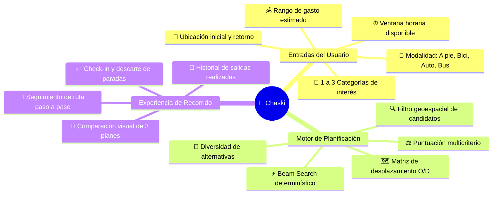
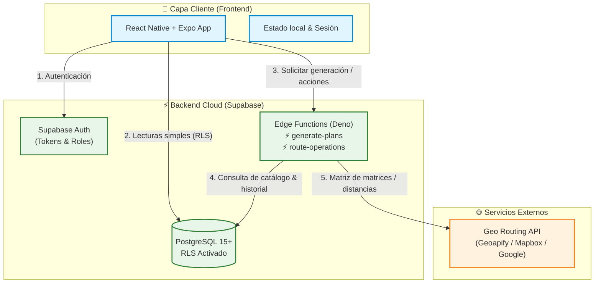
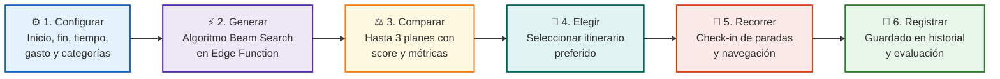
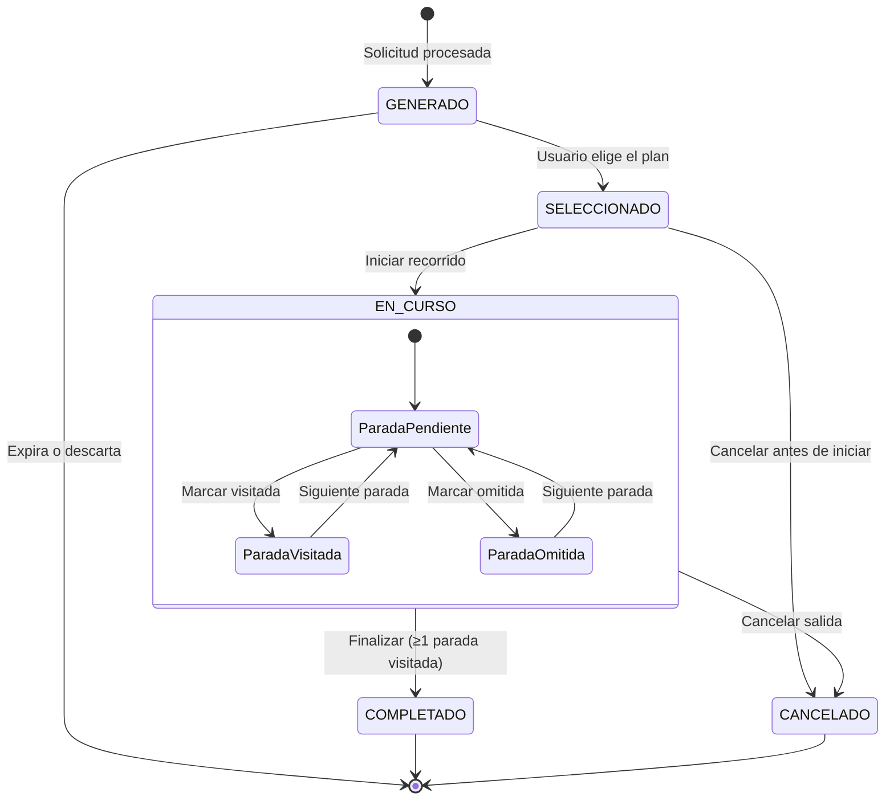
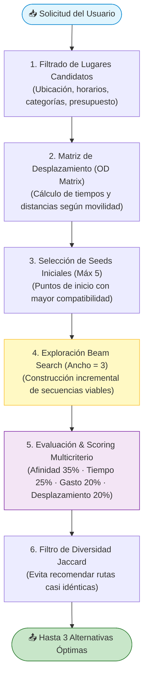
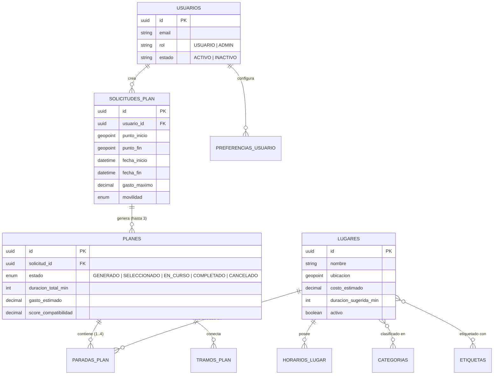

<div align="center">

# 🚌 Chaski

**Planificación inteligente y optimizada de salidas urbanas en Lima Metropolitana**

Transforma tus preferencias, tiempo disponible y presupuesto en hasta **3 alternativas de recorrido viables**, evaluadas algorítmicamente y listas para disfrutar.

[](https://reactnative.dev/)
[](https://expo.dev/)
[](https://supabase.com/)
[](https://www.postgresql.org/)
[](https://www.typescriptlang.org/)

[Explorar Documentación](./docs/README.md) · [Casos de Uso](./docs/03-modelado/casos-uso.md) · [Arquitectura](./docs/04-arquitectura/arquitectura-general.md) · [Algoritmo](./docs/05-algoritmo/generacion-rutas.md)

</div>

---

## 🧭 ¿Qué es Chaski?

> **El problema:** Planificar una salida en Lima suele implicar abrir mapas, redes sociales, calcular tiempos de tráfico, consultar horarios de atención y adivinar gastos, todo por separado.
>
> **La solución Chaski:** Centraliza tus restricciones (inicio/fin, tiempo, dinero, movilidad e intereses) y genera automáticamente hasta **3 itinerarios optimizados y realistas**, sin saturación y con control total del usuario.



---

## 🏛️ Arquitectura del Sistema

Chaski adopta una arquitectura de **cliente móvil desacoplado** con procesamiento backend serverless mediante **Supabase Edge Functions**, garantizando seguridad en el acceso a datos (RLS) y aislamiento de claves de API externas.



### Principios de Diseño Clave
* **Seguridad Row-Level (RLS):** Los usuarios solo pueden leer y modificar sus propios datos (`solicitudes`, `planes`, `preferencias`).
* **Protección de Credenciales:** La app cliente nunca expone API keys de mapas; todo cálculo geoespacial se orquesta en Edge Functions.
* **Proveedor Geográfico Intercambiable:** Implementación basada en interfaz `RoutingProvider` desacoplada del proveedor final.

---

## 🔄 Flujo de Experiencia del Usuario



### Ciclo de Vida de un Plan



---

## 🧠 Algoritmo de Generación (Beam Search)

Chaski no utiliza cajas negras de IA no determinísticas; utiliza un pipeline algorítmico estructurado basado en **Beam Search (ancho 3)** y puntuación multicriterio:



---

## 🗄️ Modelo de Datos Esencial

Esquema relacional en PostgreSQL optimizado para consultas geoespaciales y control de estado:



---

## 📂 Estructura del Código

Organización modular orientada a **Features** en el cliente móvil:

```text
chaski-app/
├── docs/                        # 📚 Documentación técnica completa
│   ├── 01-producto/             # Visión, problema, objetivos y alcance
│   ├── 02-requisitos/           # Requisitos funcionales/no funcionales y reglas
│   ├── 03-modelado/             # Casos de uso, dominio, ERD y secuencias
│   ├── 04-arquitectura/         # Arquitectura general y generador
│   └── 05-algoritmo/            # Detalle matemático de Beam Search
├── src/                         # 📱 Código fuente (React Native + Expo)
│   ├── app/                     # Providers globales y navegación raíz
│   ├── features/                # Módulos desacoplados por dominio
│   │   ├── auth/                # Registro, login y perfil
│   │   ├── planning/            # Formulario de configuración de salidas
│   │   ├── plans/               # Comparativa y detalle de planes generados
│   │   ├── active-route/        # Seguimiento y check-in del recorrido activo
│   │   ├── history/             # Historial de salidas completadas
│   │   └── admin/               # Catálogo de lugares y taxonomía (Admin)
│   ├── shared/                  # Componentes UI, hooks, utilidades y tipos
│   └── services/                # Clientes Supabase y API de rutas
└── supabase/                    # ⚡ Backend (Edge Functions & Migraciones SQL)
    ├── functions/               # Edge Functions (generate-plans, etc.)
    └── migrations/              # Esquema DDL, funciones y políticas RLS
```

---

## 📚 Mapa de la Documentación

Toda la documentación está organizada en 5 módulos técnicos visualmente documentados:

| Módulo | Contenido Principal | Diagramas incluidos |
|---|---|---|
| [**01. Producto**](./docs/01-producto/vision.md) | Visión, Problemas ([PE01–PE04](./docs/01-producto/problema-y-objetivos.md)), Objetivos y Alcance ([In/Out Scope](./docs/01-producto/alcance.md)) | Flujo macro, matriz de objetivos |
| [**02. Requisitos**](./docs/02-requisitos/requisitos-funcionales.md) | [29 Requisitos Funcionales](./docs/02-requisitos/requisitos-funcionales.md), [RNF](./docs/02-requisitos/requisitos-no-funcionales.md), [40+ Reglas de Negocio](./docs/02-requisitos/reglas-negocio.md) y [Matriz de Trazabilidad](./docs/02-requisitos/trazabilidad.md) | Tablas de trazabilidad y validación |
| [**03. Modelado**](./docs/03-modelado/casos-uso.md) | [Casos de Uso (CU01–CU09)](./docs/03-modelado/casos-uso.md), [Modelo de Dominio](./docs/03-modelado/modelo-dominio.md), [Modelo de Datos ERD](./docs/03-modelado/modelo-datos.md) y [Secuencias](./docs/03-modelado/secuencias.md) | Diagramas de secuencia, estado y casos de uso |
| [**04. Arquitectura**](./docs/04-arquitectura/arquitectura-general.md) | [Arquitectura General](./docs/04-arquitectura/arquitectura-general.md), Políticas RLS, Seguridad y [Generador de Planes](./docs/04-arquitectura/generador-planes.md) | Capas, flujo de credenciales, árbol de módulos |
| [**05. Algoritmo**](./docs/05-algoritmo/generacion-rutas.md) | [Generación de Rutas con Beam Search](./docs/05-algoritmo/generacion-rutas.md), matrices OD y scoring | Pipeline paso a paso, fórmulas y control de diversidad |

---

<div align="center">

**Chaski** · *Planifica tu salida, no tu estrés.*

</div>
