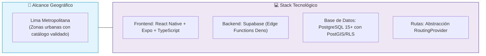
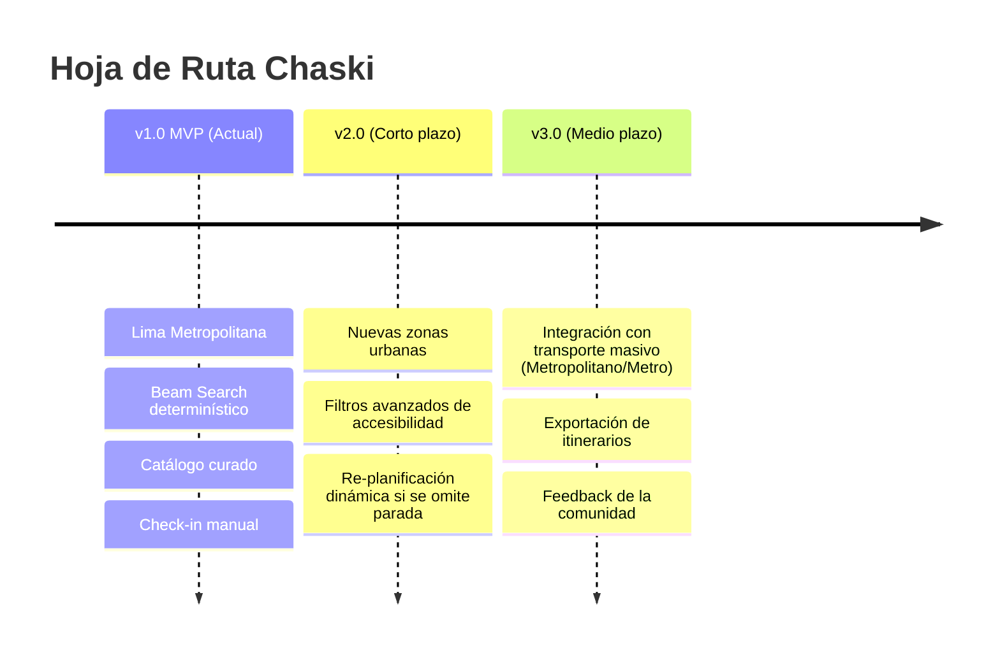

# Alcance del producto — Chaski

## 1. Propósito

Este documento establece formalmente las fronteras funcionales y técnicas contempladas para la **primera versión (MVP)** de Chaski, delimitando con precisión qué capacidades están incluidas y cuáles quedan explícitamente fuera del alcance inicial.

El objetivo es mantener una entrega realizable, robusta y verificable, evitando la dispersión de esfuerzos en características no esenciales para la validación del flujo principal de planificación.

---

## 2. Mapa Visual del Alcance (In-Scope vs Out-of-Scope)

```mermaid
graph TB
    subgraph IN["✅ DENTRO DEL ALCANCE (v1.0 MVP)"]
        direction TB
        IN1["📱 App móvil React Native + Expo"]
        IN2["🔐 Autenticación & RLS en Supabase"]
        IN3["📍 Cobertura: Lima Metropolitana"]
        IN4["⚡ Generador Beam Search (0 a 3 planes)"]
        IN5["🚶 Modalidades: Pie, Bici, Auto, Bus"]
        IN6["⏱️ Estimación de tiempo y gasto"]
        IN7["🗺️ Catálogo curado de lugares y horarios"]
        IN8["✅ Check-in manual de paradas e historial"]
    end

    subgraph OUT["❌ FUERA DEL ALCANCE (Exclusiones v1.0)"]
        direction TB
        OUT1["💳 Pagos o pasarela integrada"]
        OUT2["🎟️ Compra de entradas / Reservas"]
        OUT3["🧭 Navegación GPS giro a giro"]
        OUT4["🚕 Integración con apps de taxi (Uber, etc.)"]
        OUT5["👥 Red social, chat y perfiles públicos"]
        OUT6["🤖 Machine Learning / IA generativa"]
        OUT7["📡 Tráfico en vivo y aforo en tiempo real"]
        OUT8["📶 Modo 100% offline sin internet"]
    end

    classDef inStyle fill:#E8F5E9,stroke:#2E7D32,stroke-width:2px;
    classDef outStyle fill:#FFEBEE,stroke:#C62828,stroke-width:2px;

    class IN,IN1,IN2,IN3,IN4,IN5,IN6,IN7,IN8 inStyle;
    class OUT,OUT1,OUT2,OUT3,OUT4,OUT5,OUT6,OUT7,OUT8 outStyle;
```

---

## 3. Alcance Funcional Detallado

### 3.1. Gestión de usuarios y preferencias
* **Registro e Inicio de Sesión:** Gestión de credenciales delegada en Supabase Auth.
* **Perfil y Preferencias:** Configuración de categorías favoritas y movilidad predeterminada persistidas con políticas RLS.

### 3.2. Configuración de la salida
El usuario ingresa parámetros obligatorios y opcionales para la planificación:
* **Puntos geográficos:** Ubicación de inicio y comportamiento de destino (retornar al inicio, terminar en última parada o punto personalizado).
* **Restricciones:** Ventana de tiempo (inicio/fin), rango de gasto estimado, 1 a 3 categorías de interés y modo de movilidad.

### 3.3. Catálogo de lugares y taxonomía
* Banco controlado de lugares en Lima Metropolitana con coordenadas, horarios de atención, costo estimado y duración sugerida de visita.
* Clasificación jerárquica mediante categorías fijas y etiquetas descriptivas.

### 3.4. Motor de generación y evaluación de planes
* Algoritmo determinístico **Beam Search** ejecutado en el backend (Edge Function).
* Retorna entre **0 y 3 alternativas viables** puntuadas mediante función de compatibilidad multicriterio y filtradas por diversidad.

### 3.5. Ejecución del recorrido e historial
* **Seguimiento activo:** Máximo 1 recorrido en curso por usuario. Registro manual de paradas (`VISITADA` / `OMITIDA`).
* **Persistencia en historial:** Los planes `COMPLETADOS` o `CANCELADOS` se conservan para consulta posterior del usuario.

---

## 4. Alcance Geográfico y Tecnológico

---

## 5. Matriz de Exclusiones y Justificación de Diseño

| Característica Excluida | Justificación Técnica / De Negocio | Alternativa en v1.0 |
|---|---|---|
| **Pagos y reservas directas** | Evita la complejidad regulatoria, fiscal y de pasarelas de pago para el MVP. | Se muestra costo referencial para que el usuario pague directamente en el local. |
| **Navegación GPS giro a giro** | Alto consumo de batería y complejidad de renderizado nativo en tiempo real. | Se entrega la ruta estructurada y se enlaza a aplicaciones de mapas externas si el usuario lo requiere. |
| **Integración con apps de taxi** | Requiere contratos de API cerrados y tarifas dinámicas en tiempo real. | Se calculan tiempos y costos aproximados basados en distancias viales. |
| **Modelos de IA / Machine Learning** | Los modelos de lenguaje pueden alucinar lugares cerrados o rutas físicamente imposibles. | Se utiliza un algoritmo determinístico verificable que garantiza el cumplimiento estricto de horarios. |
| **Modo 100% Offline** | Las matrices de distancia y validaciones de catálogo requieren datos actualizados. | La app requiere conexión para generar y sincronizar el progreso de la salida. |

---

## 6. Restricciones y Supuestos de las Estimaciones

> [!NOTE]
> **Tiempo:** Los tiempos de traslado y permanencia son valores calculados a partir de matrices viales y promedios históricos. No constituyen una garantía de puntualidad exacta.

> [!NOTE]
> **Gasto:** Los costos corresponden a estimaciones promedio por persona. Un valor `0` indica gratuidad; valores nulos indican falta de datos y no gratuidad.

> [!IMPORTANT]
> **Disponibilidad:** Si los filtros del usuario son demasiado estrictos (ej. 30 minutos disponibles para visitar 3 lugares lejanos), el sistema retornará 0 resultados e informará con claridad las razones al usuario, sin relajar silenciosamente sus condiciones.

---

## 7. Hoja de Ruta de Evolución Futura

