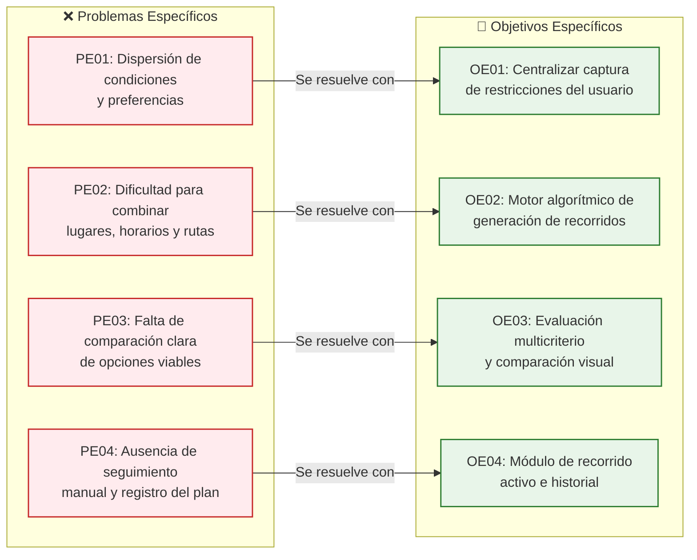
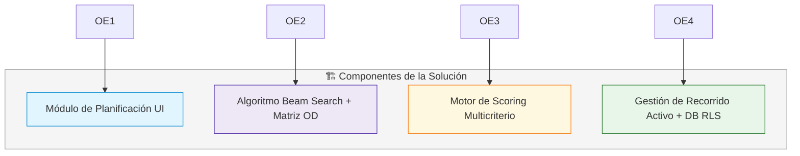

# Problema y objetivos — Chaski

## 1. Situación problemática

La planificación de una salida dentro de Lima Metropolitana puede requerir consultar diferentes fuentes de información para identificar lugares de interés, conocer sus horarios, revisar su ubicación, estimar desplazamientos y determinar si las actividades pueden realizarse dentro del tiempo y rango de gasto disponibles.

Aplicaciones de mapas, redes sociales, páginas web y recomendaciones permiten descubrir lugares o consultar información individual sobre ellos. Sin embargo, el usuario todavía debe relacionar manualmente esta información para decidir qué lugares visitar, en qué orden hacerlo y si el recorrido completo es compatible con las condiciones particulares de su salida.

Esta situación adquiere mayor importancia cuando existen restricciones como una hora específica de inicio y finalización, un punto al cual se necesita llegar al terminar, determinados intereses, una forma de movilidad o un rango aproximado de gasto.

Por ello, se identifica la necesidad de una herramienta móvil que apoye la planificación de salidas considerando conjuntamente estas condiciones y permita generar alternativas de recorrido que puedan ser comparadas por el usuario.

---

## 2. Árbol de Problemas y Objetivos

---

## 3. Formulación del Problema

### Problema general

> **¿Cómo facilitar la planificación de salidas dentro de Lima Metropolitana considerando las condiciones y preferencias del usuario, como su ubicación de inicio y finalización, tiempo disponible, intereses, rango de gasto y forma de movilidad?**

### Problemas específicos

| Código | Formulación del Problema Específico |
|---|---|
| **PE01** | ¿Cómo centralizar las principales condiciones y preferencias que una persona considera al momento de planificar una salida? |
| **PE02** | ¿Cómo generar alternativas de recorrido que combinen lugares de interés considerando horarios, duración de actividades y tiempos de desplazamiento? |
| **PE03** | ¿Cómo facilitar la comparación de alternativas considerando los intereses, tiempo disponible, rango de gasto y desplazamiento del usuario? |
| **PE04** | ¿Cómo permitir que el usuario seleccione y registre el progreso del recorrido elegido desde una aplicación móvil? |

---

## 4. Definición de Objetivos

### Objetivo general

> **Desarrollar una aplicación móvil que facilite la planificación de salidas dentro de Lima Metropolitana mediante la generación de alternativas de recorridos basadas en las condiciones y preferencias del usuario, considerando su ubicación de inicio y finalización, tiempo disponible, intereses, rango de gasto y forma de movilidad.**

### Objetivos específicos

| Código | Formulación del Objetivo Específico | Entregable técnico asociado |
|---|---|---|
| **OE01** | Implementar un mecanismo que permita al usuario registrar las principales condiciones y preferencias de una salida, incluyendo ubicación, tiempo disponible, intereses, rango de gasto y forma de movilidad. | Formulario de solicitud y módulo de preferencias (`CU01`, `CU02`) |
| **OE02** | Desarrollar un mecanismo de generación de recorridos que combine lugares de interés considerando sus horarios, duración estimada de las actividades y tiempos de desplazamiento. | Edge Function con Beam Search y proveedor geográfico (`CU03`) |
| **OE03** | Implementar un mecanismo de evaluación y presentación de alternativas que facilite su comparación según su compatibilidad con las condiciones proporcionadas por el usuario. | Comparador visual de planes con scoring multicriterio (`CU04`) |
| **OE04** | Desarrollar funcionalidades que permitan seleccionar un recorrido, registrar el progreso de sus paradas y consultar posteriormente la información correspondiente a los recorridos realizados. | Módulo de recorrido activo e historial (`CU05`, `CU06`) |

---

## 5. Matriz de Relación Problema ↔ Objetivo ↔ Solución

---

## 6. Relación con otros documentos

La definición detallada de las funcionalidades derivadas de estos objetivos se encuentra en:

- [`requisitos-funcionales.md`](../02-requisitos/requisitos-funcionales.md) — Desglose funcional detallado de cada requerimiento.
- [`reglas-negocio.md`](../02-requisitos/reglas-negocio.md) — Restricciones de negocio y criterios de validación.
- [`trazabilidad.md`](../02-requisitos/trazabilidad.md) — Matriz de correspondencia completa entre requisitos y código.
- [`alcance.md`](./alcance.md) — Delimitación de fronteras del producto (MVP vs Versiones futuras).