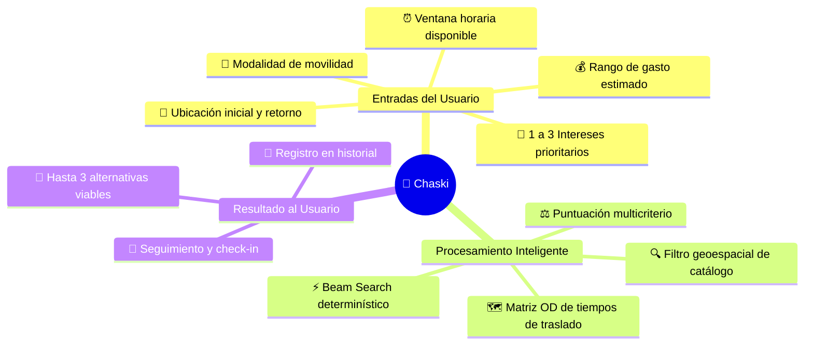
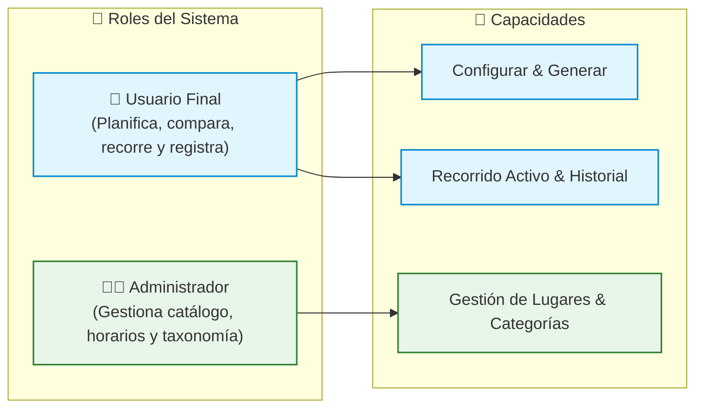
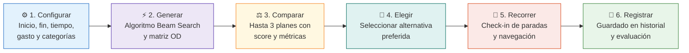

# Visión del producto — Chaski

## 1. Descripción

**Chaski** es una aplicación móvil orientada a facilitar la planificación inteligente y personalizada de salidas urbanas dentro de **Lima Metropolitana**.

La aplicación transforma las condiciones y preferencias proporcionadas por el usuario en alternativas de recorridos que pueden realizarse de manera realista dentro del tiempo y presupuesto disponibles.

---

## 2. Problema que aborda

Planificar una salida suele requerir consultar múltiples fuentes fragmentadas: mapas para rutas, redes sociales para recomendaciones, páginas web para horarios y estimaciones empíricas para prever gastos y congestión vehicular.

El reto principal no es únicamente encontrar lugares atractivos, sino **determinar cómo combinarlos secuencialmente** dentro de un itinerario continuo y compatible con las restricciones de la persona:

> **El dilema tradicional:**
> ¿Cómo enlazar una cafetería en Barranco con una galería de arte en Miraflores sin exceder 3 horas disponibles, respetando mi presupuesto y terminando en mi punto de retorno?

Chaski resuelve esta fricción centralizando los parámetros y automatizando la generación de itinerarios ordenados.

---

## 3. Usuarios Objetivo y Roles

---

## 4. Propuesta de Valor

Chaski va más allá de un simple directorio geográfico (*«¿Qué hay cerca de mí?»*). Su valor radica en responder una pregunta multidimensional:

> **«¿Qué recorrido optimizado puedo realizar considerando dónde empiezo, a qué hora debo terminar, mis intereses, mi presupuesto y mi forma de transporte?»**

---

## 5. Flujo Principal del Producto

### Desglose de Etapas

| Etapa | Responsabilidad del Sistema | Acción del Usuario |
|---|---|---|
| **1. Configurar** | Valida restricciones (hora fin > inicio, 1–3 categorías, gasto $\ge 0$). | Ingresa ubicación, horario, categorías, presupuesto y movilidad. |
| **2. Generar** | Consulta catálogo, calcula matriz OD y ejecuta Beam Search en Edge Function. | Presiona el botón de generación y espera el resultado ($\le 3$ s). |
| **3. Comparar** | Muestra métricas de cada plan: duración total, gasto estimado y score de afinidad. | Revisa las opciones en tarjetas comparativas y visualiza las paradas en mapa. |
| **4. Elegir** | Cambia el estado del plan seleccionado a `SELECCIONADO`. | Confirma la opción elegida para su salida. |
| **5. Recorrer** | Permite registrar progreso (`VISITADA` / `OMITIDA`) y mantiene 1 salida activa. | Avanza físicamente por las paradas e interactúa con la app. |
| **6. Registrar** | Transiciona el plan a `COMPLETADO` o `CANCELADO` y lo almacena en historial. | Finaliza el recorrido y consulta el resumen en su historial personal. |

---

## 6. Principios Rectores del Producto

> [!IMPORTANT]
> **6.1. Viabilidad antes que cantidad:** Chaski no forzará la entrega de 3 planes si no existen suficientes rutas seguras y viables dentro del horario indicado. Preferirá entregar 1 o 2 de alta calidad a 3 con inconsistencias.

> [!IMPORTANT]
> **6.2. No modificación silenciosa de restricciones:** El sistema jamás ampliará automáticamente el tiempo o presupuesto del usuario para forzar un resultado. Si no hay opciones, lo informará con transparencia.

> [!NOTE]
> **6.3. Gasto y tiempo como estimaciones:** Los costos y traslados son aproximaciones referenciales basadas en promedios y datos viales; no constituyen garantías absolutas de cobro o puntualidad.

> [!TIP]
> **6.4. Diversidad de alternativas:** Mediante el índice de similitud de Jaccard, el sistema evita proponer planes que solo varían en una parada secundaria, garantizando opciones genuinamente distintas.

> [!NOTE]
> **6.5. El usuario conserva la decisión final:** El ordenamiento y puntuación del algoritmo son herramientas de orientación; la elección definitiva siempre pertenece al usuario.

---

## 7. Documentos Relacionados

* [`problema-y-objetivos.md`](./problema-y-objetivos.md) — Justificación metodológica y formulación PE/OE.
* [`alcance.md`](./alcance.md) — Fronteras funcionales y técnicas del MVP.
* [`../04-arquitectura/arquitectura-general.md`](../04-arquitectura/arquitectura-general.md) — Diseño de capas y componentes del sistema.