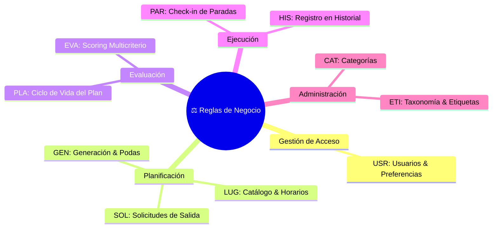

# Reglas de negocio — Chaski

## 1. Propósito

Este documento define las reglas de negocio que condicionan el funcionamiento de Chaski.

Las reglas establecen restricciones, condiciones y comportamientos que deben cumplirse durante la gestión de usuarios, creación de solicitudes, generación de recorridos, evaluación de alternativas, ejecución de planes e historial.

Los requisitos funcionales indican **qué puede hacer el sistema**, mientras que las reglas de negocio determinan **bajo qué condiciones puede hacerlo**.



---

# 2. Usuarios y preferencias

## USR-01 — Unicidad del correo

No podrán existir dos cuentas asociadas al mismo correo electrónico.

## USR-02 — Usuario autenticado

Las operaciones relacionadas con preferencias, solicitudes, planes e historial deberán ejecutarse sobre un usuario autenticado.

## USR-03 — Preferencias generales

El usuario podrá almacenar preferencias generales relacionadas con:

- categorías de interés;
- forma de movilidad preferida;
- rango de gasto habitual.

Estas preferencias podrán utilizarse como valores iniciales al crear nuevas solicitudes.

## USR-04 — Prioridad de las condiciones de la solicitud

Las condiciones indicadas en una solicitud específica tendrán prioridad sobre las preferencias generales almacenadas por el usuario.

---

# 3. Solicitudes de planificación

## SOL-01 — Intervalo temporal válido

La fecha y hora de finalización de una solicitud deberán ser posteriores a su fecha y hora de inicio.

## SOL-02 — Categorías de interés

Cada solicitud deberá contener entre una y tres categorías de interés.

## SOL-03 — Rango de gasto válido

Los valores mínimo y máximo del rango de gasto no podrán ser negativos.

Además, el valor mínimo no podrá ser superior al valor máximo.

```text
gastoMin <= gastoMax
```

## SOL-04 — Forma de movilidad obligatoria

Toda solicitud deberá indicar una forma de movilidad válida entre las opciones soportadas por la versión del sistema.

Los valores concretos disponibles serán definidos de acuerdo con las capacidades del servicio geográfico seleccionado.

## SOL-05 — Ubicación inicial obligatoria

Toda solicitud deberá incluir una ubicación inicial válida.

## SOL-06 — Tipo de punto final

Toda solicitud deberá indicar uno de los siguientes comportamientos para el final del recorrido:

- regresar al punto de inicio;
- finalizar en la última parada;
- finalizar en otra ubicación.

## SOL-07 — Ubicación final personalizada

Cuando el usuario seleccione finalizar en otra ubicación, deberá proporcionar un punto final válido.

Cuando seleccione regresar al inicio o finalizar en la última parada, no será necesario proporcionar una ubicación final adicional.

## SOL-08 — Conservación de condiciones

El sistema no deberá modificar silenciosamente las condiciones indicadas por el usuario con el objetivo de conseguir una alternativa viable.

Si no existen recorridos compatibles con las condiciones proporcionadas, el sistema deberá informar dicha situación.

---

# 4. Lugares y disponibilidad

## LUG-01 — Estado activo

Solo los lugares que se encuentren activos podrán participar en la generación de nuevos recorridos.

## LUG-02 — Información mínima

Un lugar deberá contar con la información mínima necesaria antes de poder ser considerado por el generador.

Como mínimo deberá disponer de:

- ubicación;
- categoría;
- duración sugerida;
- estado;
- información de horario cuando corresponda.

El costo podrá ser desconocido.

## LUG-03 — Compatibilidad de horario

Un lugar solo podrá incorporarse a un recorrido cuando la visita pueda realizarse dentro de su horario disponible.

La validación deberá considerar:

- hora estimada de llegada;
- tiempo de espera cuando corresponda;
- duración estimada de la actividad;
- hora estimada de salida.

## LUG-04 — Tiempo de espera

Cuando el usuario llegue antes de la hora de apertura de un lugar, podrá considerarse un tiempo de espera siempre que el recorrido continúe siendo viable.

El tiempo de espera formará parte de la duración total del recorrido.

## LUG-05 — Lugar no repetido

Un mismo lugar no podrá aparecer más de una vez dentro del mismo recorrido.

## LUG-06 — Conservación histórica de lugares

La desactivación de un lugar impedirá que participe en nuevas generaciones, pero no deberá eliminarlo de recorridos históricos donde haya sido utilizado previamente.

---

# 5. Generación de recorridos

## GEN-01 — Cumplimiento de restricciones obligatorias

Solo podrán considerarse alternativas que satisfagan las restricciones obligatorias de la solicitud y las reglas de viabilidad del sistema.

## GEN-02 — Desplazamiento inicial

La duración total del recorrido deberá incluir el desplazamiento desde el punto inicial hasta la primera parada.

## GEN-03 — Desplazamientos entre paradas

La duración total deberá incluir los tiempos de desplazamiento entre todas las paradas consecutivas.

## GEN-04 — Desplazamiento al punto final

Cuando corresponda, la viabilidad del recorrido deberá considerar el tiempo necesario para desplazarse desde la última parada hasta el punto final indicado por el usuario.

## GEN-05 — Tiempo total disponible

La suma de:

- desplazamiento inicial;
- duración de actividades;
- desplazamientos entre paradas;
- tiempos de espera;
- desplazamiento final, cuando corresponda;

no podrá superar el tiempo disponible de la solicitud.

## GEN-06 — Número máximo de paradas

La implementación podrá establecer un máximo configurable de paradas por recorrido con el objetivo de controlar la complejidad de la generación.

Para la primera versión se propone inicialmente:

```text
MAX_STOPS = 4
```

Este valor corresponde a una decisión configurable del algoritmo y no a una restricción estructural del modelo de dominio.

## GEN-07 — Número máximo de alternativas

El sistema deberá presentar como máximo tres alternativas finales por cada solicitud.

## GEN-08 — Cantidad variable de resultados

La generación podrá producir cero, una, dos o tres alternativas finales.

No será obligatorio generar tres opciones cuando no existan suficientes recorridos viables y diferenciados.

## GEN-09 — Ausencia de alternativas

Cuando no sea posible generar al menos un recorrido viable, el sistema deberá informar al usuario y no deberá construir una alternativa que incumpla las condiciones obligatorias.

## GEN-10 — Generación determinística

La primera versión de Chaski utilizará reglas y algoritmos determinísticos para generar las alternativas.

No se requiere inteligencia artificial ni Machine Learning para el proceso de generación de la versión inicial.

---

# 6. Gasto y estimaciones económicas

## EVA-01 — Rango de gasto como criterio de compatibilidad

El rango de gasto indicado por el usuario será utilizado como un criterio para evaluar la compatibilidad de una alternativa y no necesariamente como una restricción absoluta.

## EVA-02 — Costo gratuito

Un costo con valor igual a `0` representará una actividad o desplazamiento identificado como gratuito.

## EVA-03 — Costo desconocido

La ausencia de información sobre un costo deberá representarse como un valor desconocido.

Un costo desconocido no deberá interpretarse como gratuito.

Conceptualmente:

```text
0    = gratuito
NULL = desconocido
```

## EVA-04 — Gasto estimado del recorrido

El gasto estimado de un recorrido se obtendrá a partir de los rangos de costo conocidos de sus actividades y desplazamientos cuando dichos valores se encuentren disponibles.

## EVA-05 — Estimación incompleta

Cuando uno o más elementos del recorrido tengan un costo desconocido, el sistema deberá poder indicar que la estimación económica se encuentra incompleta.

---

# 7. Evaluación de alternativas

## EVA-06 — Viabilidad antes de puntuación

Solo las alternativas que hayan cumplido las restricciones obligatorias podrán participar en la evaluación final.

```text
validar
   ↓
evaluar
   ↓
ordenar
```

## EVA-07 — Criterios de evaluación

La valoración de una alternativa podrá considerar:

- cobertura de intereses;
- utilización del tiempo disponible;
- compatibilidad con el rango de gasto;
- desplazamiento requerido.

## EVA-08 — Pesos configurables

Los pesos utilizados para combinar los criterios de evaluación deberán mantenerse como parámetros configurables.

Como configuración inicial se propone:

| Criterio | Peso inicial |
|---|---:|
| Intereses | 35 % |
| Tiempo | 25 % |
| Gasto | 25 % |
| Desplazamiento | 15 % |

Estos valores podrán ajustarse durante las pruebas sin modificar la estructura principal del algoritmo.

## EVA-09 — Interpretación de la valoración

La puntuación obtenida será una medida interna de compatibilidad entre una alternativa y las condiciones de la solicitud.

No deberá interpretarse como:

- probabilidad de satisfacción;
- porcentaje de éxito;
- indicador de seguridad;
- garantía sobre la experiencia real.

## EVA-10 — Tiempo de espera y valoración

Los tiempos de espera podrán generar una penalización en la valoración de una alternativa para favorecer recorridos que aprovechen mejor el tiempo disponible.

El coeficiente exacto utilizado será configurable.

---

# 8. Diversidad de alternativas

## EVA-11 — Alternativas diferenciadas

Cuando existan suficientes recorridos viables, el sistema procurará presentar opciones suficientemente diferentes entre sí.

## EVA-12 — Similitud entre recorridos

La similitud podrá evaluarse principalmente considerando los lugares compartidos entre dos recorridos.

El mecanismo inicial podrá utilizar una medida de similitud basada en conjuntos, como el índice de Jaccard.

El umbral concreto será definido y ajustado mediante pruebas.

## EVA-13 — Equivalencia de recorridos

Dos recorridos que contengan esencialmente los mismos lugares no deberán considerarse automáticamente alternativas distintas únicamente por presentar un orden diferente.

Podrán considerarse diferentes cuando el cambio de orden produzca una diferencia relevante en su viabilidad, duración u organización.

---

# 9. Planes y estados

Los estados contemplados para un plan son:

```text
GENERADO
SELECCIONADO
EN_CURSO
COMPLETADO
CANCELADO
```

El flujo principal será:

```text
GENERADO
    ↓
SELECCIONADO
    ↓
EN_CURSO
    ↓
COMPLETADO
```

También podrá ocurrir:

```text
SELECCIONADO ──→ CANCELADO
EN_CURSO ──────→ CANCELADO
```

## PLA-01 — Estado inicial

Todo plan creado como resultado del proceso de generación deberá iniciar en estado `GENERADO`.

## PLA-02 — Selección de plan

Solo un plan en estado `GENERADO` podrá cambiar a `SELECCIONADO`.

## PLA-03 — Inicio del recorrido

Solo un plan en estado `SELECCIONADO` podrá cambiar a `EN_CURSO`.

## PLA-04 — Un único recorrido activo

Un usuario podrá mantener como máximo un plan en estado `EN_CURSO` simultáneamente.

## PLA-05 — Finalización del recorrido

Un plan en estado `EN_CURSO` podrá cambiar a `COMPLETADO` cuando:

- no existan paradas en estado `PENDIENTE`;
- al menos una parada haya sido registrada como `VISITADA`.

Un recorrido cuyas paradas hayan sido todas omitidas no deberá considerarse completado.

## PLA-06 — Cancelación

Un plan podrá cambiar a `CANCELADO` cuando se encuentre en estado:

- `SELECCIONADO`;
- `EN_CURSO`.

## PLA-07 — Estados terminales

Los estados `COMPLETADO` y `CANCELADO` serán terminales para la primera versión.

Un plan en cualquiera de estos estados no podrá regresar a `EN_CURSO`.

## PLA-08 — Conservación del progreso

La cancelación de un recorrido no deberá eliminar la información de progreso registrada previamente.

---

# 10. Paradas del recorrido

Los estados contemplados para una parada son:

```text
PENDIENTE
VISITADA
OMITIDA
```

## PAR-01 — Estado inicial

Toda parada perteneciente a un plan generado deberá iniciar en estado `PENDIENTE`.

## PAR-02 — Registro de visita

Una parada en estado `PENDIENTE` podrá cambiar a `VISITADA`.

## PAR-03 — Omisión

Una parada en estado `PENDIENTE` podrá cambiar a `OMITIDA`.

## PAR-04 — Estados terminales

Los estados `VISITADA` y `OMITIDA` serán terminales durante la primera versión.

No se contempla regresar una parada a `PENDIENTE`.

## PAR-05 — Registro manual

El registro de una parada como visitada u omitida será realizado manualmente por el usuario.

La primera versión no requerirá mecanismos de validación mediante códigos QR o confirmación automática mediante geolocalización.

## PAR-06 — Omisión sin regeneración

La omisión de una parada no generará automáticamente un nuevo recorrido.

El plan restante continuará utilizando la planificación original.

---

# 11. Historial

## HIS-01 — Recorridos pertenecientes al historial

El historial estará compuesto por planes que hayan alcanzado estados asociados a la ejecución del recorrido:

- `EN_CURSO`;
- `COMPLETADO`;
- `CANCELADO`.

## HIS-02 — Alternativas generadas

Los planes que permanezcan únicamente en estado `GENERADO` no formarán parte del historial de recorridos.

## HIS-03 — Plan seleccionado pendiente

Un plan en estado `SELECCIONADO` que todavía no haya sido iniciado podrá mostrarse al usuario como un plan pendiente.

No será considerado automáticamente como parte del historial de recorridos ejecutados.

## HIS-04 — Conservación de valores históricos

Las modificaciones posteriores sobre un lugar no deberán alterar los valores estimados almacenados en recorridos generados previamente.

Los valores necesarios para preservar la información histórica podrán mantenerse como datos de referencia dentro del plan, sus paradas o sus desplazamientos.

---

# 12. Administración

## ADM-01 — Gestión de lugares

El administrador podrá:

- registrar lugares;
- consultar lugares;
- actualizar su información;
- activar lugares;
- desactivar lugares.

## ADM-02 — Eliminación de lugares

Los lugares asociados a información histórica no deberán eliminarse físicamente como parte de las operaciones administrativas normales.

Se utilizará su estado para controlar su disponibilidad en nuevas generaciones.

## ADM-03 — Gestión de categorías y etiquetas

El administrador podrá registrar, consultar, modificar, activar y desactivar categorías y etiquetas.

## ADM-04 — Uso de categorías

Las categorías representarán intereses generales utilizados:

- por los usuarios al configurar sus solicitudes;
- por el sistema al seleccionar lugares candidatos.

Ejemplos:

- Gastronomía;
- Cultura;
- Entretenimiento;
- Naturaleza.

## ADM-05 — Uso de etiquetas

Las etiquetas representarán características complementarias de los lugares.

No sustituirán a las categorías utilizadas como intereses principales de planificación.

Ejemplos:

- al aire libre;
- gratuito;
- familiar;
- mirador.

## ADM-06 — Reportes administrativos

Los reportes deberán obtenerse a partir de la información registrada por el sistema.

No será necesario mantener una entidad persistente independiente denominada `Reporte`.

---

# 13. Parámetros configurables

Algunas decisiones del proceso de generación corresponden a parámetros técnicos y no a reglas rígidas del dominio.

Los valores iniciales propuestos son:

| Parámetro | Valor inicial |
|---|---:|
| Máximo de paradas | 4 |
| Máximo de alternativas finales | 3 |
| Peso de intereses | 35 % |
| Peso de tiempo | 25 % |
| Peso de gasto | 25 % |
| Peso de desplazamiento | 15 % |
| Umbral de similitud | Pendiente de pruebas |
| Penalización por espera | Pendiente de pruebas |

Los parámetros marcados como pendientes deberán definirse mediante pruebas del algoritmo antes de considerarse definitivos.

---

# 14. Relación con otros documentos

Estas reglas complementan los siguientes documentos:

- [Visión del producto](../01-producto/vision.md)
- [Problema y objetivos](../01-producto/problema-y-objetivos.md)
- [Alcance del producto](../01-producto/alcance.md)
- [Requisitos funcionales](./requisitos-funcionales.md)
- [Requisitos no funcionales](./requisitos-no-funcionales.md)
- [Trazabilidad](./trazabilidad.md)