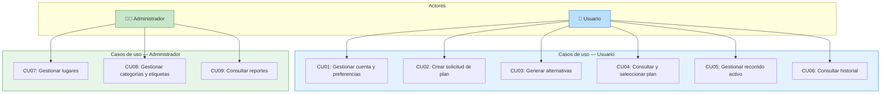
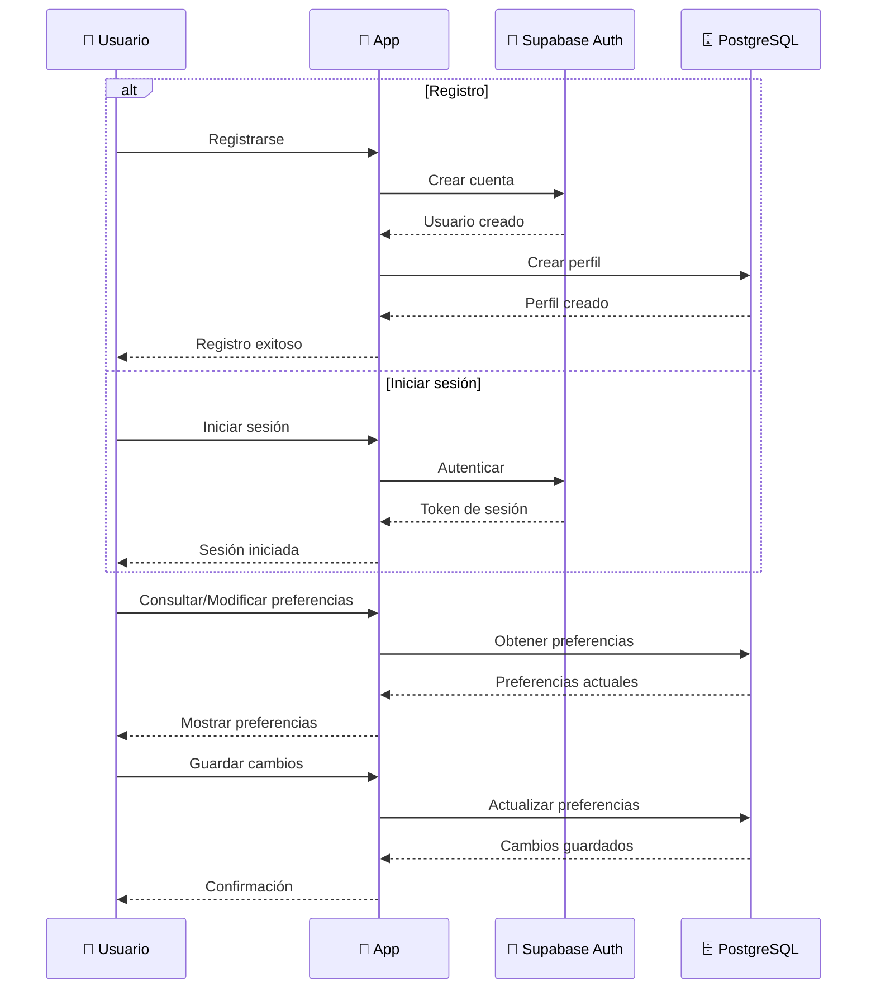
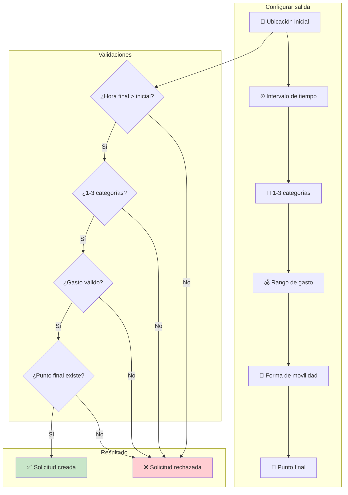
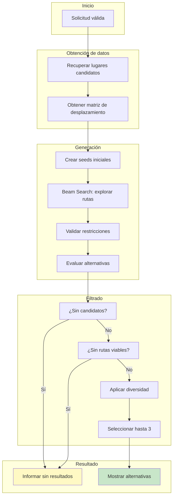
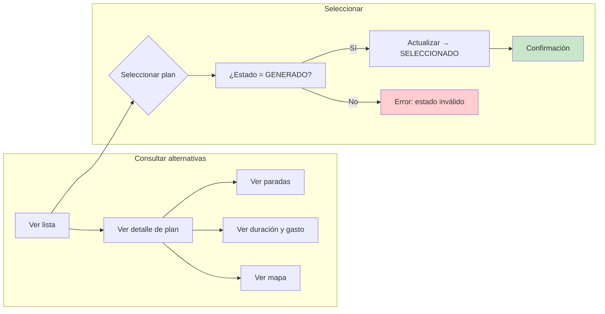
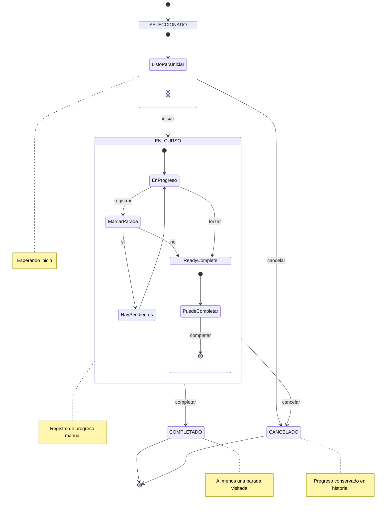
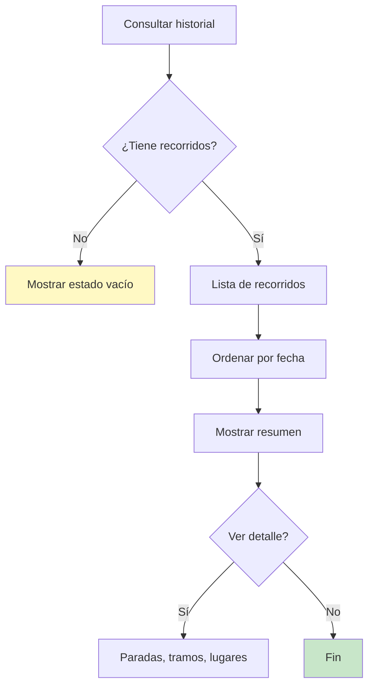

 # Casos de uso — Chaski

## 1. Propósito

Este documento describe los principales casos de uso de Chaski para su primera versión.

Los casos de uso representan las interacciones principales entre los actores y el sistema y se encuentran relacionados con los requisitos funcionales definidos en [`requisitos-funcionales.md`](../02-requisitos/requisitos-funcionales.md).

---

## 2. Actores

| Actor | Descripción |
|---|---|
| **Usuario** | Persona registrada que configura salidas, genera alternativas, selecciona planes, registra progreso y consulta historial |
| **Administrador** | Usuario con permisos para gestionar lugares, categorías, horarios y consultar reportes |

---

## 3. Resumen de casos de uso

| ID | Caso de uso | Actor | Descripción |
|---|---|---|---|
| CU01 | Gestionar cuenta y preferencias | Usuario | Registro, login, perfil, preferencias |
| CU02 | Crear solicitud de plan | Usuario | Configurar condiciones de una salida |
| CU03 | Generar alternativas | Usuario | Obtener hasta 3 planes compatibles |
| CU04 | Consultar y seleccionar plan | Usuario | Ver alternativas y elegir una |
| CU05 | Gestionar recorrido activo | Usuario | Iniciar, marcar paradas, completar, cancelar |
| CU06 | Consultar historial | Usuario | Ver recorridos realizados |
| CU07 | Gestionar lugares | Administrador | CRUD de lugares del catálogo |
| CU08 | Gestionar categorías y etiquetas | Administrador | Administrartaxonomía del catálogo |
| CU09 | Consultar reportes | Administrador | Ver estadísticas del sistema |

---

## 4. CU01 — Gestionar cuenta y preferencias

### Precondiciones

- Para consultar o modificar preferencias, el usuario deberá encontrarse autenticado.

### Flujos alternativos

- **Registro con correo existente**: el sistema rechaza el registro e informa al usuario.
- **Datos inválidos**: el sistema no guarda los cambios y solicita corrección.

---

## 5. CU02 — Crear solicitud de plan

### Campos requeridos

| Campo | Tipo | Validación |
|---|---|---|
| Ubicación inicial | GeoPoint | Requerido |
| Fecha/hora inicio | Timestamp | Requerido |
| Fecha/hora fin | Timestamp | > fecha inicio |
| Categorías | Array | 1 a 3 elementos |
| Gasto min/max | Decimal | ≥ 0, min ≤ max |
| Movilidad | Enum | CAMINAR, BICICLETA, AUTO, TRANSPORTE_PUBLICO |
| Tipo punto final | Enum | REGRESAR_INICIO, ULTIMA_PARADA, OTRA_UBICACION |

---

## 6. CU03 — Generar alternativas

### Parámetros del algoritmo

| Parámetro | Valor | Descripción |
|---|---|---|
| `MAX_INITIAL_SEEDS` | 5 | Seeds iniciales como puntos de partida |
| `BEAM_WIDTH` | 3 | Rutas parciales conservadas por nivel |
| `MIN_STOPS` | 1 | Paradas mínimas en un plan |
| `MAX_STOPS` | 4 | Paradas máximas en un plan |
| `MAX_RESULTS` | 3 | Resultados finales máximo |

---

## 7. CU04 — Consultar y seleccionar plan

---

## 8. CU05 — Gestionar recorrido activo

### Restricciones

- Solo un recorrido activo por usuario a la vez.
- Para completar: al menos una parada `VISITADA`, sin `PENDIENTE`.
- Cancelar está permitido desde `SELECCIONADO` o `EN_CURSO`.

---

## 9. CU06 — Consultar historial

> Los planes `GENERADO` sin seleccionar **no** forman parte del historial.

---

## 10. CU07 — CU09 — Casos del administrador

```mermaid
flowchart TB
    subgraph CU07["CU07: Gestionar lugares"]
        A1[Registrar lugar] --> A2[¿Datos válidos?]
        A2 -->|Sí| A3[Guardar lugar]
        A2 -->|No| A4[Mostrar errores]
        A3 --> A5[Gestionar horarios]
        A5 --> A6[Activar/Desactivar]
    end

    subgraph CU08["CU08: Gestionar categorías"]
        B1[Crear categoría] --> B2[¿Nombre único?]
        B2 -->|Sí| B3[Guardar]
        B2 -->|No| B4[Error]
        B3 --> B5[Crear etiqueta]
        B5 --> B6[Asociar a lugares]
    end

    subgraph CU09["Consultar reportes"]
        C1[Seleccionar tipo] --> C2{Lugares más visitados}
        C2 --> C3[Planes por período]
        C3 --> C4[Duración promedio]
        C4 --> C5[Reporte consolidado]
    end

    style A3 fill:#c8e6c9
    style B3 fill:#c8e6c9
    style C5 fill:#c8e6c9
```

---

## 11. Tabla resumen de estados

| Entidad | Estados posibles |
|---|---|
| **Plan** | GENERADO → SELECCIONADO → EN_CURSO → COMPLETADO / CANCELADO |
| **Parada** | PENDIENTE → VISITADA / OMITIDA |
| **Lugar** | ACTIVO / INACTIVO |
| **Usuario** | ACTIVO / INACTIVO |

---

## 12. Requisitos y reglas relacionados

| CU | Requisitos | Reglas de negocio |
|---|---|---|
| CU01 | RF01, RF02, RF03 | USR-01 a USR-04 |
| CU02 | RF04, RF05 | SOL-01 a SOL-08 |
| CU03 | RF06, RF07, RF08 | LUG-01 a LUG-05, GEN-01 a GEN-10 |
| CU04 | RF09, RF10, RF11, RF12 | PLA-01, PLA-02, EVA-01 a EVA-13 |
| CU05 | RF13, RF14, RF15, RF16 | PLA-03 a PLA-08, PAR-01 a PAR-06 |
| CU06 | RF17 | HIS-01 a HIS-04 |
| CU07 | RF18 a RF25 | LUG-01 a LUG-05 |
| CU08 | RF26 a RF28 | CAT-01, ETI-01 |
| CU09 | RF29 | — |
