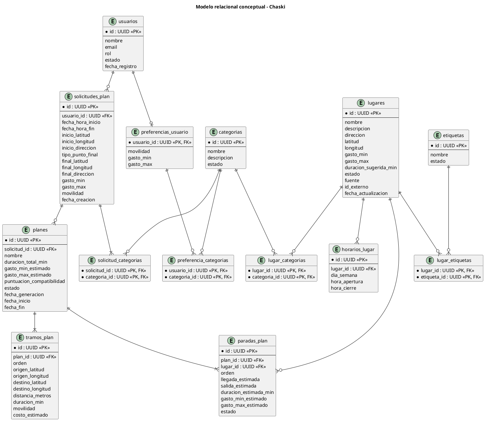

# Modelo de datos — Chaski

## 1. Propósito

Este documento describe el modelo relacional propuesto para la primera versión de Chaski.

El modelo traduce los conceptos definidos en el modelo de dominio a estructuras que posteriormente serán implementadas en PostgreSQL mediante Supabase.

Los objetivos principales del modelo son:

- mantener la integridad de la información;
- representar las relaciones del dominio;
- conservar información histórica de los recorridos;
- evitar redundancia innecesaria;
- facilitar las consultas requeridas por la aplicación;
- servir como base para la implementación de migraciones.

---

# 2. Consideraciones generales

## 2.1. Sistema gestor

La persistencia principal utilizará:

```text
PostgreSQL
```

administrado mediante Supabase.

---

## 2.2. Identificadores

Las entidades principales utilizarán identificadores UUID.

Ejemplo conceptual:

```text
id UUID PRIMARY KEY
```

---

## 2.3. Usuarios y autenticación

La autenticación será gestionada mediante Supabase Auth.

La tabla de dominio:

```text
usuarios
```

almacenará únicamente la información necesaria para el perfil del usuario dentro de Chaski.

No almacenará:

- contraseñas;
- tokens de acceso;
- secretos de autenticación.

Conceptualmente se plantea:

```text
auth.users.id
      │
      │ 1 : 1
      ▼
usuarios.id
```

---

# 3. Tablas

La primera versión contempla **14 tablas**:

| N.º | Tabla | Propósito |
|---:|---|---|
| 1 | `usuarios` | Perfil de usuarios |
| 2 | `preferencias_usuario` | Preferencias generales |
| 3 | `preferencia_categorias` | Categorías preferidas |
| 4 | `solicitudes_plan` | Condiciones de una salida |
| 5 | `solicitud_categorias` | Intereses de una solicitud |
| 6 | `planes` | Alternativas generadas |
| 7 | `paradas_plan` | Paradas de cada plan |
| 8 | `tramos_plan` | Desplazamientos del recorrido |
| 9 | `lugares` | Catálogo de lugares |
| 10 | `horarios_lugar` | Disponibilidad de lugares |
| 11 | `categorias` | Categorías de interés |
| 12 | `lugar_categorias` | Categorías asociadas a lugares |
| 13 | `etiquetas` | Características complementarias |
| 14 | `lugar_etiquetas` | Etiquetas asociadas a lugares |

---

# 4. Usuarios

## 4.1. `usuarios`

Representa el perfil de un usuario de Chaski.

| Campo | Tipo conceptual | Restricción |
|---|---|---|
| `id` | UUID | PK |
| `nombre` | VARCHAR | NOT NULL |
| `email` | VARCHAR | NOT NULL, UNIQUE |
| `rol` | VARCHAR / ENUM | NOT NULL |
| `estado` | BOOLEAN | NOT NULL |
| `fecha_registro` | TIMESTAMP | NOT NULL |

### Valores de rol

```text
USUARIO
ADMIN
```

### Consideraciones

`id` deberá estar relacionado con la identidad correspondiente administrada por Supabase Auth.

---

## 4.2. `preferencias_usuario`

Almacena las preferencias generales del usuario.

| Campo | Tipo conceptual | Restricción |
|---|---|---|
| `usuario_id` | UUID | PK, FK |
| `movilidad` | VARCHAR / ENUM | NULL |
| `gasto_min` | DECIMAL | NULL |
| `gasto_max` | DECIMAL | NULL |

### Relaciones

```text
usuarios
   1
   │
   │ 0..1
   ▼
preferencias_usuario
```

### Restricciones

Cuando ambos valores de gasto existan:

```text
gasto_min >= 0
gasto_max >= 0
gasto_min <= gasto_max
```

---

## 4.3. `preferencia_categorias`

Resuelve la relación muchos a muchos entre preferencias y categorías.

| Campo | Tipo conceptual | Restricción |
|---|---|---|
| `usuario_id` | UUID | PK, FK |
| `categoria_id` | UUID | PK, FK |

### Clave primaria

```text
PRIMARY KEY (
    usuario_id,
    categoria_id
)
```

Esto evita asociar dos veces la misma categoría a las preferencias del usuario.

---

# 5. Solicitudes

## 5.1. `solicitudes_plan`

Representa las condiciones específicas de una salida.

| Campo | Tipo conceptual | Restricción |
|---|---|---|
| `id` | UUID | PK |
| `usuario_id` | UUID | FK, NOT NULL |
| `fecha_hora_inicio` | TIMESTAMP | NOT NULL |
| `fecha_hora_fin` | TIMESTAMP | NOT NULL |
| `inicio_latitud` | DECIMAL | NOT NULL |
| `inicio_longitud` | DECIMAL | NOT NULL |
| `inicio_direccion` | VARCHAR | NULL |
| `tipo_punto_final` | VARCHAR / ENUM | NOT NULL |
| `final_latitud` | DECIMAL | NULL |
| `final_longitud` | DECIMAL | NULL |
| `final_direccion` | VARCHAR | NULL |
| `gasto_min` | DECIMAL | NOT NULL |
| `gasto_max` | DECIMAL | NOT NULL |
| `movilidad` | VARCHAR / ENUM | NOT NULL |
| `fecha_creacion` | TIMESTAMP | NOT NULL |

### Tipo de punto final

```text
REGRESAR_INICIO
ULTIMA_PARADA
OTRA_UBICACION
```

### Restricciones principales

```text
fecha_hora_fin > fecha_hora_inicio

gasto_min >= 0

gasto_max >= gasto_min
```

Cuando:

```text
tipo_punto_final = OTRA_UBICACION
```

deberán existir:

```text
final_latitud
final_longitud
```

---

## 5.2. `solicitud_categorias`

Representa los intereses seleccionados específicamente para una solicitud.

| Campo | Tipo conceptual | Restricción |
|---|---|---|
| `solicitud_id` | UUID | PK, FK |
| `categoria_id` | UUID | PK, FK |

### Clave primaria

```text
PRIMARY KEY (
    solicitud_id,
    categoria_id
)
```

### Regla

Cada solicitud deberá contener entre:

```text
1 y 3 categorías
```

Esta regla deberá controlarse principalmente mediante la lógica de negocio, debido a que depende del número de registros asociados.

---

# 6. Planes

## 6.1. `planes`

Representa una alternativa generada para una solicitud.

| Campo | Tipo conceptual | Restricción |
|---|---|---|
| `id` | UUID | PK |
| `solicitud_id` | UUID | FK, NOT NULL |
| `nombre` | VARCHAR | NOT NULL |
| `duracion_total_min` | INTEGER | NOT NULL |
| `gasto_min_estimado` | DECIMAL | NULL |
| `gasto_max_estimado` | DECIMAL | NULL |
| `puntuacion_compatibilidad` | DECIMAL | NOT NULL |
| `estado` | VARCHAR / ENUM | NOT NULL |
| `fecha_generacion` | TIMESTAMP | NOT NULL |
| `fecha_inicio` | TIMESTAMP | NULL |
| `fecha_fin` | TIMESTAMP | NULL |

### Estados

```text
GENERADO
SELECCIONADO
EN_CURSO
COMPLETADO
CANCELADO
```

### Restricciones

```text
duracion_total_min >= 0

0 <= puntuacion_compatibilidad <= 100
```

Cuando ambos valores económicos sean conocidos:

```text
gasto_min_estimado <= gasto_max_estimado
```

### Cantidad de planes

Una solicitud podrá producir hasta tres planes finales.

Esta restricción corresponde a la lógica de generación y no necesita implementarse como una cardinalidad rígida de la base de datos.

---

# 7. Paradas

## 7.1. `paradas_plan`

Representa las paradas incluidas dentro de un plan.

| Campo | Tipo conceptual | Restricción |
|---|---|---|
| `id` | UUID | PK |
| `plan_id` | UUID | FK, NOT NULL |
| `lugar_id` | UUID | FK, NOT NULL |
| `orden` | INTEGER | NOT NULL |
| `llegada_estimada` | TIMESTAMP | NOT NULL |
| `salida_estimada` | TIMESTAMP | NOT NULL |
| `duracion_estimada_min` | INTEGER | NOT NULL |
| `gasto_min_estimado` | DECIMAL | NULL |
| `gasto_max_estimado` | DECIMAL | NULL |
| `estado` | VARCHAR / ENUM | NOT NULL |

### Estados

```text
PENDIENTE
VISITADA
OMITIDA
```

### Restricciones

El orden debe ser positivo:

```text
orden >= 1
```

Dentro de un mismo plan no podrán existir dos paradas con el mismo orden:

```text
UNIQUE (
    plan_id,
    orden
)
```

Tampoco podrá repetirse el mismo lugar:

```text
UNIQUE (
    plan_id,
    lugar_id
)
```

Además:

```text
salida_estimada >= llegada_estimada
duracion_estimada_min >= 0
```

---

# 8. Tramos

## 8.1. `tramos_plan`

Representa los desplazamientos que componen un recorrido.

| Campo | Tipo conceptual | Restricción |
|---|---|---|
| `id` | UUID | PK |
| `plan_id` | UUID | FK, NOT NULL |
| `orden` | INTEGER | NOT NULL |
| `origen_latitud` | DECIMAL | NOT NULL |
| `origen_longitud` | DECIMAL | NOT NULL |
| `destino_latitud` | DECIMAL | NOT NULL |
| `destino_longitud` | DECIMAL | NOT NULL |
| `distancia_metros` | INTEGER | NOT NULL |
| `duracion_min` | INTEGER | NOT NULL |
| `movilidad` | VARCHAR / ENUM | NOT NULL |
| `costo_estimado` | DECIMAL | NULL |

### Restricciones

```text
orden >= 1

distancia_metros >= 0

duracion_min >= 0
```

Dentro de un mismo plan:

```text
UNIQUE (
    plan_id,
    orden
)
```

### Razón para almacenar coordenadas

No se utilizan únicamente claves hacia `lugares`, debido a que los extremos de un tramo pueden representar:

- punto inicial proporcionado por el usuario;
- lugar registrado;
- punto final personalizado;
- regreso al punto inicial.

Por ello se almacenan los puntos utilizados para el cálculo del tramo.

---

# 9. Lugares

## 9.1. `lugares`

Representa los lugares disponibles para la generación de recorridos.

| Campo | Tipo conceptual | Restricción |
|---|---|---|
| `id` | UUID | PK |
| `nombre` | VARCHAR | NOT NULL |
| `descripcion` | TEXT | NULL |
| `direccion` | VARCHAR | NULL |
| `latitud` | DECIMAL | NOT NULL |
| `longitud` | DECIMAL | NOT NULL |
| `gasto_min` | DECIMAL | NULL |
| `gasto_max` | DECIMAL | NULL |
| `duracion_sugerida_min` | INTEGER | NOT NULL |
| `estado` | VARCHAR / ENUM | NOT NULL |
| `fuente` | VARCHAR | NULL |
| `id_externo` | VARCHAR | NULL |
| `fecha_actualizacion` | TIMESTAMP | NOT NULL |

### Estados

```text
ACTIVO
INACTIVO
```

### Restricciones

```text
duracion_sugerida_min > 0
```

Cuando los costos sean conocidos:

```text
gasto_min >= 0
gasto_max >= gasto_min
```

### Semántica de costos

```text
0    → gratuito
NULL → desconocido
```

Estas dos situaciones no deberán interpretarse de la misma manera.

---

## 9.2. `horarios_lugar`

Representa los intervalos de disponibilidad de un lugar.

| Campo | Tipo conceptual | Restricción |
|---|---|---|
| `id` | UUID | PK |
| `lugar_id` | UUID | FK, NOT NULL |
| `dia_semana` | SMALLINT | NOT NULL |
| `hora_apertura` | TIME | NOT NULL |
| `hora_cierre` | TIME | NOT NULL |

### Día de la semana

Se propone:

```text
1 = lunes
2 = martes
3 = miércoles
4 = jueves
5 = viernes
6 = sábado
7 = domingo
```

### Restricciones

```text
1 <= dia_semana <= 7

hora_apertura < hora_cierre
```

La primera versión no contempla horarios que atraviesen la medianoche.

### Lugar cerrado

No se requiere una columna:

```text
cerrado BOOLEAN
```

Si un lugar no posee un intervalo registrado para determinado día, se considera que no dispone de horario para dicho día.

---

# 10. Categorías

## 10.1. `categorias`

Representa los intereses generales utilizados para clasificar lugares y configurar solicitudes.

| Campo | Tipo conceptual | Restricción |
|---|---|---|
| `id` | UUID | PK |
| `nombre` | VARCHAR | UNIQUE, NOT NULL |
| `descripcion` | TEXT | NULL |
| `estado` | BOOLEAN | NOT NULL |

---

## 10.2. `lugar_categorias`

Resuelve la relación muchos a muchos entre lugares y categorías.

| Campo | Tipo conceptual | Restricción |
|---|---|---|
| `lugar_id` | UUID | PK, FK |
| `categoria_id` | UUID | PK, FK |

### Clave primaria

```text
PRIMARY KEY (
    lugar_id,
    categoria_id
)
```

---

# 11. Etiquetas

## 11.1. `etiquetas`

Representa características complementarias asociadas a los lugares.

| Campo | Tipo conceptual | Restricción |
|---|---|---|
| `id` | UUID | PK |
| `nombre` | VARCHAR | UNIQUE, NOT NULL |
| `estado` | BOOLEAN | NOT NULL |

---

## 11.2. `lugar_etiquetas`

Resuelve la relación muchos a muchos entre lugares y etiquetas.

| Campo | Tipo conceptual | Restricción |
|---|---|---|
| `lugar_id` | UUID | PK, FK |
| `etiqueta_id` | UUID | PK, FK |

### Clave primaria

```text
PRIMARY KEY (
    lugar_id,
    etiqueta_id
)
```

---

# 12. Relaciones principales

```text
usuarios
    │
    ├── preferencias_usuario
    │       │
    │       └── preferencia_categorias
    │                    │
    │                    ▼
    │                categorias
    │
    └── solicitudes_plan
            │
            ├── solicitud_categorias
            │          │
            │          ▼
            │      categorias
            │
            └── planes
                  │
                  ├── paradas_plan ─── lugares
                  │
                  └── tramos_plan

lugares
    │
    ├── horarios_lugar
    │
    ├── lugar_categorias ─── categorias
    │
    └── lugar_etiquetas ─── etiquetas
```

---

# 13. Política de eliminación

No todas las relaciones utilizarán la misma estrategia de eliminación.

## CASCADE

Podrá utilizarse cuando el registro dependiente no tenga sentido sin su entidad principal.

Ejemplos:

```text
preferencias_usuario
preferencia_categorias
solicitud_categorias
horarios_lugar
lugar_categorias
lugar_etiquetas
```

## RESTRICT

Se priorizará cuando eliminar un registro pueda afectar información histórica.

Especialmente:

```text
planes
paradas_plan
lugares utilizados históricamente
```

## Desactivación lógica

Para elementos como:

```text
usuarios
lugares
categorias
etiquetas
```

se priorizará la desactivación sobre la eliminación física cuando sea necesario conservar referencias históricas.

La estrategia exacta `ON DELETE` será definida durante la implementación de las migraciones.

---

# 14. Integridad histórica y desnormalización controlada

El modelo busca mantenerse normalizado, pero existen datos que se almacenan intencionalmente como una fotografía del momento de generación.

## Plan

Conserva:

```text
duracion_total_min
gasto_min_estimado
gasto_max_estimado
puntuacion_compatibilidad
```

## ParadaPlan

Conserva:

```text
llegada_estimada
salida_estimada
duracion_estimada_min
gasto_min_estimado
gasto_max_estimado
```

## TramoPlan

Conserva:

```text
origen
destino
distancia
duracion
movilidad
costo
```

Esto permite que modificaciones posteriores sobre:

```text
lugares
horarios
costos
duraciones
```

no alteren la información correspondiente a un plan generado anteriormente.

Esta decisión corresponde a una **desnormalización controlada orientada a preservar información histórica**.

---

# 15. Índices previstos

Además de las claves primarias y restricciones `UNIQUE`, durante la implementación deberán evaluarse índices sobre campos utilizados frecuentemente en consultas.

Entre los principales candidatos se encuentran:

```text
solicitudes_plan.usuario_id
planes.solicitud_id
planes.estado
paradas_plan.plan_id
paradas_plan.lugar_id
tramos_plan.plan_id
horarios_lugar.lugar_id
lugar_categorias.categoria_id
lugar_etiquetas.etiqueta_id
```

Los índices definitivos deberán definirse según las consultas reales implementadas.

---

# 16. Seguridad de datos

El acceso a la información deberá considerar políticas de Row Level Security (RLS) cuando corresponda.

Como principio general:

```text
Usuario autenticado
        │
        ├── sus preferencias
        ├── sus solicitudes
        ├── sus planes
        └── su historial
```

Un usuario normal no deberá acceder a información privada perteneciente a otro usuario.

El catálogo de lugares y categorías podrá utilizar políticas diferentes según las operaciones de lectura y administración requeridas.

Los permisos administrativos deberán restringirse a usuarios con el rol correspondiente.

Las políticas concretas se definirán durante la implementación de la base de datos.

---

# 17. Diagrama entidad-relación conceptual



---

# 18. Modelo conceptual vs. implementación física

Este documento no constituye todavía el script definitivo de creación de la base de datos.

Durante la implementación deberán definirse de manera concreta:

- tipos PostgreSQL;
- `CHECK`;
- `UNIQUE`;
- claves foráneas;
- acciones `ON DELETE`;
- valores por defecto;
- índices;
- políticas RLS;
- funciones o procedimientos necesarios;
- migraciones;
- datos iniciales.

Por ejemplo:

```text
Modelo actual

estado : EstadoPlan
```

podrá convertirse posteriormente en:

```sql
CREATE TYPE estado_plan AS ENUM (
    'GENERADO',
    'SELECCIONADO',
    'EN_CURSO',
    'COMPLETADO',
    'CANCELADO'
);
```

La decisión física deberá quedar registrada en las migraciones correspondientes.

---

# 19. Documentos relacionados

- [Modelo de dominio](./modelo-dominio.md)
- [Casos de uso](./casos-uso.md)
- [Reglas de negocio](../02-requisitos/reglas-negocio.md)
- [Requisitos funcionales](../02-requisitos/requisitos-funcionales.md)
- [Arquitectura general](../04-arquitectura/arquitectura-general.md)