# Modelo de datos — Chaski

## 1. Propósito

Este documento describe el modelo relacional propuesto para la primera versión de Chaski.

El modelo traduce los conceptos definidos en el modelo de dominio a estructuras implementadas en PostgreSQL mediante Supabase.

---

## 2. Visión general

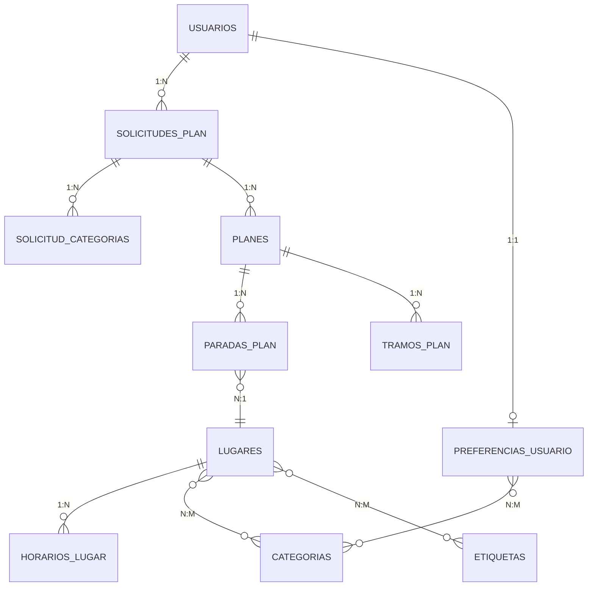
```mermaid
erDiagram
    USUARIOS ||--o{ SOLICITUDES_PLAN : "1:N"
    USUARIOS ||--o| PREFERENCIAS_USUARIO : "1:1"
    PREFERENCIAS_USUARIO }o--o{ CATEGORIAS : "N:M"

    SOLICITUDES_PLAN ||--o{ SOLICITUD_CATEGORIAS : "1:N"
    SOLICITUDES_PLAN ||--o{ PLANES : "1:N"

    PLANES ||--o{ PARADAS_PLAN : "1:N"
    PLANES ||--o{ TRAMOS_PLAN : "1:N"

    PARADAS_PLAN }o--|| LUGARES : "N:1"
    LUGARES ||--o{ HORARIOS_LUGAR : "1:N"
    LUGARES }o--o{ CATEGORIAS : "N:M"
    LUGARES }o--o{ ETIQUETAS : "N:M"
```

---

## 3. Tablas del sistema

La primera versión contempla **14 tablas**:

| N.º | Tabla | Propósito |
|---:|---|---|
| 1 | `usuarios` | Perfil de usuarios |
| 2 | `preferencias_usuario` | Preferencias generales |
| 3 | `preferencia_categorias` | Categorías preferidas |
| 4 | `solicitudes_plan` | Condiciones de una salida |
| 5 | `solicitud_categorias` | Intereses de una solicitud |
| 6 | `planes` | Alternativas generadas |
| 7 | `paradas_plan` | Paradas de cada plan |
| 8 | `tramos_plan` | Desplazamientos del recorrido |
| 9 | `lugares` | Catálogo de lugares |
| 10 | `horarios_lugar` | Disponibilidad de lugares |
| 11 | `categorias` | Categorías de interés |
| 12 | `lugar_categorias` | Categorías asociadas a lugares |
| 13 | `etiquetas` | Características complementarias |
| 14 | `lugar_etiquetas` | Etiquetas asociadas a lugares |

---

## 4. Gestión de usuarios

### 4.1. `usuarios`

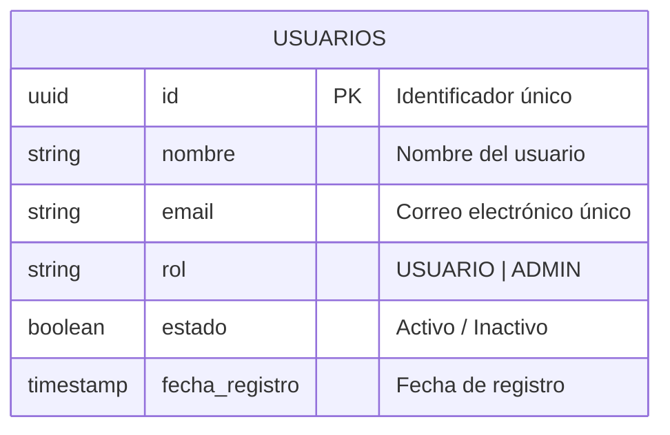
```mermaid
erDiagram
    USUARIOS {
        uuid id PK "Identificador único"
        string nombre "Nombre del usuario"
        string email "Correo electrónico único"
        string rol "USUARIO | ADMIN"
        boolean estado "Activo / Inactivo"
        timestamp fecha_registro "Fecha de registro"
    }
```

#### Roles

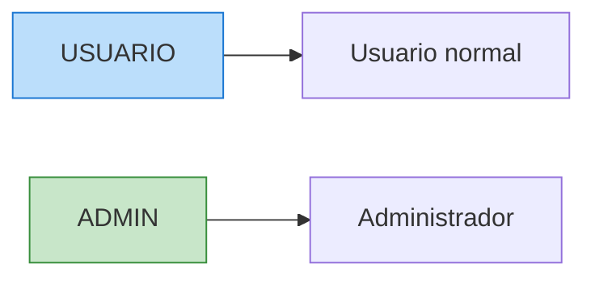
```mermaid
graph LR
    A["USUARIO"] --> B["Usuario normal"]
    C["ADMIN"] --> D["Administrador"]

    style A fill:#bbdefb,stroke:#1976d2
    style C fill:#c8e6c9,stroke:#388e3c
```

### 4.2. `preferencias_usuario`

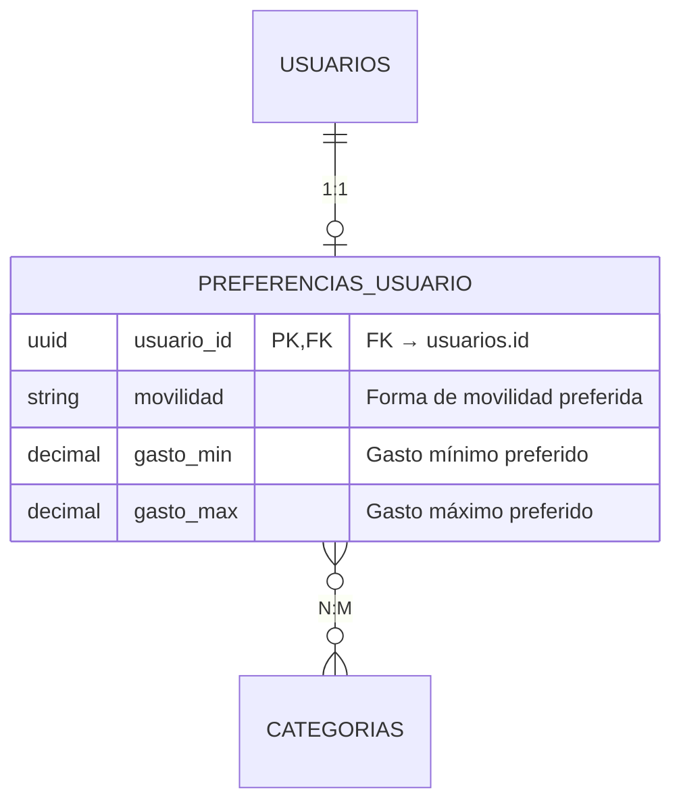
```mermaid
erDiagram
    USUARIOS ||--o| PREFERENCIAS_USUARIO : "1:1"
    PREFERENCIAS_USUARIO }o--o{ CATEGORIAS : "N:M"

    PREFERENCIAS_USUARIO {
        uuid usuario_id PK, FK "FK → usuarios.id"
        string movilidad "Forma de movilidad preferida"
        decimal gasto_min "Gasto mínimo preferido"
        decimal gasto_max "Gasto máximo preferido"
    }
```

### 4.3. Relación con autenticación

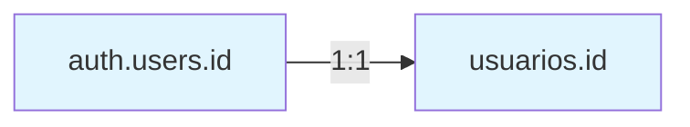
```mermaid
graph LR
    A["auth.users.id"] -->|"1:1"| B["usuarios.id"]

    style A fill:#e1f5fe
    style B fill:#e1f5fe
```

> La identidad y autenticación (`auth.users`) se mantiene separada de la información del dominio (`usuarios`).

---

## 5. Solicitudes de planificación

### 5.1. `solicitudes_plan`

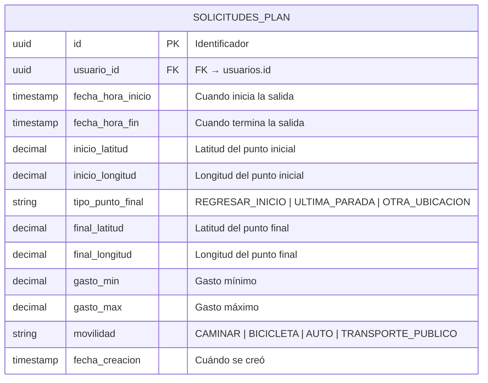
```mermaid
erDiagram
    SOLICITUDES_PLAN {
        uuid id PK "Identificador"
        uuid usuario_id FK "FK → usuarios.id"
        timestamp fecha_hora_inicio "Cuando inicia la salida"
        timestamp fecha_hora_fin "Cuando termina la salida"
        decimal inicio_latitud "Latitud del punto inicial"
        decimal inicio_longitud "Longitud del punto inicial"
        string tipo_punto_final "REGRESAR_INICIO | ULTIMA_PARADA | OTRA_UBICACION"
        decimal final_latitud "Latitud del punto final"
        decimal final_longitud "Longitud del punto final"
        decimal gasto_min "Gasto mínimo"
        decimal gasto_max "Gasto máximo"
        string movilidad "CAMINAR | BICICLETA | AUTO | TRANSPORTE_PUBLICO"
        timestamp fecha_creacion "Cuándo se creó"
    }
```

### 5.2. Tipos de punto final

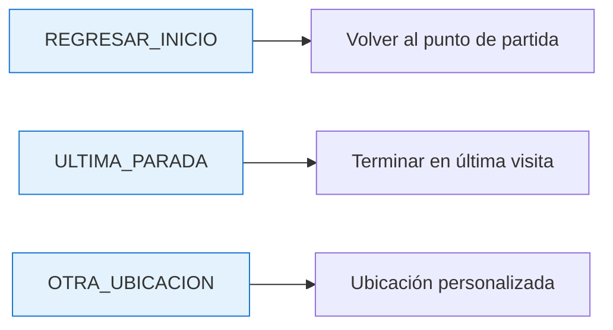
```mermaid
flowchart LR
    A["REGRESAR_INICIO"] --> B["Volver al punto de partida"]
    C["ULTIMA_PARADA"] --> D["Terminar en última visita"]
    E["OTRA_UBICACION"] --> F["Ubicación personalizada"]

    style A fill:#e3f2fd,stroke:#1976d2
    style C fill:#e3f2fd,stroke:#1976d2
    style E fill:#e3f2fd,stroke:#1976d2
```

### 5.3. `solicitud_categorias`

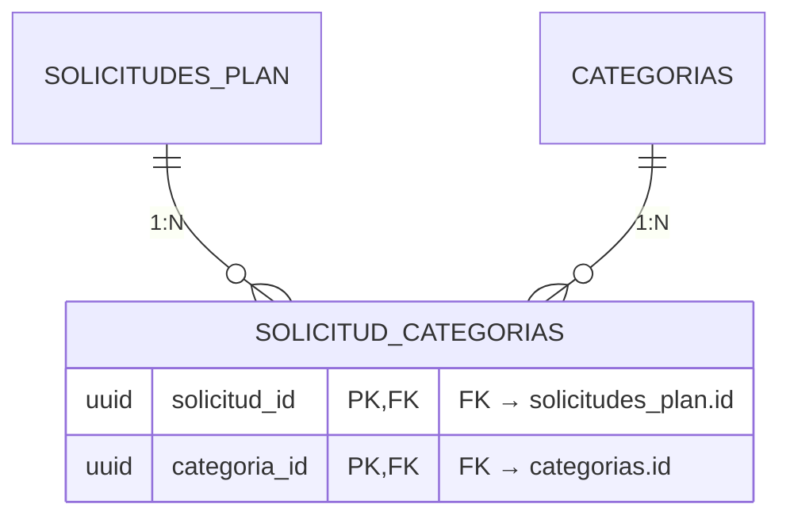
```mermaid
erDiagram
    SOLICITUDES_PLAN ||--o{ SOLICITUD_CATEGORIAS : "1:N"
    CATEGORIAS ||--o{ SOLICITUD_CATEGORIAS : "1:N"

    SOLICITUD_CATEGORIAS {
        uuid solicitud_id PK, FK "FK → solicitudes_plan.id"
        uuid categoria_id PK, FK "FK → categorias.id"
    }
```

---

## 6. Planes generados

### 6.1. `planes`

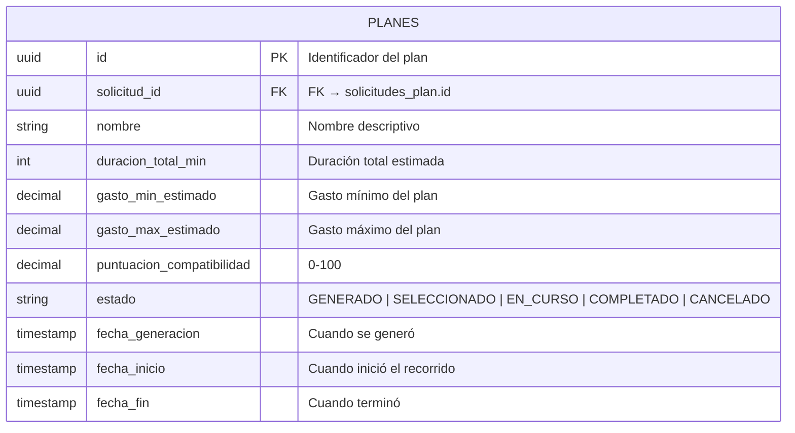
```mermaid
erDiagram
    PLANES {
        uuid id PK "Identificador del plan"
        uuid solicitud_id FK "FK → solicitudes_plan.id"
        string nombre "Nombre descriptivo"
        int duracion_total_min "Duración total estimada"
        decimal gasto_min_estimado "Gasto mínimo del plan"
        decimal gasto_max_estimado "Gasto máximo del plan"
        decimal puntuacion_compatibilidad "0-100"
        string estado "GENERADO | SELECCIONADO | EN_CURSO | COMPLETADO | CANCELADO"
        timestamp fecha_generacion "Cuando se generó"
        timestamp fecha_inicio "Cuando inició el recorrido"
        timestamp fecha_fin "Cuando terminó"
    }
```

### 6.2. Estados del plan

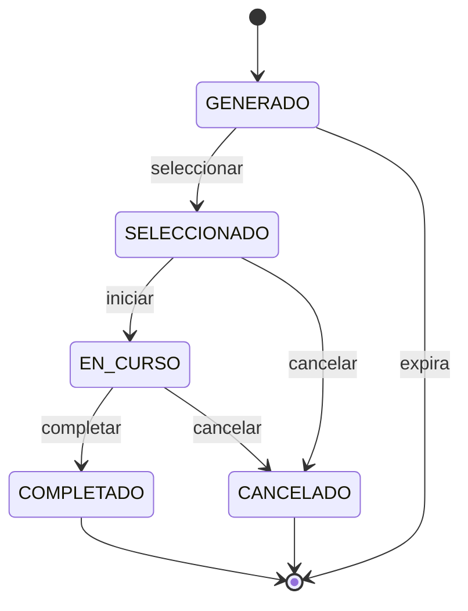
```mermaid
stateDiagram-v2
    [*] --> GENERADO
    GENERADO --> SELECCIONADO : seleccionar
    GENERADO --> [*] : expira

    SELECCIONADO --> EN_CURSO : iniciar
    SELECCIONADO --> CANCELADO : cancelar

    EN_CURSO --> COMPLETADO : completar
    EN_CURSO --> CANCELADO : cancelar

    COMPLETADO --> [*]
    CANCELADO --> [*]
```

---

## 7. Paradas y tramos

### 7.1. `paradas_plan`

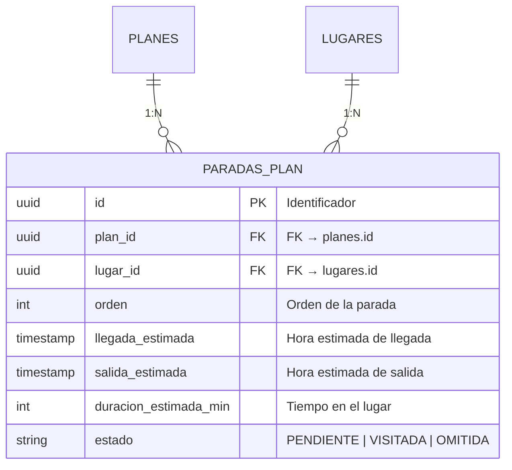
```mermaid
erDiagram
    PLANES ||--o{ PARADAS_PLAN : "1:N"
    LUGARES ||--o{ PARADAS_PLAN : "1:N"

    PARADAS_PLAN {
        uuid id PK "Identificador"
        uuid plan_id FK "FK → planes.id"
        uuid lugar_id FK "FK → lugares.id"
        int orden "Orden de la parada"
        timestamp llegada_estimada "Hora estimada de llegada"
        timestamp salida_estimada "Hora estimada de salida"
        int duracion_estimada_min "Tiempo en el lugar"
        string estado "PENDIENTE | VISITADA | OMITIDA"
    }
```

### 7.2. Estados de las paradas

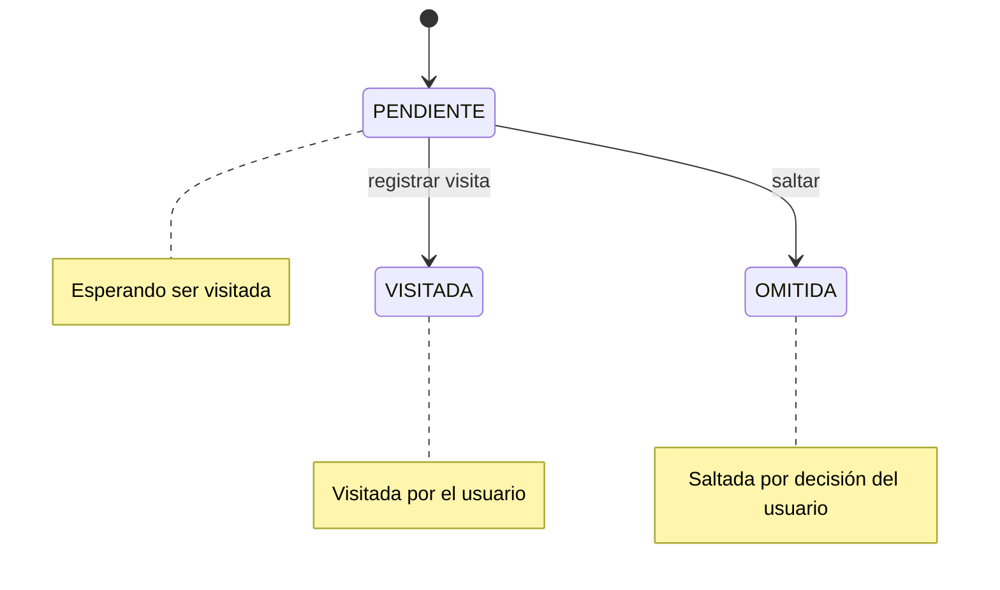
```mermaid
stateDiagram-v2
    [*] --> PENDIENTE
    PENDIENTE --> VISITADA : registrar visita
    PENDIENTE --> OMITIDA : saltar

    note right of PENDIENTE : Esperando ser visitada
    note right of VISITADA : Visitada por el usuario
    note right of OMITIDA : Saltada por decisión del usuario
```

### 7.3. `tramos_plan`

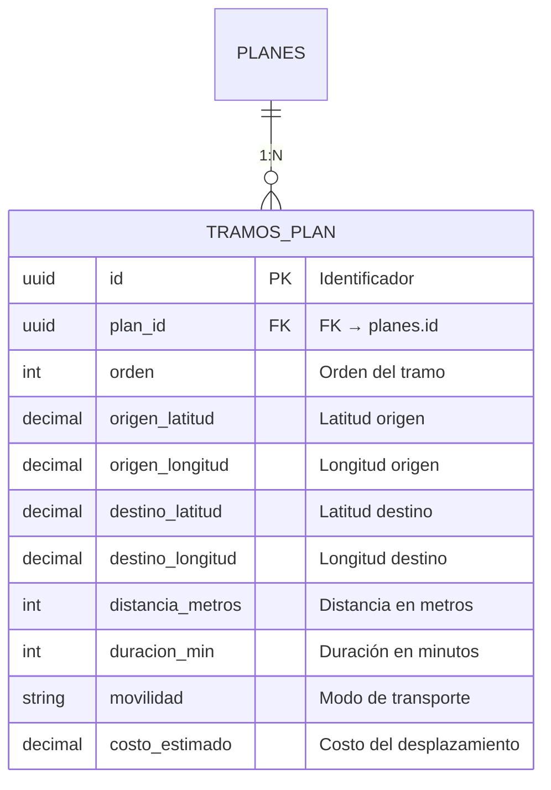
```mermaid
erDiagram
    PLANES ||--o{ TRAMOS_PLAN : "1:N"

    TRAMOS_PLAN {
        uuid id PK "Identificador"
        uuid plan_id FK "FK → planes.id"
        int orden "Orden del tramo"
        decimal origen_latitud "Latitud origen"
        decimal origen_longitud "Longitud origen"
        decimal destino_latitud "Latitud destino"
        decimal destino_longitud "Longitud destino"
        int distancia_metros "Distancia en metros"
        int duracion_min "Duración en minutos"
        string movilidad "Modo de transporte"
        decimal costo_estimado "Costo del desplazamiento"
    }
```

> Los tramos almacenan coordenadas porque los extremos pueden ser: punto inicial, lugar, punto final personalizado o regreso al inicio.

---

## 8. Catálogo de lugares

### 8.1. `lugares`

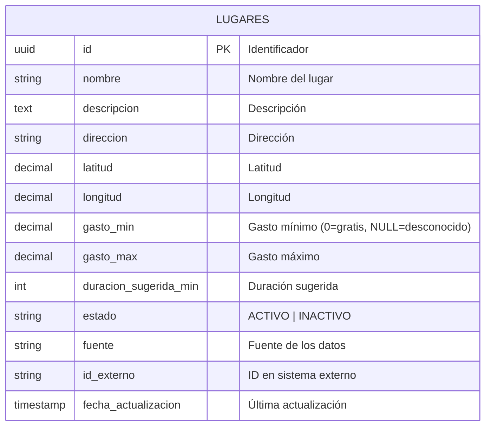
```mermaid
erDiagram
    LUGARES {
        uuid id PK "Identificador"
        string nombre "Nombre del lugar"
        text descripcion "Descripción"
        string direccion "Dirección"
        decimal latitud "Latitud"
        decimal longitud "Longitud"
        decimal gasto_min "Gasto mínimo (0=gratis, NULL=desconocido)"
        decimal gasto_max "Gasto máximo"
        int duracion_sugerida_min "Duración sugerida"
        string estado "ACTIVO | INACTIVO"
        string fuente "Fuente de los datos"
        string id_externo "ID en sistema externo"
        timestamp fecha_actualizacion "Última actualización"
    }
```

### 8.2. Semántica de costos

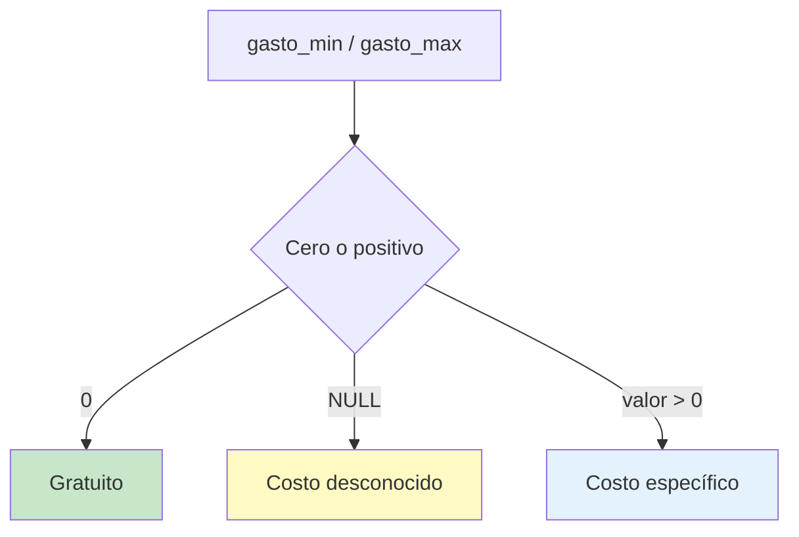
```mermaid
flowchart TB
    A["gasto_min / gasto_max"] --> B{Cero o positivo}

    B -->|0| C["Gratuito"]
    B -->|NULL| D["Costo desconocido"]
    B -->|valor > 0| E["Costo específico"]

    style C fill:#c8e6c9
    style D fill:#fff9c4
    style E fill:#e3f2fd
```

> **Importante**: `0` significa gratuito. `NULL` significa costo desconocido. Son semanticamente diferentes y no deben tratarse igual.

### 8.3. `horarios_lugar`

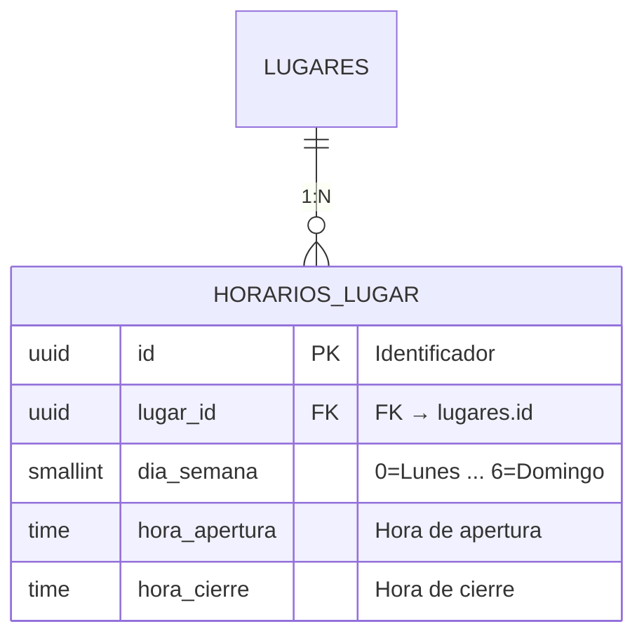
```mermaid
erDiagram
    LUGARES ||--o{ HORARIOS_LUGAR : "1:N"

    HORARIOS_LUGAR {
        uuid id PK "Identificador"
        uuid lugar_id FK "FK → lugares.id"
        smallint dia_semana "0=Lunes ... 6=Domingo"
        time hora_apertura "Hora de apertura"
        time hora_cierre "Hora de cierre"
    }
```

### 8.4. Categorías y etiquetas

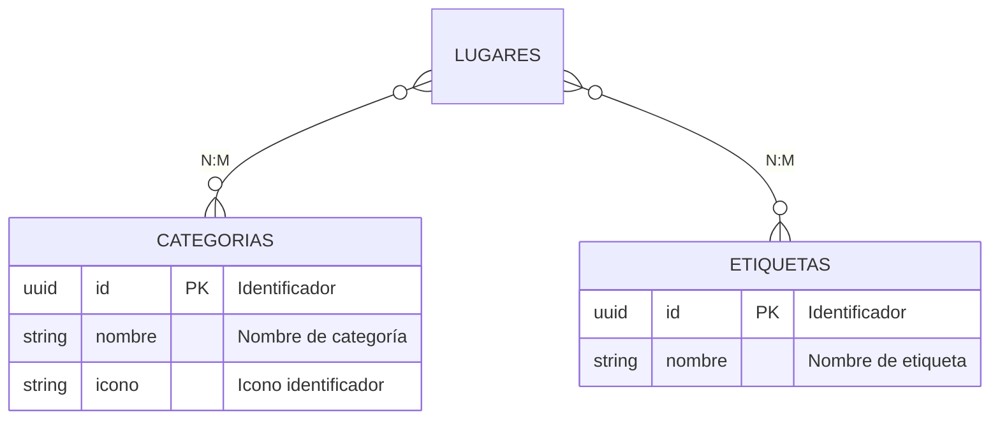
```mermaid
erDiagram
    LUGARES }o--o{ CATEGORIAS : "N:M"
    LUGARES }o--o{ ETIQUETAS : "N:M"

    CATEGORIAS {
        uuid id PK "Identificador"
        string nombre "Nombre de categoría"
        string icono "Icono identificador"
    }

    ETIQUETAS {
        uuid id PK "Identificador"
        string nombre "Nombre de etiqueta"
    }
```

---

## 9. Restricciones principales

### 9.1. Restricciones de tiempo

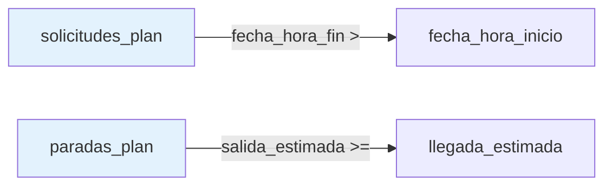
```mermaid
flowchart LR
    A["solicitudes_plan"] -->|fecha_hora_fin >| B["fecha_hora_inicio"]
    C["paradas_plan"] -->|salida_estimada >=| D["llegada_estimada"]

    style A fill:#e3f2fd
    style C fill:#e3f2fd
```

### 9.2. Restricciones de gasto

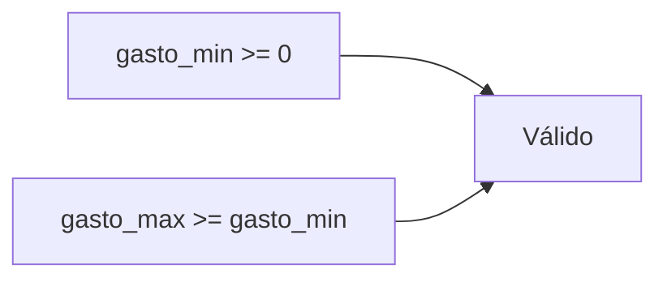
```mermaid
flowchart LR
    A["gasto_min >= 0"]
    B["gasto_max >= gasto_min"]

    A --> C["Válido"]
    B --> C
```

### 9.3. Restricciones de orden

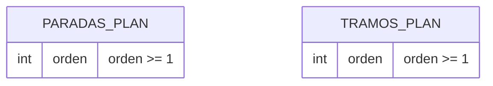
```mermaid
erDiagram
    PARADAS_PLAN {
        int orden "orden >= 1"
    }
    TRAMOS_PLAN {
        int orden "orden >= 1"
    }
```

- No puede haber dos paradas con el mismo orden dentro de un plan.
- No puede haber dos tramos con el mismo orden dentro de un plan.
- No puede haber dos paradas del mismo lugar dentro de un plan.

---

## 10. Row Level Security

```mermaid
graph TB
    subgraph UserA["👤 Usuario A"]
        PA["Preferencias A"]
        SA["Solicitudes A"]
        PLA["Planes A"]
        HA["Historial A"]
    end

    subgraph UserB["👤 Usuario B"]
        PB["Preferencias B"]
        SB["Solicitudes B"]
        PLB["Planes B"]
        HB["Historial B"]
    end

    PA -.->|"Solo propio"| RLS_A
    SA -.->|"Solo propio"| RLS_A
    PLA -.->|"Solo propio"| RLS_A
    HA -.->|"Solo propio"| RLS_A

    PB -.x|"Bloqueado"| RLS_B
    SB -.x|"Bloqueado"| RLS_B
    PLB -.x|"Bloqueado"| RLS_B
    HB -.x|"Bloqueado"| RLS_B

    LU["Lugares"] -.->|"Lectura libre"| RLS_CAT
    CA["Categorías"] -.->|"Lectura libre"| RLS_CAT
    ET["Etiquetas"] -.->|"Solo admin"| RLS_CAT

    style RLS_A fill:#c8e6c9,stroke:#388e3c
    style RLS_B fill:#ffcdd2,stroke:#d32f2f
    style RLS_CAT fill:#fff9c4,stroke:#f9a825
```

> El acceso a los datos de un usuario está restringido por políticas de fila en PostgreSQL (RLS).

---

## 11. Índice de tablas

```mermaid
flowchart TB
    subgraph Usuarios["Usuarios"]
        U["usuarios"]
        PU["preferencias_usuario"]
        PC["preferencia_categorias"]
    end

    subgraph Solicitudes["Solicitudes"]
        SP["solicitudes_plan"]
        SC["solicitud_categorias"]
    end

    subgraph Planes["Planes"]
        PL["planes"]
        PPA["paradas_plan"]
        TP["tramos_plan"]
    end

    subgraph Catalogo["Catálogo"]
        L["lugares"]
        HL["horarios_lugar"]
        CA["categorias"]
        LC["lugar_categorias"]
        ET["etiquetas"]
        LE["lugar_etiquetas"]
    end

    U --> PU
    U --> SP
    PU --> PC
    SP --> SC
    SP --> PL
    PL --> PPA
    PL --> TP
    PPA --> L
    L --> HL
    L --> LC
    L --> LE
    LC --> CA
    LE --> ET

    style Usuarios fill:#e1f5fe
    style Solicitudes fill:#e8f5e9
    style Planes fill:#fff3e0
    style Catalogo fill:#f3e5f5
```
