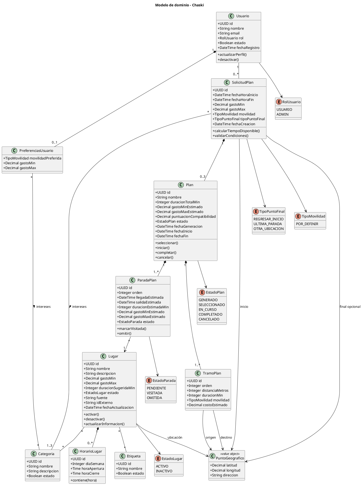

# Modelo de dominio — Chaski

## 1. Propósito

Este documento describe el modelo de dominio de Chaski.

El modelo representa los principales conceptos del negocio, sus atributos relevantes, relaciones y comportamientos.

No incluye componentes técnicos de infraestructura, persistencia, servicios externos o implementación del algoritmo de generación.

---

# 2. Vista general

El dominio principal de Chaski puede resumirse de la siguiente manera:

```text
Usuario
   │
   ├── PreferenciasUsuario
   │
   └── SolicitudPlan
            │
            └── Plan
                 │
                 ├── ParadaPlan ─── Lugar
                 │
                 └── TramoPlan

Lugar
   ├── HorarioLugar
   ├── Categoria
   └── Etiqueta
```

Adicionalmente, diferentes elementos del dominio utilizan el concepto de:

```text
PuntoGeografico
```

para representar ubicaciones mediante coordenadas y una descripción opcional.

---

# 3. Entidades y objetos de valor

## 3.1. Usuario

Representa a una persona registrada en Chaski.

### Atributos principales

- id
- nombre
- correo electrónico
- rol
- estado
- fecha de registro

### Responsabilidades

- mantener su información de perfil;
- gestionar sus preferencias;
- crear solicitudes de planificación;
- seleccionar y realizar recorridos.

### Comportamientos conceptuales

```text
actualizarPerfil()
desactivar()
```

La autenticación, contraseñas y tokens no forman parte del dominio de `Usuario`, debido a que serán gestionados por el servicio de autenticación utilizado por la aplicación.

---

## 3.2. PreferenciasUsuario

Representa las preferencias generales almacenadas por un usuario.

### Atributos principales

- forma de movilidad preferida
- rango de gasto mínimo
- rango de gasto máximo

### Relaciones

Una preferencia puede asociarse con múltiples categorías de interés.

### Consideración

Las preferencias generales actúan como valores iniciales o habituales.

Las condiciones proporcionadas en una solicitud específica tienen prioridad sobre ellas.

---

## 3.3. SolicitudPlan

Representa las condiciones proporcionadas por el usuario para generar alternativas de recorrido.

### Atributos principales

- id
- fecha y hora de inicio
- fecha y hora de finalización
- punto inicial
- tipo de punto final
- punto final, cuando corresponda
- rango de gasto mínimo
- rango de gasto máximo
- forma de movilidad
- fecha de creación

### Relaciones

Una solicitud:

- pertenece a un usuario;
- contiene entre una y tres categorías de interés;
- puede producir hasta tres planes finales.

### Comportamientos conceptuales

```text
calcularTiempoDisponible()
validarCondiciones()
```

### Reglas principales

- la fecha y hora final debe ser posterior a la inicial;
- debe contener entre una y tres categorías;
- el rango de gasto debe ser válido;
- debe incluir una forma de movilidad;
- debe incluir un punto inicial;
- cuando el tipo de final sea otra ubicación, debe incluir un punto final.

---

## 3.4. PuntoGeografico

`PuntoGeografico` es un objeto de valor utilizado para representar una ubicación.

### Atributos

- latitud
- longitud
- dirección o descripción opcional

### Uso

Puede ser utilizado por:

- `SolicitudPlan`;
- `Lugar`;
- `TramoPlan`.

### Consideración

`PuntoGeografico` no requiere una entidad o tabla independiente en la primera versión.

Su valor se encuentra determinado por sus coordenadas y datos asociados.

---

## 3.5. Plan

Representa una alternativa de recorrido generada a partir de una solicitud.

### Atributos principales

- id
- nombre
- duración total estimada
- gasto mínimo estimado
- gasto máximo estimado
- puntuación de compatibilidad
- estado
- fecha de generación
- fecha de inicio, cuando corresponda
- fecha de finalización, cuando corresponda

### Estados

```text
GENERADO
SELECCIONADO
EN_CURSO
COMPLETADO
CANCELADO
```

### Transiciones principales

```text
GENERADO
    │
    ▼
SELECCIONADO
    │
    ▼
EN_CURSO
    │
    ▼
COMPLETADO
```

También se permite:

```text
SELECCIONADO ─────→ CANCELADO

EN_CURSO ─────────→ CANCELADO
```

### Comportamientos conceptuales

```text
seleccionar()
iniciar()
completar()
cancelar()
```

### Consideración

Los estados `COMPLETADO` y `CANCELADO` son terminales durante la primera versión.

---

## 3.6. ParadaPlan

Representa una actividad o lugar incluido dentro de un plan.

### Atributos principales

- id
- orden
- hora estimada de llegada
- hora estimada de salida
- duración estimada
- gasto mínimo estimado
- gasto máximo estimado
- estado

### Estados

```text
PENDIENTE
VISITADA
OMITIDA
```

### Relaciones

Cada parada:

- pertenece a un plan;
- referencia a un lugar.

### Comportamientos conceptuales

```text
marcarVisitada()
omitir()
```

### Reglas principales

- toda parada inicia como `PENDIENTE`;
- una parada pendiente puede pasar a `VISITADA`;
- una parada pendiente puede pasar a `OMITIDA`;
- `VISITADA` y `OMITIDA` son estados terminales en la primera versión;
- un mismo lugar no puede aparecer dos veces dentro del mismo plan.

---

## 3.7. TramoPlan

Representa un desplazamiento entre dos puntos consecutivos de un recorrido.

### Atributos principales

- id
- orden
- punto de origen
- punto de destino
- distancia estimada
- duración estimada
- forma de movilidad
- costo estimado, cuando se encuentre disponible

### Consideración

Los extremos de un tramo no se modelan necesariamente como relaciones directas entre dos lugares.

Esto permite representar también:

```text
inicio → primera parada

parada → parada

última parada → punto final
```

El punto inicial y el punto final personalizado pueden no corresponder a lugares registrados dentro del catálogo.

---

## 3.8. Lugar

Representa una ubicación disponible para ser considerada durante la generación de recorridos.

### Atributos principales

- id
- nombre
- descripción
- punto geográfico
- gasto mínimo estimado
- gasto máximo estimado
- duración sugerida
- estado
- fuente de información
- identificador externo, cuando corresponda
- fecha de actualización

### Estados

```text
ACTIVO
INACTIVO
```

### Relaciones

Un lugar:

- puede contener varios horarios;
- puede pertenecer a varias categorías;
- puede contener varias etiquetas;
- puede ser utilizado por múltiples paradas de diferentes planes.

### Comportamientos conceptuales

```text
activar()
desactivar()
actualizarInformacion()
```

### Consideración histórica

Desactivar un lugar no elimina las referencias existentes dentro de planes generados previamente.

---

## 3.9. HorarioLugar

Representa un intervalo de atención o disponibilidad de un lugar.

### Atributos principales

- id
- día de la semana
- hora de apertura
- hora de cierre

### Comportamiento conceptual

```text
contiene(hora)
```

### Consideraciones

Un lugar podrá tener:

- cero o más horarios;
- múltiples intervalos en un mismo día cuando sea necesario.

Para la primera versión no se contempla el manejo de intervalos que atraviesen la medianoche.

Cuando un lugar no tenga un horario registrado para determinado día, se considerará no disponible durante dicho día.

---

## 3.10. Categoria

Representa un interés general que puede ser seleccionado por los usuarios y asociado a los lugares.

### Atributos principales

- id
- nombre
- descripción
- estado

### Ejemplos

- Gastronomía
- Cultura
- Entretenimiento
- Naturaleza

### Relaciones

Una categoría puede:

- estar asociada a múltiples lugares;
- formar parte de las preferencias de múltiples usuarios;
- ser seleccionada en múltiples solicitudes.

---

## 3.11. Etiqueta

Representa una característica complementaria utilizada para describir lugares.

### Atributos principales

- id
- nombre
- estado

### Ejemplos

- al aire libre
- gratuito
- familiar
- mirador

### Consideración

Las etiquetas complementan la información de un lugar, pero no sustituyen a las categorías utilizadas como intereses principales durante la generación.

---

# 4. Relaciones del modelo

Las principales relaciones son:

| Entidad origen | Relación | Entidad destino |
|---|---|---|
| Usuario | 1 — 0..1 | PreferenciasUsuario |
| Usuario | 1 — 0..* | SolicitudPlan |
| PreferenciasUsuario | * — * | Categoria |
| SolicitudPlan | * — 1..3 | Categoria |
| SolicitudPlan | 1 — 0..3 | Plan |
| Plan | 1 — 1..* | ParadaPlan |
| Plan | 1 — 1..* | TramoPlan |
| ParadaPlan | * — 1 | Lugar |
| Lugar | 1 — 0..* | HorarioLugar |
| Lugar | * — * | Categoria |
| Lugar | * — * | Etiqueta |

---

# 5. Composición y asociación

## Plan y sus componentes

`ParadaPlan` y `TramoPlan` forman parte de la estructura de un plan.

Por ello, se consideran relaciones de composición:

```text
Plan
 ◆── ParadaPlan

Plan
 ◆── TramoPlan
```

Una parada o tramo no tiene sentido funcional independiente del plan al que pertenece.

---

## Lugar y HorarioLugar

Los horarios dependen del lugar al que pertenecen.

Por ello puede representarse como:

```text
Lugar
 ◆── HorarioLugar
```

---

## ParadaPlan y Lugar

Una parada utiliza un lugar existente, pero el lugar puede existir independientemente del plan.

Por ello corresponde a una asociación:

```text
ParadaPlan
 ───→ Lugar
```

y no a composición.

---

# 6. Límite de paradas

El modelo de dominio no establece una cardinalidad máxima fija de cuatro paradas.

La relación se representa como:

```text
Plan 1 ─── 1..* ParadaPlan
```

La versión inicial del algoritmo podrá utilizar:

```text
MAX_STOPS = 4
```

como parámetro configurable para limitar la complejidad de la generación.

Por tanto:

> El máximo de cuatro paradas corresponde a una decisión de implementación del generador y no a una restricción estructural del modelo de dominio.

---

# 7. Valores históricos

Algunos datos se almacenarán dentro del plan o sus componentes como valores estimados del momento de generación.

Por ejemplo:

```text
Lugar actual
Duración sugerida: 120 min
Costo: S/ 20

Plan generado anteriormente
Duración estimada: 90 min
Costo estimado: S/ 15
```

El plan anterior deberá conservar los valores utilizados cuando fue generado.

Por ello `ParadaPlan` podrá mantener copias controladas de:

- duración estimada;
- gasto estimado;
- hora de llegada;
- hora de salida.

Asimismo, `TramoPlan` conservará:

- distancia;
- duración estimada;
- costo cuando corresponda;
- origen y destino utilizados.

Esta duplicación es intencional y tiene como objetivo preservar la información histórica del recorrido.

---

# 8. Elementos que no forman parte del modelo

No se crearán entidades de dominio independientes para:

## Historial

El historial corresponde a una consulta sobre los planes del usuario según sus estados.

```text
Historial ≠ entidad
```

## Reporte

Los reportes administrativos se calculan a partir de información existente.

```text
Reporte ≠ entidad persistente
```

## Sesión o token

La autenticación será responsabilidad del servicio de autenticación.

```text
Token ≠ entidad del dominio
```

## Algoritmo de generación

Elementos como:

```text
BeamSearchStrategy
RoutingProvider
RouteExpander
ScoringStrategy
Repository
```

pertenecen al diseño técnico del módulo de generación y no al modelo de dominio.

---

# 9. Enumeraciones conceptuales

## RolUsuario

```text
USUARIO
ADMIN
```

## EstadoPlan

```text
GENERADO
SELECCIONADO
EN_CURSO
COMPLETADO
CANCELADO
```

## EstadoParada

```text
PENDIENTE
VISITADA
OMITIDA
```

## EstadoLugar

```text
ACTIVO
INACTIVO
```

## TipoPuntoFinal

```text
REGRESAR_INICIO
ULTIMA_PARADA
OTRA_UBICACION
```

## TipoMovilidad

Los valores concretos se definirán después de evaluar las modalidades soportadas por el proveedor geográfico seleccionado.

---

# 10. Diagrama de clases conceptual

El siguiente diagrama representa el modelo de dominio principal.



---

# 11. Consideraciones de implementación

El modelo presentado es conceptual.

La implementación física podrá representar algunas relaciones mediante tablas intermedias, claves foráneas, enumeraciones o restricciones de base de datos.

Por ejemplo:

```text
PreferenciasUsuario * ── * Categoria
```

podrá implementarse mediante una tabla de asociación.

Asimismo:

```text
SolicitudPlan * ── * Categoria
Lugar * ── * Categoria
Lugar * ── * Etiqueta
```

requerirán estructuras relacionales específicas.

Estas decisiones se documentan en:

- [`modelo-datos.md`](./modelo-datos.md)

El diseño interno del algoritmo se documentará por separado dentro de:

- `../04-arquitectura/generador-planes.md`
- `../05-algoritmo/generacion-rutas.md`