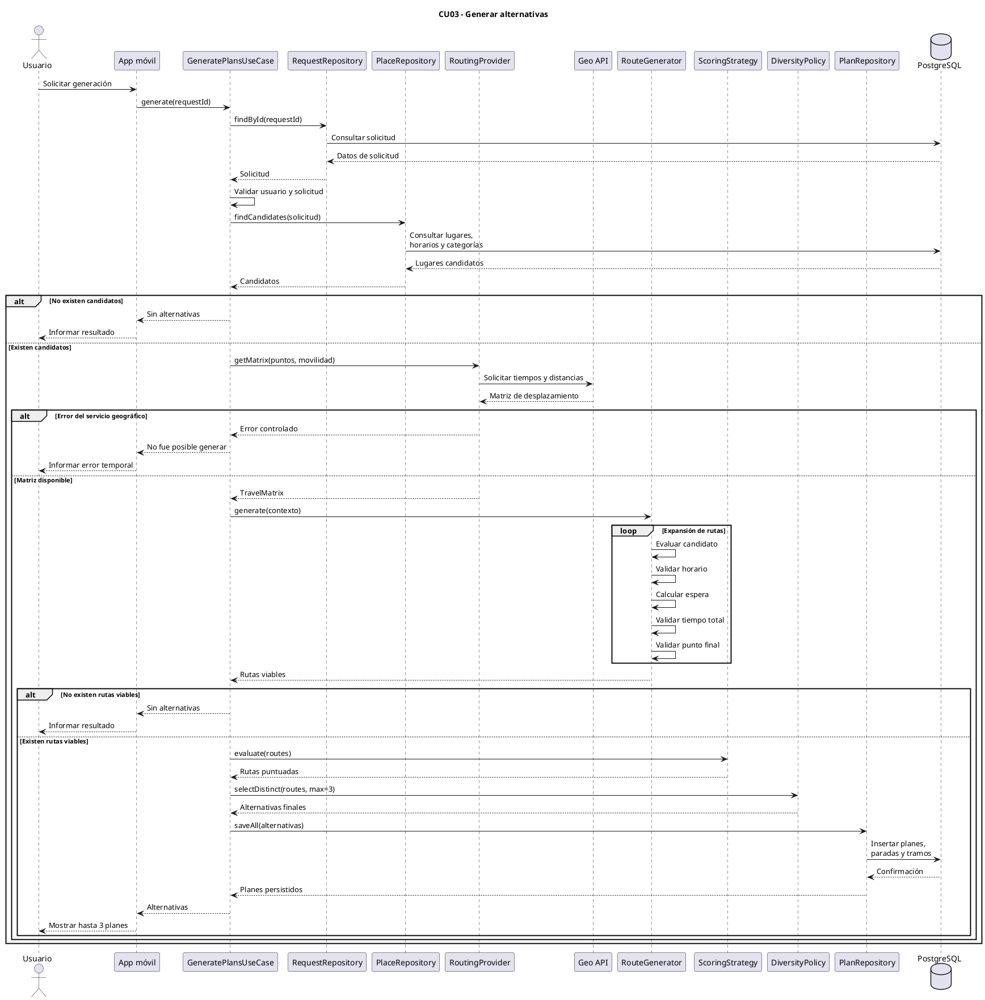
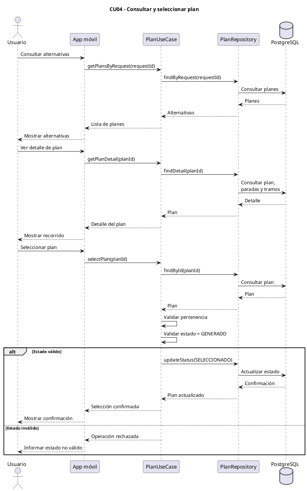
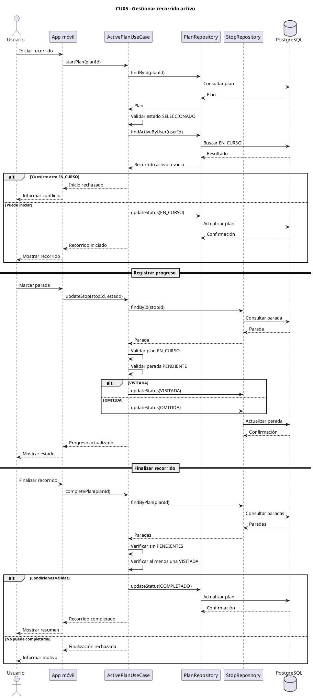
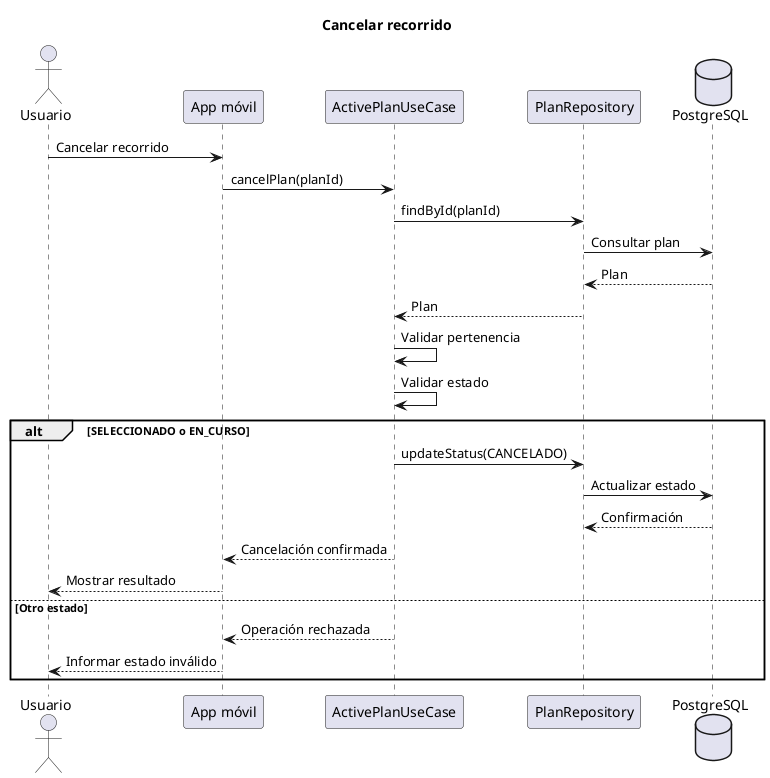
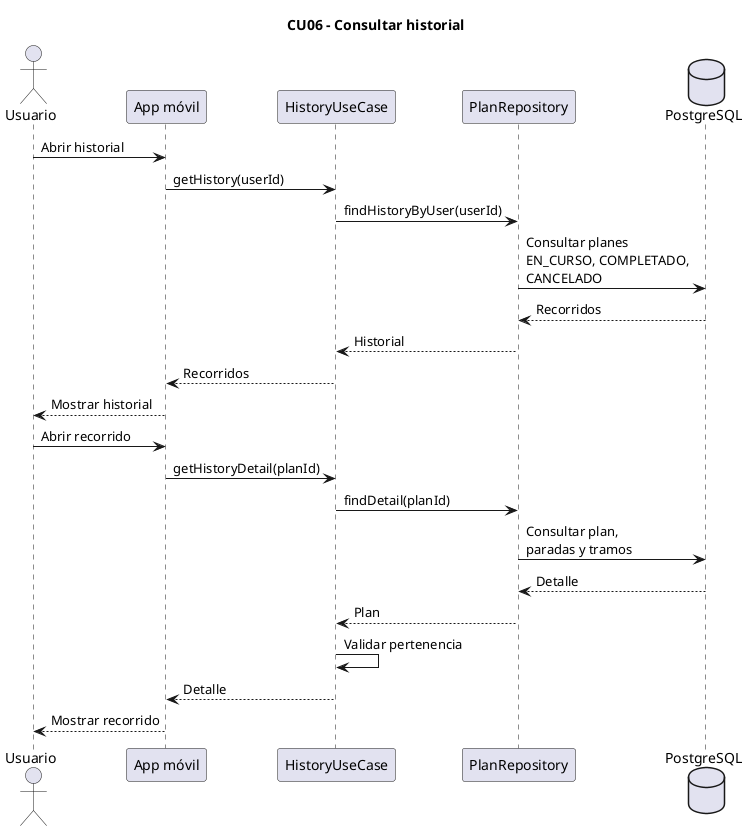
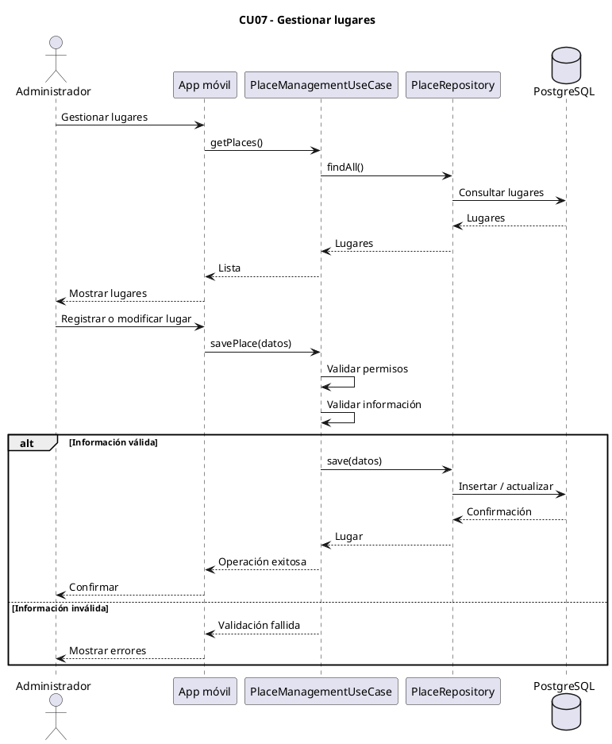
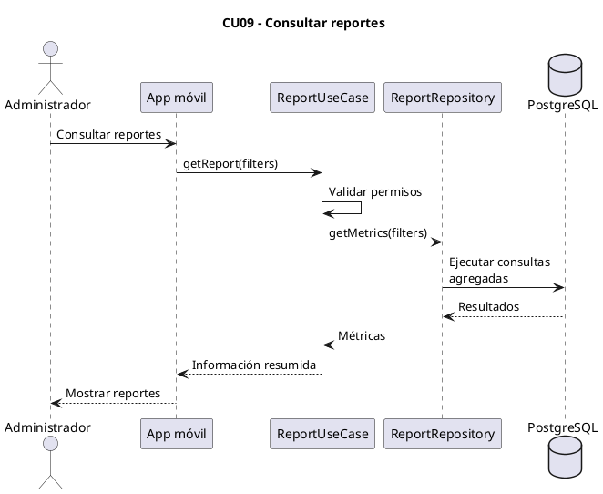
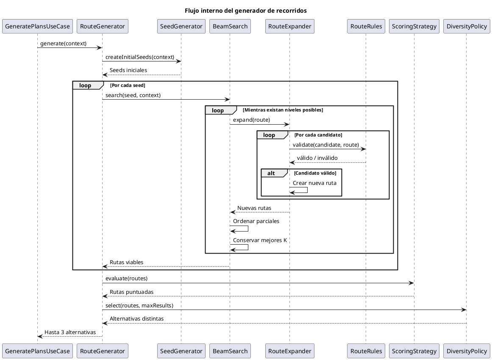

# Diagramas de secuencia — Chaski

## 1. Propósito

Este documento representa la interacción entre los principales componentes del sistema durante los casos de uso más relevantes.

Los diagramas no buscan reflejar cada método de implementación, sino mostrar cómo colaboran:

- la aplicación móvil;
- los casos de uso;
- los repositorios;
- la base de datos;
- los servicios externos;
- el módulo de generación de recorridos.

Los diagramas se encuentran alineados con los casos de uso definidos en:

- [`casos-uso.md`](./casos-uso.md)
- [`modelo-dominio.md`](./modelo-dominio.md)
- [`modelo-datos.md`](./modelo-datos.md)

---

# 2. Componentes utilizados

Los diagramas utilizan los siguientes participantes conceptuales:

| Componente | Responsabilidad |
|---|---|
| Usuario | Persona que utiliza la aplicación |
| Administrador | Usuario con permisos administrativos |
| App | Aplicación móvil React Native |
| Auth | Servicio de autenticación |
| Caso de uso | Coordina una operación del sistema |
| Repository | Abstrae el acceso a datos |
| PostgreSQL | Persistencia principal |
| Generador | Coordina la generación de recorridos |
| RoutingProvider | Obtiene información de desplazamiento |
| Geo API | Servicio externo de rutas/geolocalización |

La implementación concreta podrá agrupar o distribuir estas responsabilidades de manera diferente sin alterar el comportamiento descrito.

---

# 3. CU03 — Generar alternativas

Este es el flujo más importante del sistema, debido a que concentra la lógica principal de Chaski.

## Flujo general

```text
Usuario
   ↓
Solicitud válida
   ↓
Obtener lugares
   ↓
Obtener desplazamientos
   ↓
Generar rutas
   ↓
Validar viabilidad
   ↓
Evaluar
   ↓
Aplicar diversidad
   ↓
Guardar hasta 3
   ↓
Mostrar alternativas
```

## Diagrama de secuencia



## Consideraciones

- El caso de uso obtiene la solicitud mediante `RequestRepository`.
- El generador no accede directamente a la base de datos.
- El proveedor geográfico se encuentra abstraído mediante `RoutingProvider`.
- No se asume tiempo de desplazamiento igual a cero cuando el servicio geográfico falla.
- Solo las alternativas finales seleccionadas para presentación son almacenadas.
- Las rutas parciales utilizadas durante la búsqueda no se persisten.

---

# 4. CU04 — Consultar y seleccionar plan

## Flujo general

```text
Usuario
   ↓
Consultar alternativas
   ↓
Ver detalle
   ↓
Seleccionar plan
   ↓
GENERADO → SELECCIONADO
```

## Diagrama de secuencia



## Consideraciones

Seleccionar una alternativa no requiere eliminar ni modificar automáticamente las demás alternativas generadas.

Estas podrán permanecer en estado:

```text
GENERADO
```

---

# 5. CU05 — Gestionar recorrido activo

Este flujo representa el ciclo de vida del plan después de ser seleccionado.

## Estados involucrados

```text
SELECCIONADO
     ↓
EN_CURSO
     ↓
COMPLETADO
```

También:

```text
SELECCIONADO → CANCELADO
EN_CURSO     → CANCELADO
```

## Diagrama de secuencia



---

# 6. Cancelación de recorrido

La cancelación puede ocurrir desde `CU05`, pero se muestra separadamente para visualizar mejor la transición.



La cancelación no elimina las paradas ni el progreso registrado.

---

# 7. CU06 — Consultar historial

## Diagrama de secuencia



## Consideraciones

Los planes que permanezcan únicamente en estado:

```text
GENERADO
```

no forman parte del historial.

Los planes `SELECCIONADO` todavía no iniciados podrán mostrarse por separado como pendientes.

---

# 8. CU07 — Gestionar lugares

## Diagrama de secuencia



### Desactivación

```text
ACTIVO → INACTIVO
```

será preferida frente a eliminar físicamente un lugar utilizado históricamente.

---

# 9. CU09 — Consultar reportes

## Diagrama de secuencia



## Consideración

`ReportRepository` representa una abstracción de consultas.

No implica la existencia de una tabla:

```text
reportes
```

ni de una entidad de dominio `Reporte`.

---

# 10. Secuencia interna del generador

Además del flujo de `CU03`, es útil representar con mayor detalle el comportamiento interno de la generación.



---

# 11. Responsabilidades durante la generación

La separación esperada es:

```text
GeneratePlansUseCase
        │
        ├── coordina operación
        │
        ▼
RouteGenerator
        │
        ├── controla proceso de generación
        │
        ▼
BeamSearch
        │
        ├── mantiene mejores rutas parciales
        │
        ▼
RouteExpander
        │
        ├── intenta agregar lugares
        │
        ▼
RouteRules
        │
        └── determina si una expansión es válida
```

Posteriormente:

```text
Rutas viables
      ↓
ScoringStrategy
      ↓
DiversityPolicy
      ↓
Alternativas finales
```

Esto permite mantener separadas:

- generación;
- validación;
- puntuación;
- diversidad.

---

# 12. Acceso a servicios externos

Los componentes de dominio o algoritmo no deberán depender directamente del proveedor geográfico concreto.

Se utilizará una abstracción similar a:

```text
RoutingProvider
```

con una operación conceptual:

```text
getTravelMatrix(points, mobility)
```

La implementación podrá utilizar el proveedor seleccionado posteriormente.

Esto permite evitar que el algoritmo dependa directamente de una API específica.

---

# 13. Manejo de errores

Los principales errores contemplados durante estos flujos son:

| Situación | Comportamiento |
|---|---|
| Solicitud inexistente | Rechazar operación |
| Solicitud de otro usuario | Rechazar acceso |
| Sin lugares candidatos | Informar ausencia de alternativas |
| Sin recorridos viables | Retornar cero alternativas |
| Servicio geográfico no disponible | Informar fallo temporal |
| Plan en estado inválido | Rechazar transición |
| Otro recorrido activo | No permitir iniciar otro |
| Parada no pendiente | Rechazar cambio de estado |
| Todas las paradas omitidas | No permitir completar |
| Usuario sin permisos administrativos | Rechazar operación |

---

# 14. Diagramas prioritarios para el informe

Si el informe académico no requiere incluir todos los diagramas de este documento, los tres de mayor importancia son:

```text
CU03 — Generar alternativas
CU04 — Consultar y seleccionar plan
CU05 — Gestionar recorrido activo
```

Estos representan:

1. la lógica diferenciadora de Chaski;
2. la elección del recorrido;
3. la ejecución del plan.

Los demás diagramas pueden mantenerse dentro de la documentación técnica del repositorio y utilizarse como anexos cuando sea necesario.

---

# 15. Documentos relacionados

- [Casos de uso](./casos-uso.md)
- [Modelo de dominio](./modelo-dominio.md)
- [Modelo de datos](./modelo-datos.md)
- [Reglas de negocio](../02-requisitos/reglas-negocio.md)
- [Arquitectura general](../04-arquitectura/arquitectura-general.md)
- [Generador de planes](../04-arquitectura/generador-planes.md)
- [Generación de rutas](../05-algoritmo/generacion-rutas.md)