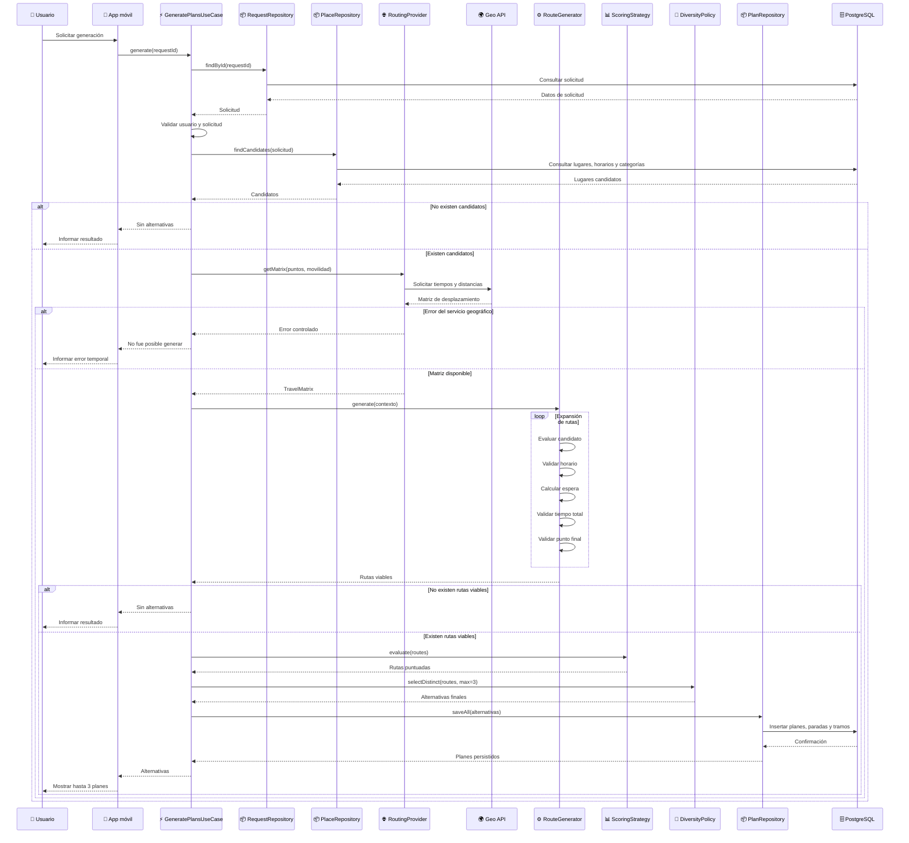
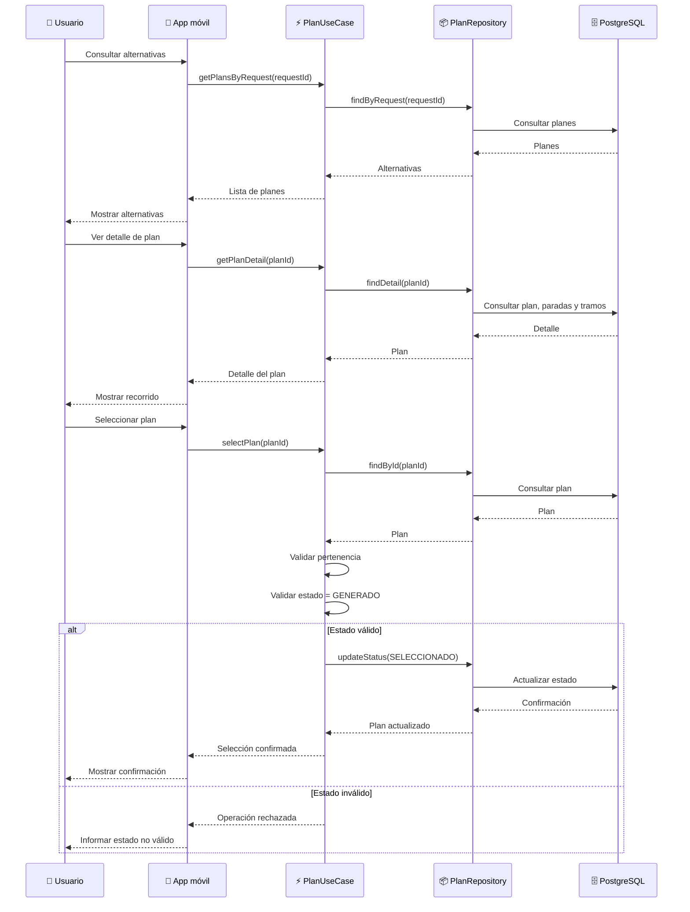
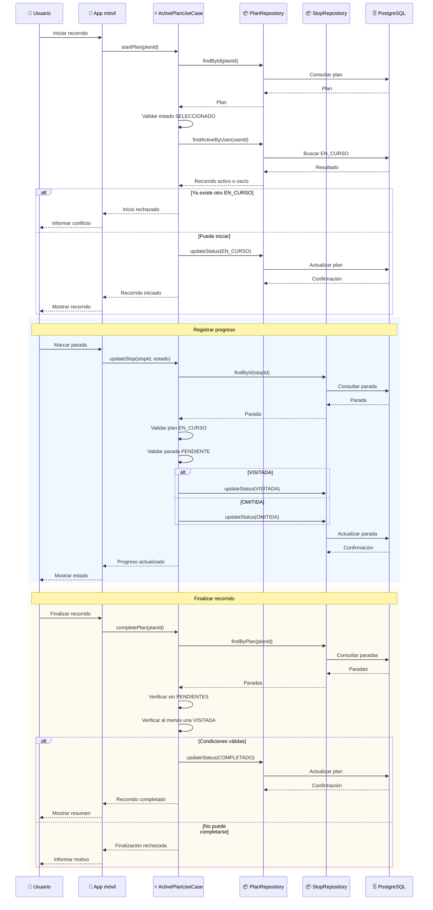
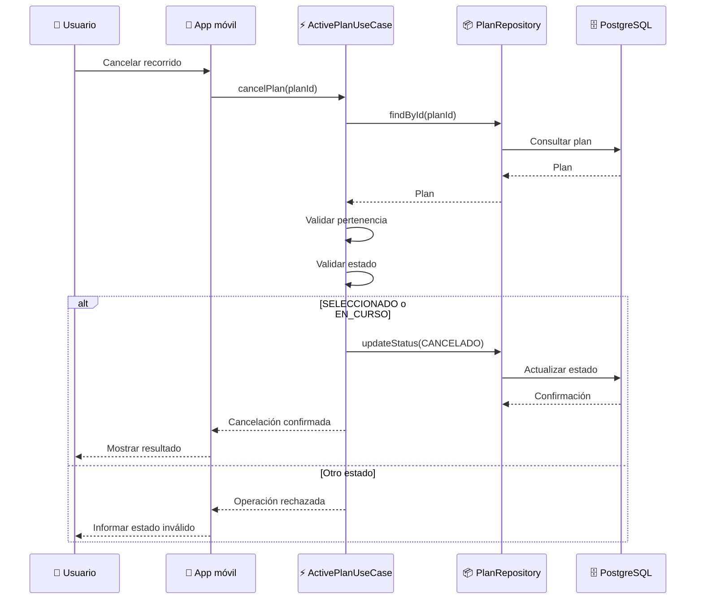
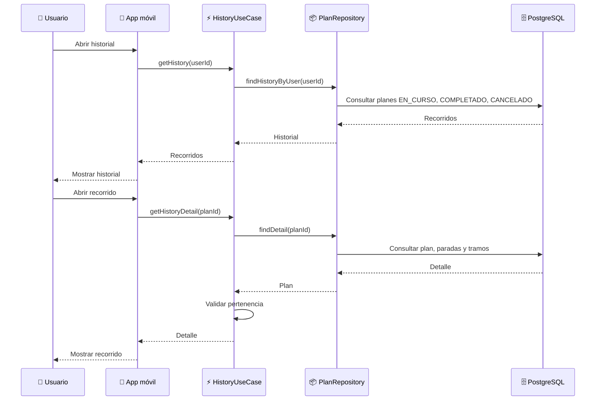
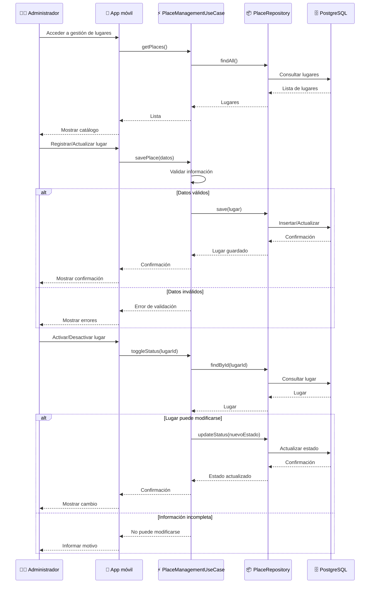
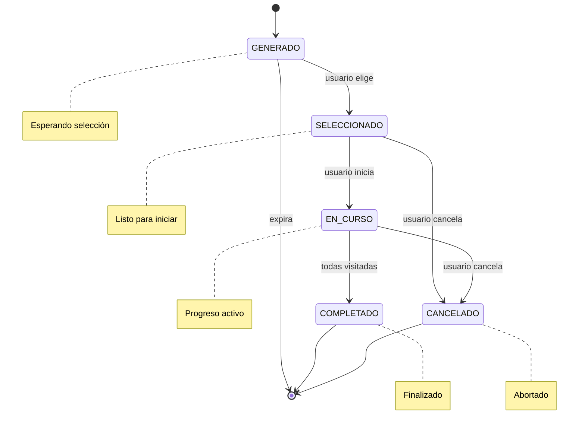

# Diagramas de secuencia — Chaski

## 1. Propósito

Este documento representa la interacción entre los principales componentes del sistema durante los casos de uso más relevantes.

Los diagramas no buscan reflejar cada método de implementación, sino mostrar cómo colaboran:

- la aplicación móvil;
- los casos de uso;
- los repositorios;
- la base de datos;
- los servicios externos;
- el módulo de generación de recorridos.

---

## 2. Componentes utilizados

| Componente | Responsabilidad |
|---|---|
| Usuario | Persona que utiliza la aplicación |
| Administrador | Usuario con permisos administrativos |
| App | Aplicación móvil React Native |
| Auth | Servicio de autenticación |
| Caso de uso | Coordina una operación del sistema |
| Repository | Abstrae el acceso a datos |
| PostgreSQL | Persistencia principal |
| Generador | Coordina la generación de recorridos |
| RoutingProvider | Obtiene información de desplazamiento |
| Geo API | Servicio externo de rutas/geolocalización |

---

## 3. CU03 — Generar alternativas

Este es el flujo más importante del sistema, debido a que concentra la lógica principal de Chaski.

### Consideraciones

- El caso de uso obtiene la solicitud mediante `RequestRepository`.
- El generador no accede directamente a la base de datos.
- El proveedor geográfico se encuentra abstraído mediante `RoutingProvider`.
- No se asume tiempo de desplazamiento igual a cero cuando el servicio geográfico falla.
- Solo las alternativas finales seleccionadas para presentación son almacenadas.
- Las rutas parciales utilizadas durante la búsqueda no se persisten.

---

## 4. CU04 — Consultar y seleccionar plan

> Seleccionar una alternativa no requiere eliminar las demás. Estas podrán permanecer en estado `GENERADO`.

---

## 5. CU05 — Gestionar recorrido activo

Este flujo representa el ciclo de vida del plan después de ser seleccionado.

---

## 6. Cancelar recorrido

La cancelación puede ocurrir desde `SELECCIONADO` o `EN_CURSO`.

> La cancelación no elimina las paradas ni el progreso registrado.

---

## 7. CU06 — Consultar historial

> Los planes en estado `GENERADO` no forman parte del historial. Los `SELECCIONADO` pendientes podrán mostrarse por separado.

---

## 8. CU07 — Gestionar lugares (Administrador)

---

## 9. Estados del plan — Resumen visual

