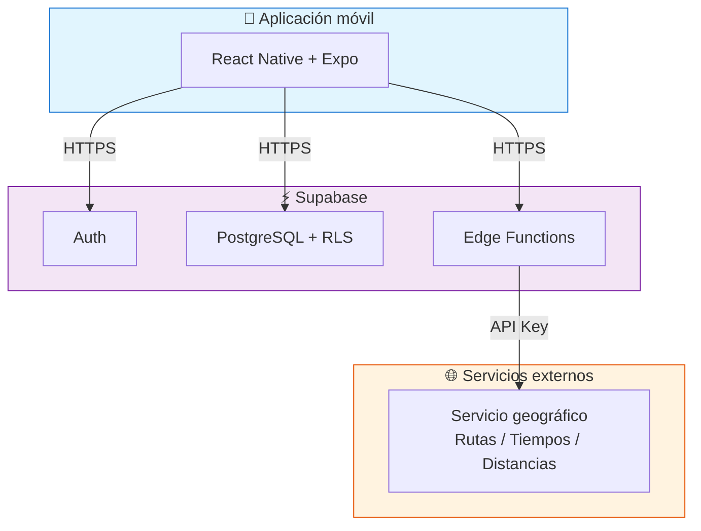
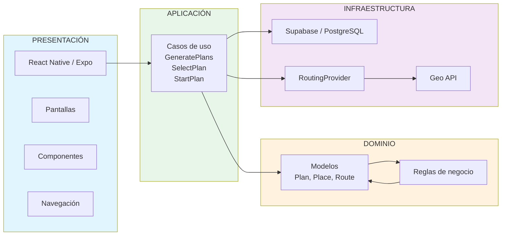
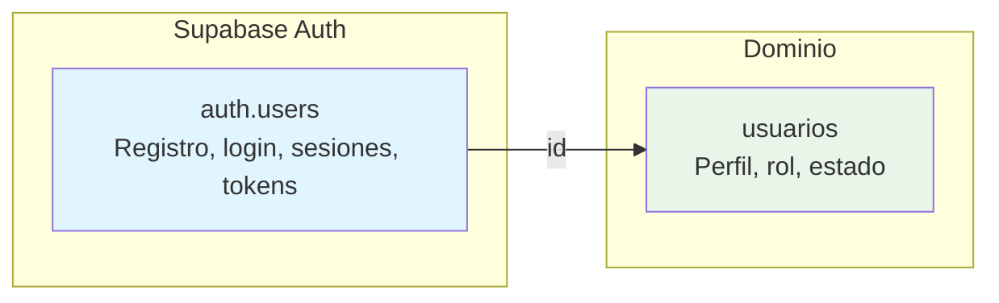
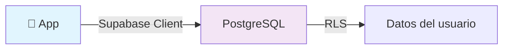
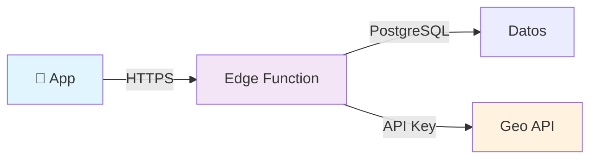
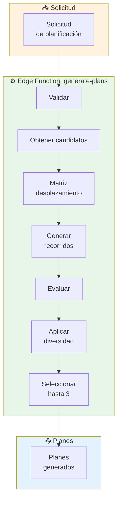
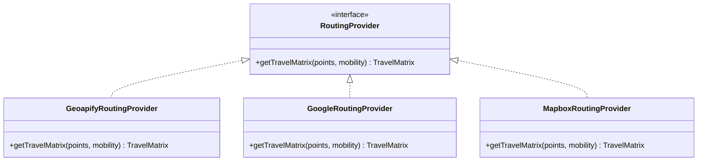
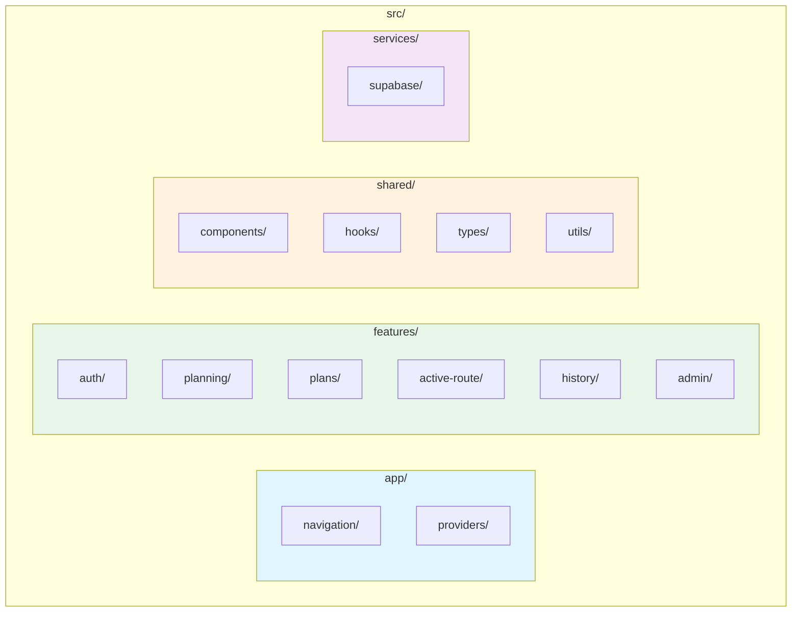
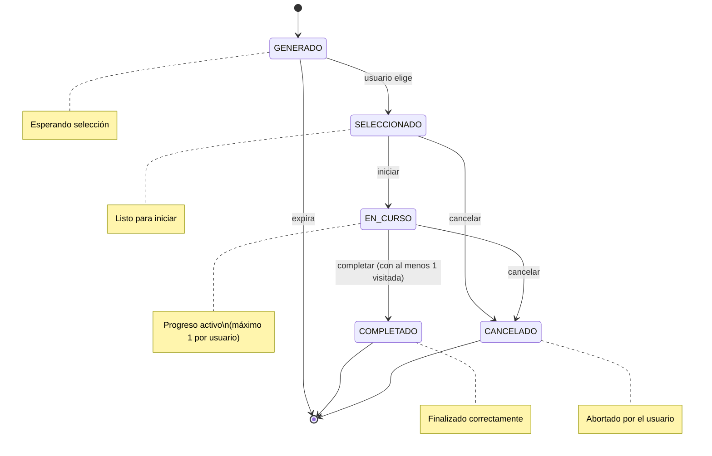

# Arquitectura general — Chaski

## 1. Propósito

Este documento describe la arquitectura general propuesta para Chaski.

La arquitectura busca separar las responsabilidades de:

- interfaz móvil;
- autenticación;
- acceso a datos;
- lógica sensible del sistema;
- generación de recorridos;
- persistencia;
- integración con servicios externos.

---

## 2. Visión general



---

## 3. Capas de responsabilidad



---

## 4. Autenticación



> La identidad y autenticación (`auth.users`) se mantiene separada de la información del dominio (`usuarios`).

---

## 5. Acceso a datos

### 5.1. Operaciones simples — Cliente Supabase directo



Ejemplos: consultar preferencias propias, categorías, historial.

### 5.2. Operaciones sensibles — Edge Functions



Ejemplos: generar planes, iniciar recorrido, marcar parada.

### 5.3. Principio

```mermaid
flowchart TB
    A["Operación"] --> B{¿Tiene lógica sensible?"}

    B -->|Sí| C["Edge Function"]
    B -->|No| D{¿Requiere validaciones?"}

    D -->|Sí| C
    D -->|No| E["Cliente Supabase directo"]

    style C fill:#f3e5f5
    style E fill:#e8f5e9
```

---

## 6. Row Level Security

```mermaid
graph TB
    subgraph UserA["👤 Usuario A"]
        PA1["Preferencias A"]
        SA1["Solicitudes A"]
        PLA1["Planes A"]
    end

    subgraph UserB["👤 Usuario B"]
        PA2["Preferencias B"]
        SA2["Solicitudes B"]
        PLA2["Planes B"]
    end

    PA1 -.->|"propio"| RLS1["Row Level Security"]
    SA1 -.->|"propio"| RLS1
    PLA1 -.->|"propio"| RLS1

    PA2 -.x|"bloqueado"| RLS2
    SA2 -.x|"bloqueado"| RLS2
    PLA2 -.x|"bloqueado"| RLS2

    LU["Lugares"] -.->|"lectura libre"| RLS_CAT
    CA["Categorías"] -.->|"lectura libre"| RLS_CAT
    ET["Etiquetas"] -.->|"solo admin"| RLS_CAT

    style RLS1 fill:#c8e6c9,stroke:#388e3c
    style RLS2 fill:#ffcdd2,stroke:#d32f2f
    style RLS_CAT fill:#fff9c4,stroke:#f9a825
```

---

## 7. Protección de credenciales

```mermaid
flowchart TB
    subgraph Correct["✅ Flujo correcto"]
        A1["📱 App móvil"]
        B1["Edge Function"]
        C1["Servicio externo"]
        A1 -->|"request"| B1
        B1 -->|"API Key"| C1
    end

    subgraph Incorrect["❌ Flujo incorrecto"]
        A2["📱 App móvil"]
        C2["Servicio externo"]
        A2 -->|"API Key| C2
    end

    style Correct fill:#e8f5e9
    style Incorrect fill:#ffcdd2
```

> Las claves privadas de servicios externos **nunca** deben incorporarse en el código de la aplicación móvil.

---

## 8. Generación de planes



Ver detalle en [`generador-planes.md`](./generador-planes.md) y [`../05-algoritmo/generacion-rutas.md`](../05-algoritmo/generacion-rutas.md).

---

## 9. Abstracción del proveedor geográfico



> La lógica del sistema depende de `RoutingProvider`, no del proveedor concreto.

---

## 10. Organización del proyecto móvil



Organización por `features` permite agrupar código según las funcionalidades del producto.

---

## 11. Estados de un plan — Transiciones



---

## 12. Principios arquitectónicos

| # | Principio | Descripción |
|---|---|---|
| 1 | **Cliente delgado** | La interfaz móvil no contiene lógica crítica de generación |
| 2 | **Validación en servidor** | Las reglas sensibles se validan del lado del servidor |
| 3 | **Secretos protegidos** | Las API keys de servicios externos permanecen fuera del cliente |
| 4 | **Acceso autorizado** | Los usuarios solo acceden a su propia información |
| 5 | **Acoplamiento mínimo** | El proveedor geográfico se mantiene desacoplado del algoritmo |
| 6 | **Abstracción de persistencia** | Los repositorios aíslan el acceso a datos |
| 7 | **Simplicidad inicial** | No se introduce infraestructura innecesaria para la v1 |
| 8 | **Testabilidad** | Los componentes deben poder probarse de manera aislada |

---

## 13. Documentos relacionados

| Documento | Descripción |
|---|---|
| [`modelo-dominio.md`](../03-modelado/modelo-dominio.md) | Conceptos y reglas del dominio |
| [`modelo-datos.md`](../03-modelado/modelo-datos.md) | Esquema relacional completo |
| [`secuencias.md`](../03-modelado/secuencias.md) | Diagramas de secuencia |
| [`generador-planes.md`](./generador-planes.md) | Arquitectura interna del generador |
| [`../05-algoritmo/generacion-rutas.md`](../05-algoritmo/generacion-rutas.md) | Detalle del algoritmo Beam Search |
