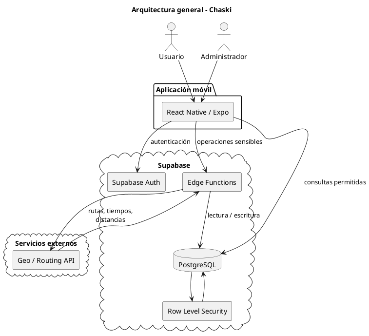

# Arquitectura general — Chaski

## 1. Propósito

Este documento describe la arquitectura general propuesta para Chaski.

La arquitectura busca separar las responsabilidades de:

- interfaz móvil;
- autenticación;
- acceso a datos;
- lógica sensible del sistema;
- generación de recorridos;
- persistencia;
- integración con servicios externos.

La propuesta se encuentra orientada a la primera versión del proyecto y prioriza simplicidad, mantenibilidad y facilidad de implementación.

---

# 2. Visión general

Chaski utilizará una arquitectura cliente-servidor apoyada en servicios administrados.

La estructura general será:

```text
┌──────────────────────────────┐
│     Aplicación móvil         │
│   React Native + Expo        │
└──────────────┬───────────────┘
               │
               │ HTTPS
               ▼
┌──────────────────────────────┐
│          Supabase            │
│                              │
│  ┌────────────────────────┐  │
│  │ Auth                   │  │
│  ├────────────────────────┤  │
│  │ Edge Functions         │  │
│  ├────────────────────────┤  │
│  │ PostgreSQL + RLS       │  │
│  └────────────────────────┘  │
└──────────────┬───────────────┘
               │
               │ HTTPS
               ▼
┌──────────────────────────────┐
│ Servicio geográfico externo │
│ Rutas / tiempos / distancias│
└──────────────────────────────┘
```

---

# 3. Componentes principales

## 3.1. Aplicación móvil

La aplicación será desarrollada utilizando:

```text
React Native
Expo
TypeScript
```

### Responsabilidades

La aplicación móvil será responsable de:

- mostrar las interfaces;
- gestionar navegación;
- capturar datos del usuario;
- mostrar lugares y recorridos;
- representar información geográfica;
- consumir los servicios del backend;
- mostrar estados de carga y errores;
- mantener únicamente estado local necesario para la interacción.

### No será responsable de

La aplicación no deberá implementar directamente:

- reglas críticas de generación;
- Beam Search;
- cálculo final de compatibilidad;
- políticas de diversidad;
- almacenamiento de secretos de servicios externos;
- validaciones sensibles de autorización.

Esto evita duplicar lógica importante en el cliente.

---

# 4. Supabase

Supabase será utilizado como plataforma principal de backend.

Los servicios considerados son:

```text
Supabase Auth
PostgreSQL
Row Level Security
Edge Functions
```

Opcionalmente podrán utilizarse otros servicios de Supabase cuando el alcance lo requiera.

---

# 5. Autenticación

## 5.1. Supabase Auth

La autenticación de usuarios será gestionada mediante Supabase Auth.

Supabase será responsable de:

- registro;
- inicio de sesión;
- gestión de identidad;
- sesiones;
- tokens.

La aplicación no almacenará contraseñas directamente.

---

## 5.2. Relación con el dominio

La identidad gestionada por Supabase Auth se relacionará con:

```text
usuarios
```

Conceptualmente:

```text
auth.users.id
      │
      ▼
usuarios.id
```

De esta manera se separan:

```text
Identidad y autenticación
           │
           ▼
       auth.users

Información del dominio
           │
           ▼
        usuarios
```

---

# 6. Persistencia

La información principal de Chaski será almacenada en PostgreSQL.

Entre los datos persistidos se encuentran:

- usuarios;
- preferencias;
- solicitudes;
- planes;
- paradas;
- tramos;
- lugares;
- horarios;
- categorías;
- etiquetas.

El modelo detallado se encuentra documentado en:

```text
../03-modelado/modelo-datos.md
```

---

# 7. Row Level Security

Se utilizará Row Level Security para limitar el acceso a los registros según el usuario autenticado.

Como principio general:

```text
Usuario A
   │
   ├── Preferencias A
   ├── Solicitudes A
   ├── Planes A
   └── Historial A
```

no deberá poder consultar o modificar:

```text
Preferencias B
Solicitudes B
Planes B
Historial B
```

---

## 7.1. Catálogos

Los catálogos como:

```text
lugares
categorias
etiquetas
```

podrán permitir lectura a usuarios normales cuando sea necesario.

Las operaciones de:

```text
crear
modificar
activar
desactivar
```

deberán restringirse a administradores.

---

# 8. Edge Functions

Las Edge Functions se utilizarán para operaciones que requieren:

- lógica sensible;
- integración con servicios externos;
- protección de secretos;
- múltiples validaciones;
- transacciones o cambios de estado importantes;
- generación de recorridos.

No será necesario convertir cada requisito funcional en una Edge Function.

---

# 9. Acceso directo a Supabase

Algunas operaciones sencillas podrán ejecutarse desde la aplicación utilizando el cliente de Supabase y las políticas RLS.

Ejemplos:

```text
consultar preferencias propias
consultar categorías
consultar historial propio
consultar detalles permitidos
```

Esto evita crear una capa de backend innecesaria para operaciones simples.

---

# 10. Operaciones sensibles

Las operaciones que impliquen cambios importantes de estado deberán ejecutarse de forma controlada.

Por ejemplo:

```text
seleccionar plan
iniciar recorrido
marcar parada
completar recorrido
cancelar recorrido
```

La implementación podrá utilizar:

```text
Edge Functions
```

o funciones PostgreSQL/RPC cuando resulte más conveniente.

El objetivo es evitar que el cliente pueda modificar arbitrariamente estados sin validar las reglas de negocio.

---

# 11. Generación de recorridos

La operación más compleja será:

```text
generate-plans
```

Esta operación se ejecutará del lado del servidor mediante una Edge Function.

Flujo general:

```text
App
 │
 │ requestId
 ▼
generate-plans
 │
 ├── autenticar
 ├── validar solicitud
 ├── obtener candidatos
 ├── obtener desplazamientos
 ├── generar recorridos
 ├── evaluar
 ├── aplicar diversidad
 ├── persistir resultados
 │
 ▼
hasta 3 planes
```

La arquitectura interna del generador se documenta en:

```text
generador-planes.md
```

---

# 12. Servicio geográfico externo

Chaski necesitará un proveedor externo capaz de proporcionar, según disponibilidad:

- rutas;
- distancias;
- tiempos estimados;
- posiblemente matrices de desplazamiento.

La integración deberá realizarse mediante una abstracción.

Conceptualmente:

```text
RoutingProvider
```

en lugar de acoplar directamente el algoritmo a:

```text
ProveedorX
```

---

# 13. Abstracción del proveedor

La lógica del sistema podrá depender de una interfaz conceptual similar a:

```typescript
interface RoutingProvider {
  getTravelMatrix(
    points: GeoPoint[],
    mobility: MobilityMode
  ): Promise<TravelMatrix>;
}
```

La implementación concreta podrá ser:

```text
GeoapifyRoutingProvider
GoogleRoutingProvider
MapboxRoutingProvider
```

dependiendo del proveedor seleccionado.

---

# 14. Protección de credenciales

Las claves privadas de servicios externos no deberán incorporarse directamente en el código de la aplicación móvil.

Las credenciales sensibles deberán mantenerse en configuración segura del backend.

Flujo recomendado:

```text
App móvil
   │
   ▼
Edge Function
   │
   │ API KEY
   ▼
Servicio externo
```

y no:

```text
App móvil
   │
   │ API KEY privada
   ▼
Servicio externo
```

---

# 15. Arquitectura por responsabilidades

La organización conceptual será:

```text
PRESENTACIÓN
React Native / Expo
        │
        ▼
APLICACIÓN
Casos de uso / operaciones
        │
        ▼
DOMINIO
Reglas y modelos
        │
        ▼
INFRAESTRUCTURA
Supabase / PostgreSQL / Geo API
```

No se pretende implementar una arquitectura Clean completa de manera estricta.

La separación se utilizará únicamente donde aporte claridad y mantenibilidad.

---

# 16. Presentación

La capa de presentación contiene:

- pantallas;
- componentes;
- navegación;
- formularios;
- manejo de interacción;
- representación visual de recorridos.

Ejemplo conceptual:

```text
screens/
components/
navigation/
hooks/
```

---

# 17. Aplicación

La capa de aplicación coordina operaciones del sistema.

Ejemplos:

```text
GeneratePlansUseCase
SelectPlanUseCase
StartPlanUseCase
CompletePlanUseCase
```

Sus responsabilidades incluyen:

- coordinar repositorios;
- ejecutar validaciones;
- invocar servicios;
- devolver resultados.

No debería contener detalles específicos del proveedor de base de datos.

---

# 18. Dominio

El dominio contiene conceptos y reglas relacionadas directamente con Chaski.

Ejemplos:

```text
Plan
SolicitudPlan
ParadaPlan
RouteRule
ScoringStrategy
DiversityPolicy
```

El dominio no debería conocer:

```text
Supabase
HTTP
React Native
API keys
```

---

# 19. Infraestructura

La infraestructura contiene implementaciones concretas para:

- persistencia;
- servicios externos;
- acceso a datos;
- integración con Supabase.

Ejemplos:

```text
SupabasePlanRepository
SupabasePlaceRepository
GeoapifyRoutingProvider
```

---

# 20. Repositorios

Se utilizarán repositorios para aislar operaciones de persistencia en las zonas donde resulte útil.

Ejemplo conceptual:

```typescript
interface PlanRepository {
  saveAll(plans: Plan[]): Promise<Plan[]>;
  findById(id: string): Promise<Plan | null>;
  findByRequest(requestId: string): Promise<Plan[]>;
}
```

Esto permite que la lógica principal trabaje con operaciones del dominio sin depender directamente de consultas SQL o del SDK específico.

---

# 21. Inyección de dependencias

No se requiere utilizar un framework de Dependency Injection.

Las dependencias podrán proporcionarse explícitamente.

Ejemplo:

```typescript
type GeneratePlansDependencies = {
  requestRepository: RequestRepository;
  placeRepository: PlaceRepository;
  planRepository: PlanRepository;
  routingProvider: RoutingProvider;
};
```

Posteriormente:

```typescript
generatePlans(dependencies, input);
```

Esto mantiene el código testeable sin introducir complejidad innecesaria.

---

# 22. Organización del proyecto móvil

Una estructura inicial podría ser:

```text
src/
├── app/
│   ├── navigation/
│   └── providers/
│
├── features/
│   ├── auth/
│   ├── planning/
│   ├── plans/
│   ├── active-route/
│   ├── history/
│   └── admin/
│
├── shared/
│   ├── components/
│   ├── hooks/
│   ├── types/
│   └── utils/
│
└── services/
    └── supabase/
```

La organización por `features` permite agrupar código según las funcionalidades del producto.

---

# 23. Organización de Supabase

```text
supabase/
├── migrations/
│
└── functions/
    ├── _shared/
    │
    └── generate-plans/
```

Las migraciones contendrán:

- tablas;
- restricciones;
- índices;
- RLS;
- funciones PostgreSQL cuando correspondan.

---

# 24. Comunicación

La comunicación entre la aplicación y el backend utilizará HTTPS.

Los principales mecanismos serán:

```text
Supabase Client
Edge Functions
PostgreSQL RPC
```

dependiendo del tipo de operación.

---

# 25. Flujo de una operación simple

Ejemplo: consultar historial.

```text
App
 │
 │ Supabase Client
 ▼
PostgreSQL
 │
 │ RLS
 ▼
Planes del usuario
 │
 ▼
App
```

No necesariamente requiere Edge Function.

---

# 26. Flujo de una operación compleja

Ejemplo: generar planes.

```text
App
 │
 ▼
Edge Function
 │
 ├── PostgreSQL
 │
 ├── Generador
 │
 └── Geo API
 │
 ▼
PostgreSQL
 │
 ▼
App
```

---

# 27. Manejo de errores

Los errores deberán tratarse según su origen.

## Errores de validación

Ejemplo:

```text
fecha final <= fecha inicial
```

La aplicación deberá indicar qué dato necesita corregirse.

## Errores de autorización

Ejemplo:

```text
intentar consultar plan de otro usuario
```

La operación deberá rechazarse.

## Errores externos

Ejemplo:

```text
Geo API no disponible
```

El sistema deberá informar un error temporal y no utilizar información inventada.

## Errores de generación

Ejemplo:

```text
no existen rutas viables
```

No representa necesariamente un fallo técnico.

El sistema deberá mostrar que no fue posible generar alternativas con las condiciones proporcionadas.

---

# 28. Consideraciones de escalabilidad

La primera versión no requiere una arquitectura distribuida compleja.

No se propone inicialmente utilizar:

- microservicios;
- colas de mensajes;
- Kubernetes;
- múltiples bases de datos;
- infraestructura independiente por módulo.

La arquitectura deberá poder evolucionar si el volumen futuro lo requiere, pero la primera versión priorizará una implementación manejable por el equipo.

---

# 29. Diagrama de arquitectura



---

# 30. Principios arquitectónicos

La arquitectura de Chaski seguirá los siguientes principios:

1. La interfaz móvil no contiene la lógica crítica de generación.
2. Las reglas sensibles se validan del lado del servidor.
3. Los secretos de servicios externos permanecen fuera del cliente.
4. Los usuarios solo acceden a la información autorizada.
5. El proveedor geográfico se mantiene desacoplado del algoritmo.
6. La persistencia se abstrae cuando la complejidad lo justifica.
7. Se evita introducir infraestructura que no sea necesaria para la primera versión.
8. Los componentes deben poder probarse de manera aislada cuando sea posible.

---

# 31. Documentos relacionados

- [Modelo de dominio](../03-modelado/modelo-dominio.md)
- [Modelo de datos](../03-modelado/modelo-datos.md)
- [Diagramas de secuencia](../03-modelado/secuencias.md)
- [Generador de planes](./generador-planes.md)
- [Generación de rutas](../05-algoritmo/generacion-rutas.md)