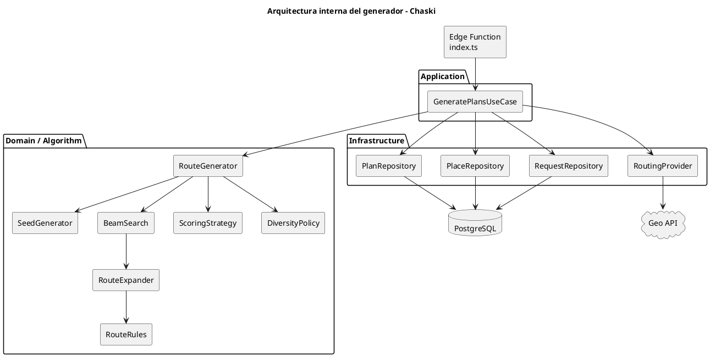

# Arquitectura del generador de planes — Chaski

## 1. Propósito

Este documento describe la arquitectura interna del módulo encargado de generar alternativas de recorrido en Chaski.

El generador recibe una solicitud válida y produce hasta tres alternativas de recorrido compatibles con las condiciones indicadas por el usuario.

La generación considera principalmente:

- ubicación inicial;
- punto final;
- tiempo disponible;
- categorías de interés;
- rango de gasto;
- forma de movilidad;
- lugares disponibles;
- horarios;
- duración de actividades;
- tiempos de desplazamiento;
- diversidad entre alternativas.

La primera versión utilizará un enfoque determinístico basado en reglas y búsqueda limitada.

---

# 2. Responsabilidad del módulo

El módulo de generación será responsable de:

- recuperar la solicitud;
- obtener los lugares candidatos;
- obtener información de desplazamiento;
- construir recorridos posibles;
- validar restricciones obligatorias;
- evaluar alternativas viables;
- controlar similitud entre resultados;
- seleccionar hasta tres alternativas;
- persistir únicamente los planes finales.

El módulo no será responsable de:

- autenticación de credenciales;
- interfaz gráfica;
- navegación móvil;
- gestión administrativa de lugares;
- renderizado del mapa;
- seguimiento GPS en tiempo real.

---

# 3. Flujo general

El proceso principal será:

```text
Solicitud
    ↓
Validar
    ↓
Obtener candidatos
    ↓
Obtener matriz de desplazamiento
    ↓
Crear contexto de generación
    ↓
Generar rutas
    ↓
Validar viabilidad
    ↓
Evaluar
    ↓
Aplicar diversidad
    ↓
Seleccionar hasta 3
    ↓
Persistir
```

---

# 4. Componentes principales

El generador estará formado conceptualmente por los siguientes componentes:

| Componente | Responsabilidad |
|---|---|
| `GeneratePlansUseCase` | Coordinar el proceso completo |
| `RequestRepository` | Obtener solicitudes |
| `PlaceRepository` | Obtener lugares candidatos |
| `PlanRepository` | Persistir planes finales |
| `RoutingProvider` | Obtener tiempos y distancias |
| `RouteGenerator` | Coordinar la generación de recorridos |
| `SeedGenerator` | Crear puntos iniciales de búsqueda |
| `BeamSearch` | Explorar rutas manteniendo las mejores opciones |
| `RouteExpander` | Intentar agregar lugares a una ruta |
| `RouteRules` | Validar restricciones |
| `ScoringStrategy` | Evaluar alternativas |
| `DiversityPolicy` | Evitar resultados demasiado similares |

---

# 5. GeneratePlansUseCase

`GeneratePlansUseCase` será el punto de entrada principal del proceso.

Su responsabilidad es coordinar los componentes necesarios sin contener toda la lógica algorítmica.

Flujo conceptual:

```text
GeneratePlansUseCase
        │
        ├── RequestRepository
        ├── PlaceRepository
        ├── RoutingProvider
        ├── RouteGenerator
        └── PlanRepository
```

Una estructura conceptual podría ser:

```typescript
type GeneratePlansInput = {
  requestId: string;
  userId: string;
};

type GeneratePlansResult = {
  plans: GeneratedPlan[];
};
```

---

# 6. Dependencias

Las dependencias se proporcionarán explícitamente.

```typescript
type GeneratePlansDependencies = {
  requestRepository: RequestRepository;
  placeRepository: PlaceRepository;
  planRepository: PlanRepository;
  routingProvider: RoutingProvider;
  routeGenerator: RouteGenerator;
};
```

Esto permite sustituir implementaciones durante pruebas.

Por ejemplo:

```text
Producción
RoutingProvider → proveedor geográfico real

Pruebas
RoutingProvider → implementación simulada
```

---

# 7. Repositorios

## 7.1. RequestRepository

Responsable de obtener las solicitudes necesarias para la generación.

```typescript
interface RequestRepository {
  findById(id: string): Promise<PlanningRequest | null>;
}
```

El caso de uso deberá verificar que la solicitud pertenezca al usuario autenticado.

---

## 7.2. PlaceRepository

Responsable de recuperar lugares que puedan participar en la generación.

```typescript
interface PlaceRepository {
  findCandidates(
    request: PlanningRequest
  ): Promise<Place[]>;
}
```

La consulta podrá realizar una primera reducción utilizando:

- estado activo;
- categorías;
- ubicación;
- información mínima disponible.

Las validaciones temporales más específicas deberán realizarse posteriormente durante la generación.

---

## 7.3. PlanRepository

Responsable de almacenar los resultados finales.

```typescript
interface PlanRepository {
  saveAll(
    requestId: string,
    plans: GeneratedPlan[]
  ): Promise<GeneratedPlan[]>;
}
```

No deberá almacenar cada ruta parcial explorada durante la búsqueda.

---

# 8. RoutingProvider

El módulo no dependerá directamente de un proveedor geográfico concreto.

Se utilizará una abstracción:

```typescript
interface RoutingProvider {
  getTravelMatrix(
    points: GeoPoint[],
    mobility: MobilityMode
  ): Promise<TravelMatrix>;
}
```

La implementación será responsable de comunicarse con el servicio externo.

---

# 9. TravelMatrix

La matriz de desplazamiento representa el costo de desplazarse entre los puntos relevantes.

Cada conexión puede almacenar:

```typescript
type TravelEdge = {
  durationMinutes: number;
  distanceMeters: number;
  estimatedCost?: number | null;
};
```

La estructura conceptual puede representarse como:

```typescript
type TravelMatrix =
  Record<string, Record<string, TravelEdge>>;
```

Ejemplo:

```text
Inicio
 │
 ├── Museo       → 12 min
 ├── Parque      → 18 min
 └── Cafetería   → 9 min

Museo
 │
 ├── Parque      → 7 min
 └── Cafetería   → 5 min
```

La matriz será dirigida.

Por tanto:

```text
A → B
```

no debe asumirse necesariamente equivalente a:

```text
B → A
```

---

# 10. Contexto de generación

Una vez obtenidos los datos necesarios se construirá un contexto común.

```typescript
type GenerationContext = {
  request: PlanningRequest;
  candidates: Place[];
  travelMatrix: TravelMatrix;
  config: GenerationConfig;
};
```

Esto evita pasar múltiples parámetros independientes entre los componentes.

---

# 11. Configuración

Los parámetros técnicos se centralizarán en una configuración.

```typescript
type GenerationConfig = {
  maxInitialSeeds: number;
  beamWidth: number;
  maxStops: number;
  minStops: number;
  maxResults: number;
};
```

Configuración inicial propuesta:

```text
MAX_INITIAL_SEEDS = 5
BEAM_WIDTH        = 3
MAX_STOPS         = 4
MIN_STOPS         = 1
MAX_RESULTS       = 3
```

Estos valores podrán ajustarse durante las pruebas.

---

# 12. RouteGenerator

`RouteGenerator` coordina la construcción de rutas.

Conceptualmente:

```typescript
interface RouteGenerator {
  generate(
    context: GenerationContext
  ): GeneratedRoute[];
}
```

Internamente utilizará:

```text
SeedGenerator
BeamSearch
ScoringStrategy
DiversityPolicy
```

---

# 13. SeedGenerator

El objetivo del `SeedGenerator` es evitar iniciar toda la búsqueda siempre desde una única primera parada.

Seleccionará varios candidatos iniciales con potencial.

Ejemplo conceptual:

```text
Candidatos:
A B C D E F G

Seeds:
A
C
E
B
D
```

El número máximo inicial será configurable.

```text
MAX_INITIAL_SEEDS = 5
```

La selección podrá basarse en una valoración preliminar relacionada con:

- interés;
- proximidad;
- compatibilidad temporal;
- gasto.

---

# 14. Beam Search

Para controlar el crecimiento combinatorio se utilizará una búsqueda limitada tipo Beam Search.

La idea principal es:

```text
Nivel 1
A   B   C   D   E
        ↓
quedarse con mejores opciones

Nivel 2
A-B
A-C
B-D
...
        ↓
conservar mejores K

Nivel 3
...
```

En lugar de conservar todas las combinaciones posibles, el algoritmo mantiene únicamente las mejores rutas parciales en cada nivel.

---

# 15. Beam width

El parámetro:

```text
BEAM_WIDTH = 3
```

significa que, en cada etapa de la búsqueda, se conservarán hasta tres rutas parciales con mejor valoración preliminar por seed.

No constituye una regla del dominio.

Es una decisión de rendimiento y exploración del algoritmo.

---

# 16. RouteExpander

`RouteExpander` será responsable de intentar extender una ruta parcial con nuevos candidatos.

Conceptualmente:

```typescript
function expandRoute(
  route: PartialRoute,
  context: GenerationContext
): PartialRoute[];
```

Para cada candidato:

```text
Ruta actual
    ↓
Candidato
    ↓
Validar
    ↓
Agregar o descartar
```

---

# 17. Ruta parcial

Durante la búsqueda se utilizará una estructura inmutable o tratada como inmutable.

Ejemplo:

```typescript
type PartialRoute = {
  stops: RouteStop[];
  visitedPlaceIds: Set<string>;
  coveredCategoryIds: Set<string>;

  currentPointId: string;
  currentTime: Date;

  estimatedCostMin: number;
  estimatedCostMax: number;
  hasUnknownCost: boolean;

  travelMinutes: number;
  waitingMinutes: number;

  partialScore: number;
};
```

Cada expansión produce una nueva ruta.

No se modifica directamente una misma instancia para todas las ramas.

---

# 18. RouteRules

Las reglas de viabilidad se representarán mediante funciones pequeñas y componibles.

Ejemplo:

```typescript
type RouteRule = (
  candidate: Place,
  route: PartialRoute,
  context: GenerationContext
) => boolean;
```

Luego:

```typescript
const rules: RouteRule[] = [
  noRepeatedPlace,
  scheduleRule,
  availableTimeRule,
  finalDestinationRule
];
```

La validación puede ejecutarse mediante:

```typescript
rules.every(
  rule => rule(candidate, route, context)
);
```

---

# 19. Validaciones durante una expansión

Antes de incorporar una parada se calculará:

```text
Ruta actual
    ↓
Tiempo de viaje
    ↓
Hora de llegada
    ↓
Horario del lugar
    ↓
Posible espera
    ↓
Duración de actividad
    ↓
Hora de salida
    ↓
Tiempo necesario al punto final
    ↓
Viabilidad
```

Una expansión será descartada inmediatamente cuando incumpla una restricción obligatoria.

---

# 20. Validación del horario

No se valida únicamente si el lugar está abierto al inicio general de la salida.

Se utiliza:

```text
hora estimada de llegada
```

Si:

```text
llegada < apertura
```

podrá existir:

```text
tiempo de espera
```

siempre que la ruta siga siendo viable.

Si:

```text
salida estimada > cierre
```

la visita no será válida.

---

# 21. Punto final

La viabilidad deberá reservar tiempo suficiente para alcanzar el punto final definido en la solicitud.

Ejemplo:

```text
Inicio
 ↓
A
 ↓
B
 ↓
C
 ↓
Punto final
```

No será válida una ruta:

```text
Inicio → A → B → C
```

si después de completar `C` ya no existe tiempo suficiente para llegar al punto final.

---

# 22. Rango de gasto

El rango de gasto no se utilizará como filtro obligatorio en todos los casos.

Será principalmente un criterio de compatibilidad.

Esto permite comparar alternativas como:

```text
Usuario:
S/ 20 – S/ 40

Ruta A:
S/ 25 – S/ 35

Ruta B:
S/ 35 – S/ 50
```

La Ruta A puede recibir mayor compatibilidad económica sin necesidad de eliminar automáticamente la Ruta B.

---

# 23. Costos desconocidos

Debe distinguirse:

```text
0
```

de:

```text
NULL
```

Semántica:

```text
0    → gratuito
NULL → costo desconocido
```

Una ruta con costos desconocidos podrá mantener:

```typescript
hasUnknownCost: true;
```

para comunicar que la estimación económica está incompleta.

---

# 24. Puntuación parcial

Durante Beam Search será necesario comparar rutas parciales.

Se utilizará una puntuación preliminar.

Configuración inicial:

```text
Intereses          40 %
Viabilidad temporal 30 %
Proximidad          20 %
Compatibilidad gasto 10 %
```

Conceptualmente:

```text
PartialScore =
    Interests       × 0.40
  + TimeViability   × 0.30
  + Proximity       × 0.20
  + Spending        × 0.10
```

Esta puntuación se utiliza para decidir qué ramas conservar durante la búsqueda.

No es necesariamente la puntuación final presentada al usuario.

---

# 25. ScoringStrategy

Una vez obtenidas rutas completas y viables se aplicará la valoración final.

```typescript
interface ScoringStrategy {
  evaluate(
    route: GeneratedRoute,
    context: GenerationContext
  ): number;
}
```

Los criterios iniciales serán:

```text
Intereses       35 %
Tiempo          25 %
Gasto           25 %
Desplazamiento  15 %
```

---

# 26. Cobertura de intereses

La valoración de intereses podrá considerar la proporción de categorías solicitadas que aparecen representadas en el recorrido.

Conceptualmente:

```text
categorías cubiertas
──────────────────── × 100
categorías solicitadas
```

Ejemplo:

```text
Solicitadas:
Cultura
Gastronomía
Naturaleza

Cubiertas:
Cultura
Gastronomía

Score = 2 / 3 × 100
```

---

# 27. Utilización del tiempo

No necesariamente se desea utilizar exactamente el 100 % del tiempo disponible.

Como referencia inicial se podrá considerar una utilización ideal cercana al:

```text
85 %
```

Una función inicial podría ser:

```text
scoreTime =
max(
    0,
    100 - abs(utilization - 0.85) * 200
)
```

Este comportamiento deberá probarse con casos reales antes de considerarse definitivo.

---

# 28. Compatibilidad de gasto

La valoración económica podrá calcularse según el nivel de superposición entre el rango estimado del plan y el rango indicado por el usuario.

Conceptualmente:

```text
intersección de rangos
────────────────────── × 100
rango estimado del plan
```

Deberán manejarse explícitamente casos como:

- actividad gratuita;
- rango de ancho cero;
- costos desconocidos;
- estimación incompleta.

---

# 29. Desplazamiento

La valoración de desplazamiento buscará favorecer rutas en las que una menor proporción del tiempo disponible sea consumida únicamente trasladándose.

Conceptualmente:

```text
travelProportion =
travelMinutes / totalRouteMinutes
```

y:

```text
scoreTravel =
100 - travelProportion * 100
```

El cálculo podrá ajustarse durante las pruebas.

---

# 30. Penalización por espera

Las rutas con espera podrán ser válidas, pero recibir una penalización.

Configuración preliminar:

```text
waitingPenalty =
min(
    20,
    waitingMinutes × 0.5
)
```

Entonces:

```text
FinalScore =
BaseScore - waitingPenalty
```

Este coeficiente es experimental.

---

# 31. Puntuación final

Conceptualmente:

```text
BaseScore =
    InterestScore × 0.35
  + TimeScore     × 0.25
  + SpendingScore × 0.25
  + TravelScore   × 0.15
```

y posteriormente:

```text
FinalScore =
BaseScore - WaitingPenalty
```

El valor se normalizará al intervalo:

```text
0 – 100
```

---

# 32. Interpretación de la puntuación

El valor calculado representa:

> compatibilidad de una ruta con las condiciones de la solicitud.

No representa:

```text
probabilidad de satisfacción
probabilidad de éxito
nivel de seguridad
calidad garantizada
```

---

# 33. DiversityPolicy

Después de puntuar las rutas se aplicará una política de diversidad.

Objetivo:

```text
evitar mostrar tres rutas prácticamente iguales
```

---

# 34. Similitud mediante Jaccard

La comparación inicial podrá utilizar el conjunto de lugares de cada ruta.

Para dos conjuntos:

```text
A
B
```

la similitud será:

```text
J(A,B) =
|A ∩ B|
───────
|A ∪ B|
```

Ejemplo:

```text
Ruta A:
Museo
Parque
Cafetería

Ruta B:
Museo
Parque
Mirador
```

Entonces:

```text
Intersección = 2
Unión = 4

Jaccard = 0.5
```

---

# 35. Selección de alternativas diversas

El proceso será:

```text
Ordenar rutas por puntuación
          ↓
Aceptar la mejor
          ↓
Comparar siguiente
          ↓
¿Es suficientemente diferente?
       │
   sí  │  no
       ▼
 aceptar   descartar
          ↓
hasta MAX_RESULTS
```

El umbral exacto de similitud será configurable y deberá ajustarse mediante pruebas.

---

# 36. Rutas con mismos lugares

Dos rutas que contengan esencialmente el mismo conjunto de lugares podrán considerarse equivalentes aunque tengan un orden distinto.

Ejemplo:

```text
A → B → C

B → A → C
```

No deberían utilizar automáticamente dos espacios de las tres alternativas finales.

Podrán mantenerse ambas únicamente cuando exista una diferencia relevante en:

- duración;
- horario;
- desplazamiento;
- organización del recorrido.

---

# 37. Persistencia

La búsqueda puede producir muchas rutas temporales.

Estas rutas no serán persistidas.

Solo se guardarán:

```text
0 a 3
```

alternativas finales.

Para cada alternativa se persistirán:

```text
Plan
ParadasPlan
TramosPlan
```

---

# 38. Integridad transaccional

La creación de un plan y sus componentes deberá tratarse como una operación consistente.

Conceptualmente:

```text
crear Plan
   +
crear Paradas
   +
crear Tramos
```

deberán completarse correctamente.

No debería quedar:

```text
Plan creado
pero
paradas incompletas
```

La implementación podrá apoyarse en una función PostgreSQL, transacción o mecanismo equivalente.

---

# 39. Errores

## Solicitud inexistente

```text
REQUEST_NOT_FOUND
```

## Solicitud de otro usuario

```text
FORBIDDEN
```

## Sin candidatos

```text
NO_CANDIDATES
```

## Sin rutas viables

```text
NO_VIABLE_ROUTES
```

## Servicio geográfico no disponible

```text
ROUTING_UNAVAILABLE
```

## Error inesperado

```text
GENERATION_ERROR
```

Los nombres concretos podrán cambiar durante la implementación.

---

# 40. No inventar datos geográficos

Si el proveedor no devuelve una relación necesaria:

```text
A → B
```

el generador no deberá asumir:

```text
duration = 0
distance = 0
```

La conexión podrá considerarse no disponible o provocar un error controlado según el alcance del fallo.

---

# 41. Caché dentro de una generación

La información de desplazamiento deberá reutilizarse durante una misma ejecución.

Si ya se conoce:

```text
A → B
```

no debe solicitarse nuevamente cada vez que una rama de búsqueda utiliza dicha conexión.

La matriz permite precisamente reutilizar esta información.

---

# 42. Estrategia de implementación

El módulo podrá desarrollarse progresivamente.

Primera etapa:

```text
Solicitud
   ↓
candidatos
   ↓
TravelMatrix simulada
```

Segunda:

```text
RouteRules
RouteExpander
```

Tercera:

```text
BeamSearch
```

Cuarta:

```text
Scoring
Diversity
```

Quinta:

```text
Persistencia
```

Sexta:

```text
RoutingProvider real
```

De esta manera el algoritmo puede probarse sin depender inicialmente de una API externa.

---

# 43. Estructura de carpetas

Una organización propuesta para la Edge Function es:

```text
supabase/
└── functions/
    ├── _shared/
    │   ├── supabase-client.ts
    │   └── types.ts
    │
    └── generate-plans/
        ├── index.ts
        │
        ├── application/
        │   └── generate-plans.ts
        │
        ├── domain/
        │   ├── models.ts
        │   ├── rules.ts
        │   ├── scoring.ts
        │   └── diversity.ts
        │
        ├── algorithm/
        │   └── beam-search.ts
        │
        └── infrastructure/
            ├── request-repository.ts
            ├── place-repository.ts
            ├── plan-repository.ts
            └── routing-provider.ts
```

---

# 44. Responsabilidades por carpeta

## `index.ts`

Punto de entrada HTTP de la Edge Function.

Responsabilidades:

- recibir petición;
- obtener contexto de autenticación;
- validar entrada básica;
- crear dependencias;
- invocar el caso de uso;
- convertir resultado a respuesta HTTP.

No debe contener el algoritmo.

---

## `application/`

Coordina el caso de uso.

```text
generate-plans.ts
```

---

## `domain/`

Contiene estructuras y reglas independientes de infraestructura.

```text
models.ts
rules.ts
scoring.ts
diversity.ts
```

---

## `algorithm/`

Contiene la estrategia de búsqueda.

```text
beam-search.ts
```

---

## `infrastructure/`

Contiene adaptadores concretos.

```text
Supabase
PostgreSQL
Geo API
```

---

# 45. Diagrama interno



---

# 46. Patrones y decisiones utilizadas

## Strategy

Utilizado conceptualmente para comportamientos intercambiables como:

```text
ScoringStrategy
RoutingProvider
```

## Adapter

La implementación concreta del proveedor geográfico actúa como adaptador entre Chaski y una API externa.

## Repository

Separa el acceso a persistencia de la lógica de aplicación.

## Dependency Injection

Las dependencias se proporcionan explícitamente en lugar de crearse dentro de la lógica principal.

## Specification-style rules

Las reglas de viabilidad se implementan mediante funciones independientes y componibles.

---

# 47. Decisiones que no se aplicarán

Para la primera versión no se propone utilizar:

```text
microservicios
event sourcing
CQRS
colas
machine learning
sistemas distribuidos
framework de dependency injection
```

El objetivo es mantener una solución suficientemente modular sin introducir complejidad que el proyecto no necesita.

---

# 48. Criterios de prueba

El generador deberá probarse con casos como:

```text
solicitud sin candidatos
una única alternativa viable
tres o más alternativas viables
lugar cerrado al llegar
espera antes de apertura
ruta que excede el tiempo
ruta que impide llegar al punto final
costos gratuitos
costos desconocidos
rutas demasiado similares
fallo del proveedor geográfico
```

También deberá comprobarse que:

```text
nunca se persistan más de 3 alternativas
```

y que:

```text
las rutas inviables nunca lleguen a Scoring final
```

---

# 49. Relación con otros documentos

- [Arquitectura general](./arquitectura-general.md)
- [Diagramas de secuencia](../03-modelado/secuencias.md)
- [Reglas de negocio](../02-requisitos/reglas-negocio.md)
- [Modelo de dominio](../03-modelado/modelo-dominio.md)
- [Modelo de datos](../03-modelado/modelo-datos.md)
- [Generación de rutas](../05-algoritmo/generacion-rutas.md)