# Arquitectura del generador de planes — Chaski

## 1. Propósito

Este documento describe la arquitectura interna del módulo encargado de generar alternativas de recorrido en Chaski.

El generador recibe una solicitud válida y produce hasta tres alternativas de recorrido compatibles con las condiciones indicadas por el usuario.

La primera versión utilizará un enfoque determinístico basado en reglas y búsqueda limitada.

---

## 2. Flujo general

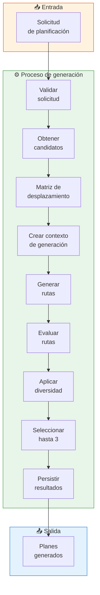

---

## 3. Componentes principales

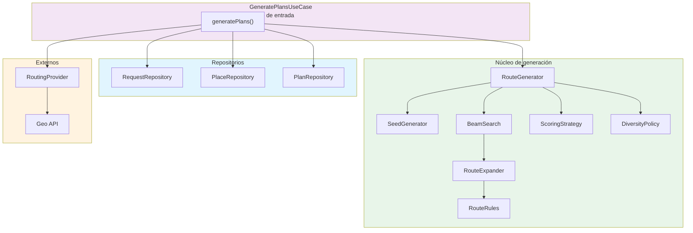

| Componente | Responsabilidad |
|---|---|
| `GeneratePlansUseCase` | Coordina el proceso completo |
| `RequestRepository` | Obtener solicitudes |
| `PlaceRepository` | Obtener lugares candidatos |
| `PlanRepository` | Persistir planes finales |
| `RoutingProvider` | Obtener tiempos y distancias |
| `RouteGenerator` | Coordina la generación de recorridos |
| `SeedGenerator` | Crear puntos iniciales de búsqueda |
| `BeamSearch` | Explorar rutas manteniendo las mejores opciones |
| `RouteExpander` | Intentar agregar lugares a una ruta |
| `RouteRules` | Validar restricciones |
| `ScoringStrategy` | Evaluar alternativas |
| `DiversityPolicy` | Evitar resultados demasiado similares |

---

## 4. Dependencias explícitas

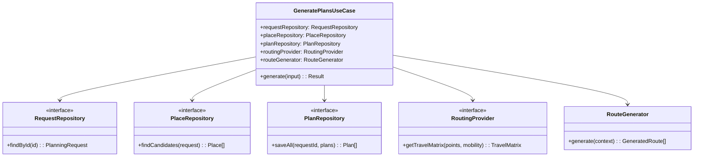

> Las dependencias se proporcionan explícitamente, permitiendo sustituir implementaciones durante pruebas.

---

## 5. RoutingProvider — Abstracción

```mermaid
graph LR
    subgraph Domain["Dominio"]
        RP["RoutingProvider\n<<interface>>"]
    end

    subgraph Implementations["Implementaciones"]
        GEOAPIFY["GeoapifyRoutingProvider"]
        GOOGLE["GoogleRoutingProvider"]
        MAPBOX["MapboxRoutingProvider"]
    end

    RP <|.. GEOAPIFY
    RP <|.. GOOGLE
    RP <|.. MAPBOX

    style RP fill:#f3e5f5
```

```typescript
interface RoutingProvider {
  getTravelMatrix(
    points: GeoPoint[],
    mobility: MobilityMode
  ): Promise<TravelMatrix>;
}
```

---

## 6. TravelMatrix — Representación

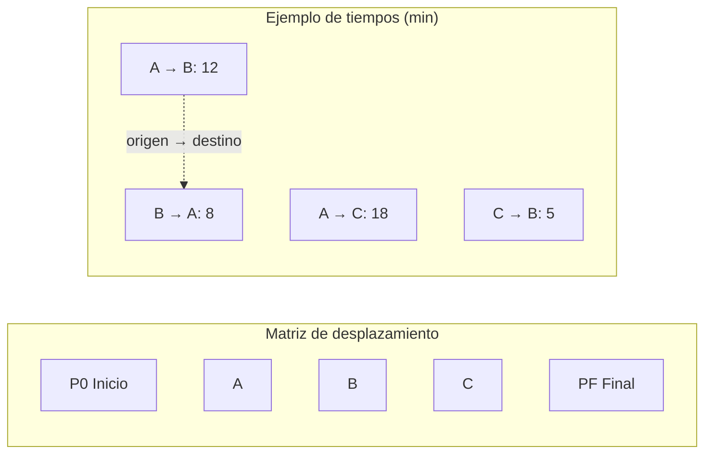

> La matriz es **dirigida**: `A → B` puede tener diferente costo que `B → A`.

---

## 7. Contexto de generación

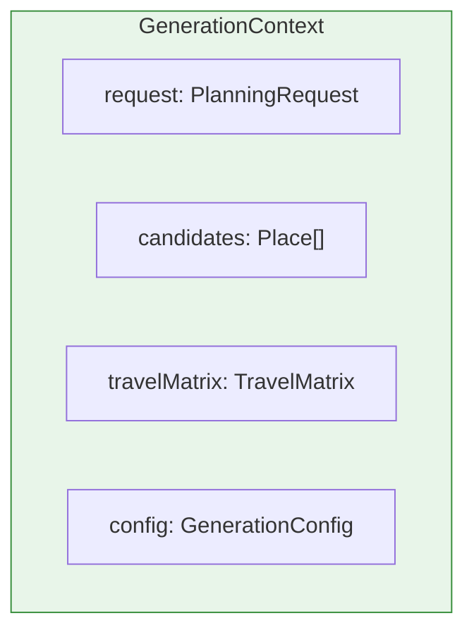

```typescript
type GenerationContext = {
  request: PlanningRequest;
  candidates: Place[];
  travelMatrix: TravelMatrix;
  config: GenerationConfig;
};
```

---

## 8. Configuración

| Parámetro | Valor inicial | Descripción |
|---|---|---|
| `MAX_INITIAL_SEEDS` | 5 | Seeds iniciales como puntos de partida |
| `BEAM_WIDTH` | 3 | Rutas parciales conservadas por nivel |
| `MIN_STOPS` | 1 | Paradas mínimas en un plan |
| `MAX_STOPS` | 4 | Paradas máximas en un plan |
| `MAX_RESULTS` | 3 | Resultados finales máximo |

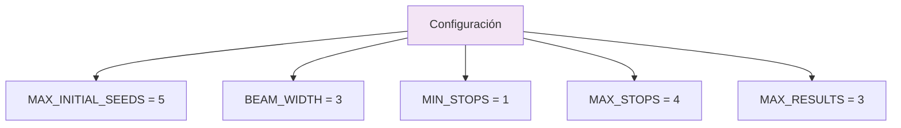

> Estos valores corresponden a decisiones de implementación y podrán ajustarse durante las pruebas.

---

## 9. SeedGenerator — Selección inicial

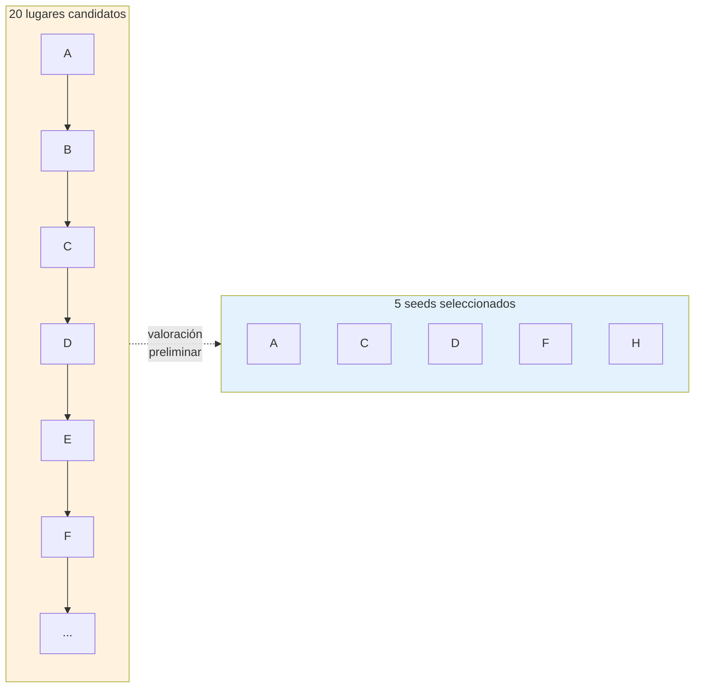

La selección puede basarse en:

- Coincidencia con intereses
- Cercanía al punto inicial
- Compatibilidad temporal
- Compatibilidad con rango de gasto

---

## 10. Beam Search — Concepto

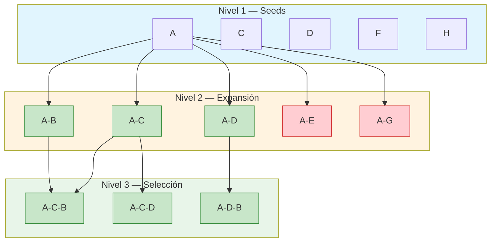

> **BEAM_WIDTH = 3**: Solo las 3 mejores rutas parciales avanzan al siguiente nivel.

---

## 11. RouteExpander — Expansión de rutas

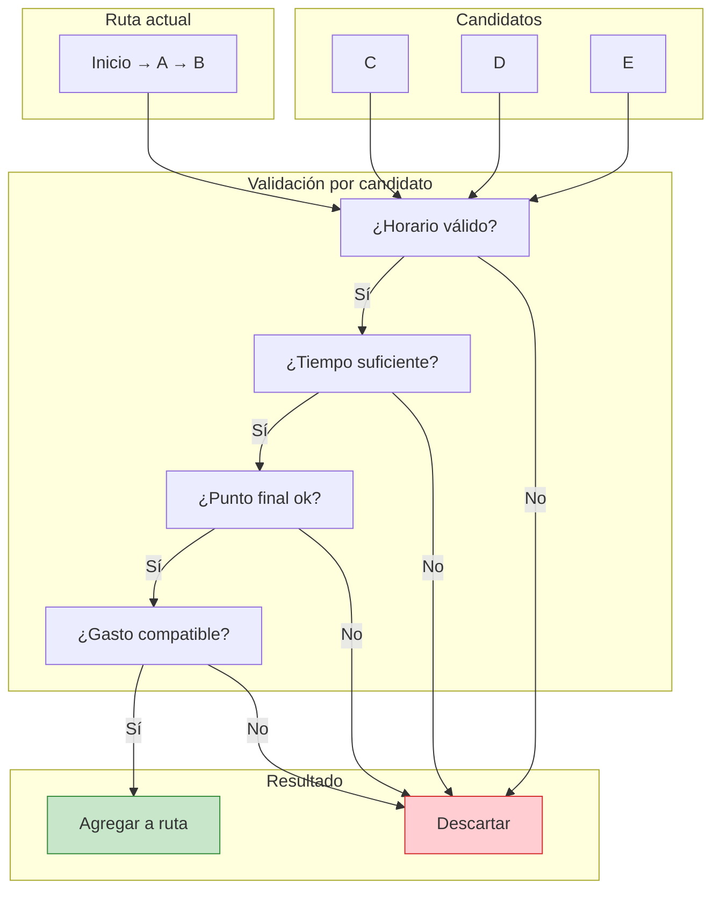

---

## 12. ScoringStrategy — Evaluación

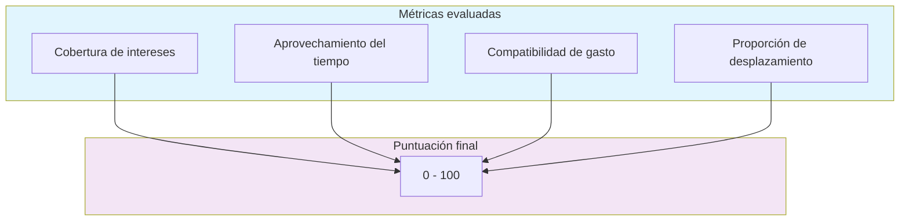

> La puntuación representa una medida interna de compatibilidad, **no** una probabilidad ni garantía de satisfacción.

---

## 13. DiversityPolicy — Control de similitud

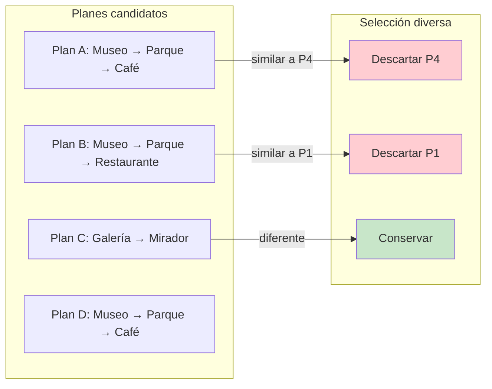

> Se procura evitar que los resultados finales sean excesivamente similares entre sí.

---

## 14. Flujo de datos completo

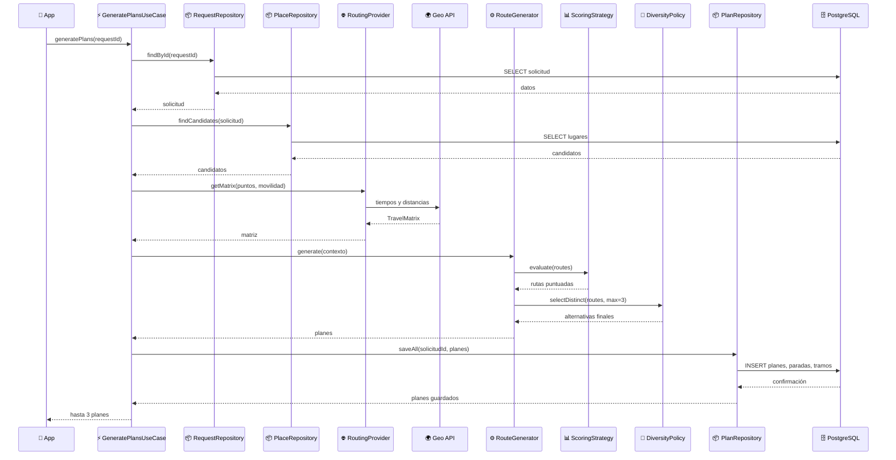

---

## 15. Qué NO hace el generador

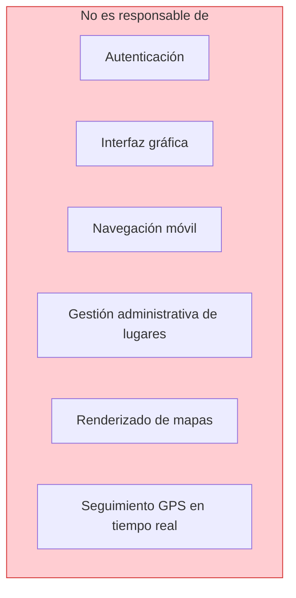

---

## 16. Documentos relacionados

| Documento | Descripción |
|---|---|
| [`arquitectura-general.md`](./arquitectura-general.md) | Visión de componentes y capas |
| [`../05-algoritmo/generacion-rutas.md`](../05-algoritmo/generacion-rutas.md) | Detalle del algoritmo |
| [`../03-modelado/secuencias.md`](../03-modelado/secuencias.md) | Diagramas de secuencia |
