# Generación de rutas — Chaski

## 1. Propósito

Este documento describe el algoritmo utilizado para generar alternativas de recorrido en Chaski.

El algoritmo recibe una solicitud válida y produce hasta tres planes compatibles con las condiciones indicadas por el usuario.

La primera versión utiliza un enfoque determinístico basado en:

- filtrado de candidatos;
- matriz de desplazamiento;
- búsqueda limitada;
- validación de restricciones;
- puntuación multicriterio;
- control de diversidad.

**No se utiliza inteligencia artificial ni aprendizaje automático.**

---

## 2. Entrada y salida

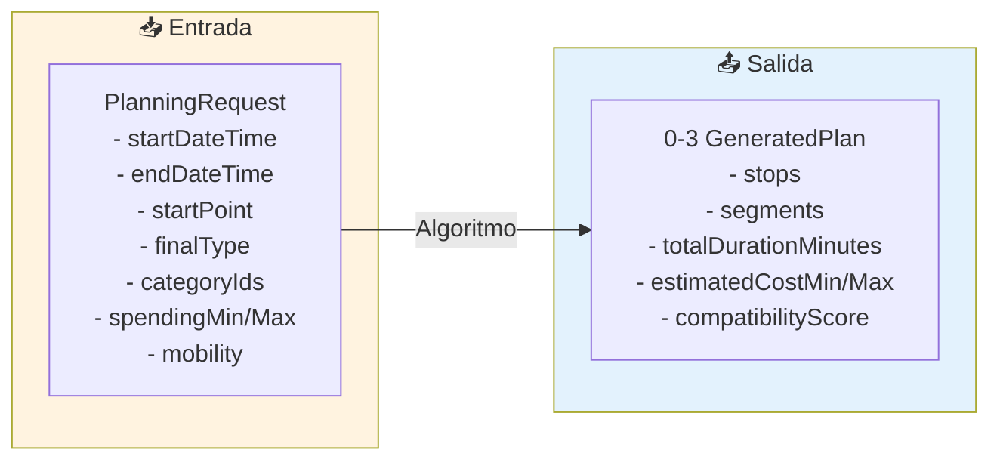

---

## 3. Flujo del algoritmo

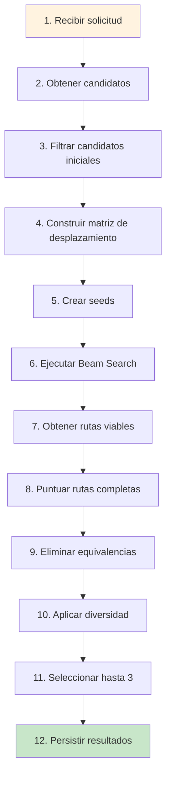

---

## 4. Parámetros iniciales

| Parámetro | Valor | Descripción |
|---|---|---|
| `MAX_INITIAL_SEEDS` | 5 | Seeds iniciales como puntos de partida |
| `BEAM_WIDTH` | 3 | Rutas parciales conservadas por nivel |
| `MIN_STOPS` | 1 | Paradas mínimas en un plan |
| `MAX_STOPS` | 4 | Paradas máximas en un plan |
| `MAX_RESULTS` | 3 | Resultados finales máximo |

---

## 5. Obtención de candidatos

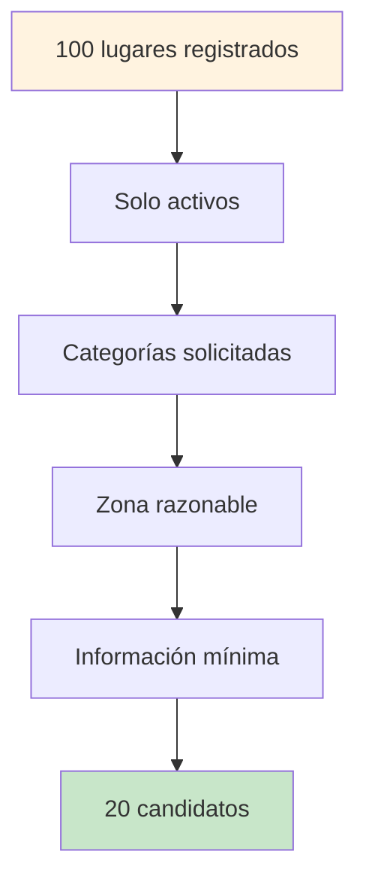

> El objetivo no es determinar todavía si cada lugar puede visitarse. La validación temporal se realiza durante la expansión de cada ruta.

---

## 6. Construcción de puntos

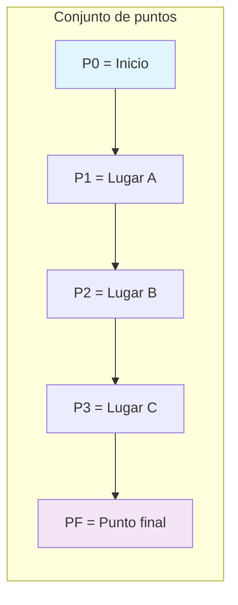

### Tipos de punto final

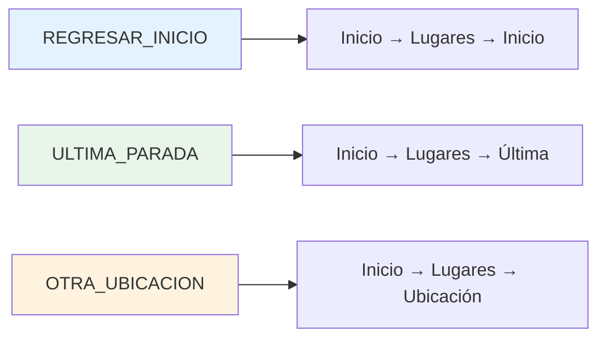

---

## 7. Matriz de desplazamiento

```mermaid
flowchart LR
    subgraph Matrix["Ejemplo de matriz de tiempos (min)"]
        direction TB
        H1[""] 
        H2["A"]
        H3["B"]
        H4["C"]

        R1["Inicio"] -->|"10"| A1["A"]
        R1["Inicio"] -->|"15"| B1["B"]
        R1["Inicio"] -->|"8"| C1["C"]
        A1 -->|"7"| A2["B"]
        A1 -->|"11"| B2["C"]
        B1 -->|"6"| A3["A"]
        B1 -->|"5"| C2["C"]
        C1 -->|"12"| A4["A"]
        C1 -->|"8"| B3["B"]
    end

    style H1 fill:#f3e5f5
    style H2 fill:#f3e5f5
    style H3 fill:#f3e5f5
    style H4 fill:#f3e5f5
```

> La matriz es **dirigida**: `A → B` puede tener diferente costo que `B → A`.

---

## 8. Representación como grafo

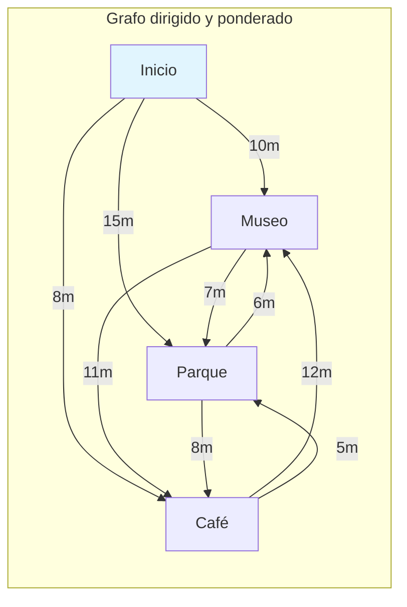

---

## 9. Problema combinatorio

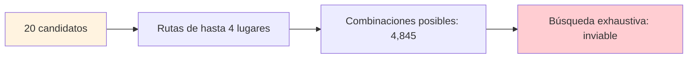

> Por esta razón se utiliza búsqueda limitada con Beam Search.

---

## 10. Estrategia de búsqueda

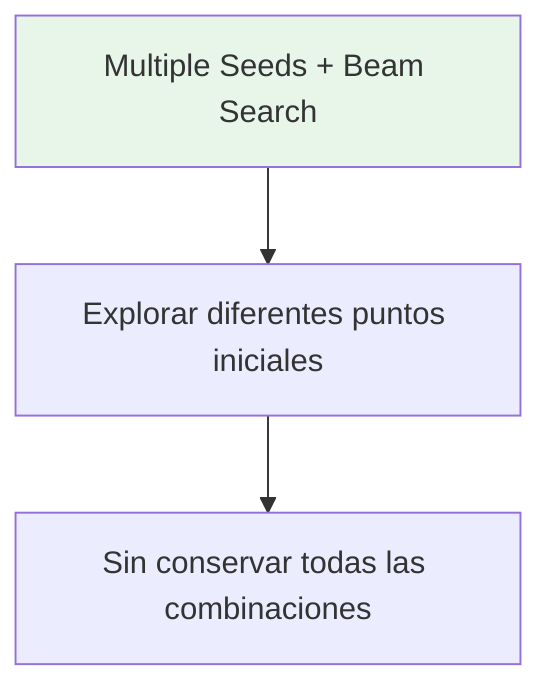

---

## 11. Seeds iniciales

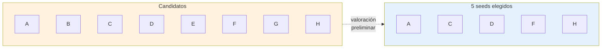

### Valoración de seeds

Los seeds se ordenan mediante una valoración preliminar que considera:

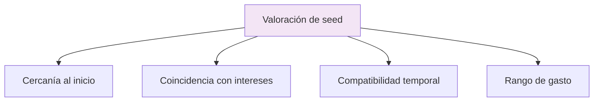

---

## 12. Beam Search — Proceso

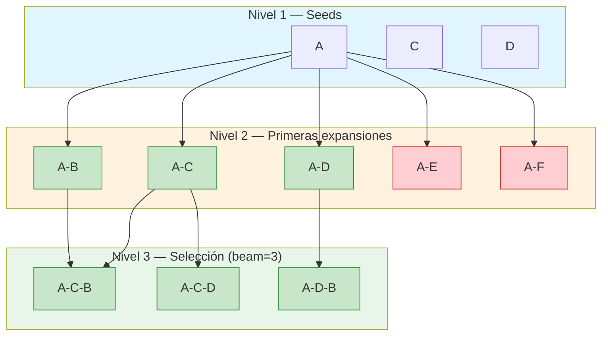

> **BEAM_WIDTH = 3**: Solo las 3 mejores rutas parciales avanzan.

---

## 13. Beam Search — Iteraciones

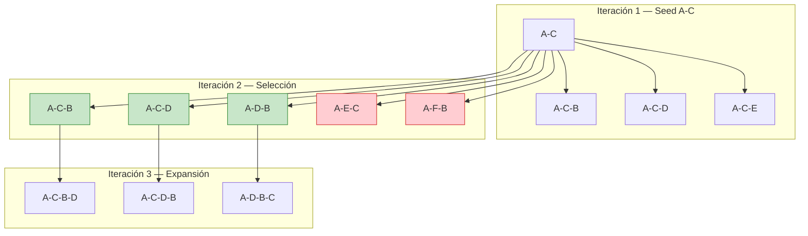

---

## 14. Validación de restricciones

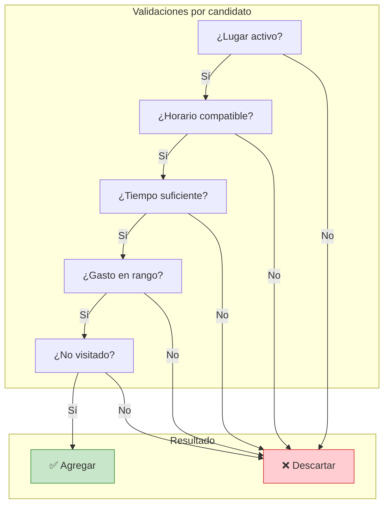

---

## 15. Evaluación — ScoringStrategy

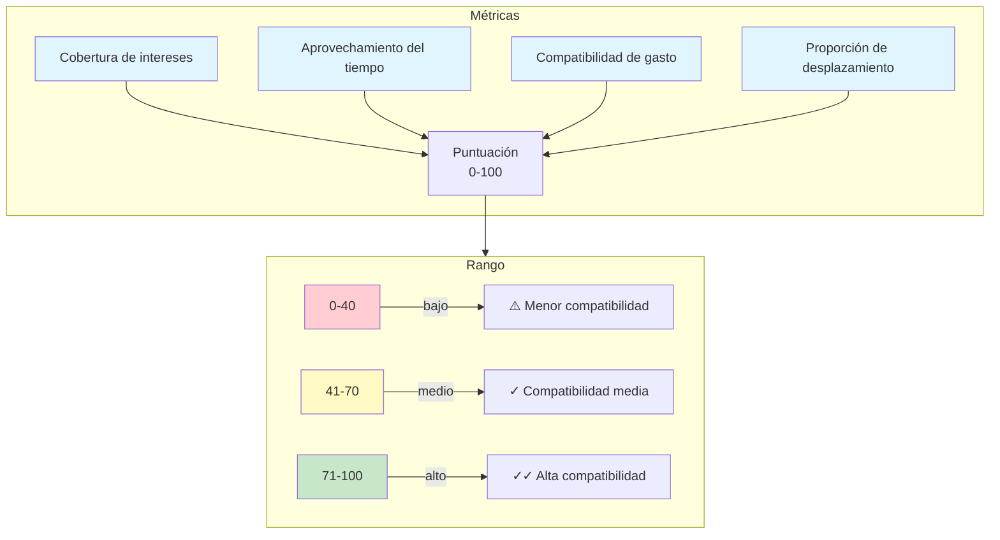

> La puntuación **no** es una probabilidad ni garantía de satisfacción.

---

## 16. Control de diversidad

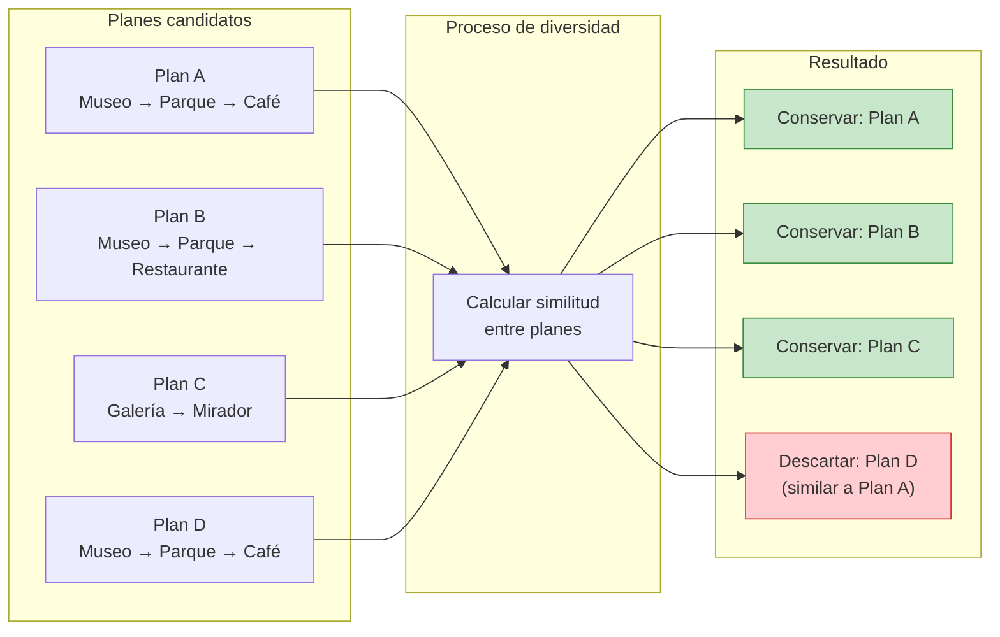

---

## 17. Manejo de errores del servicio geográfico

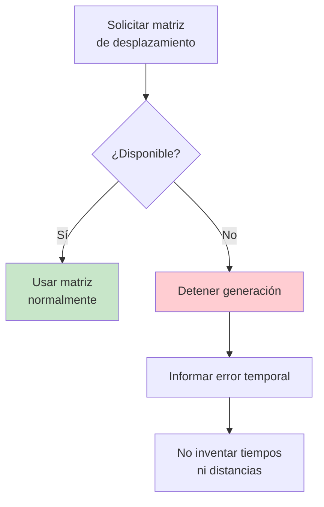

> **Nunca** utilizar `0 minutos` o `0 metros` como sustituto de información faltante.

---

## 18. Resultado final

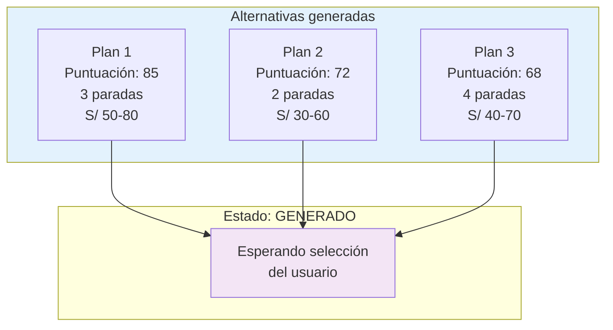

---

## 19. Documentos relacionados

| Documento | Descripción |
|---|---|
| [`generador-planes.md`](../04-arquitectura/generador-planes.md) | Arquitectura interna del generador |
| [`../04-arquitectura/arquitectura-general.md`](../04-arquitectura/arquitectura-general.md) | Visión de componentes |
| [`../03-modelado/secuencias.md`](../03-modelado/secuencias.md) | Diagramas de secuencia |
