# 📚 Centro de Documentación Técnica — Chaski

Bienvenido al repositorio central de documentación funcional, técnica y arquitectónica del proyecto **Chaski**.

---

## 🗺️ Mapa Visual de la Documentación

```mermaid
graph LR
    subgraph D01["01. Producto"]
        V["Visión"]
        PO["Problema & Objetivos"]
        AL["Alcance (In/Out)"]
    end

    subgraph D02["02. Requisitos"]
        RF["Requisitos Funcionales"]
        RNF["Requisitos No Funcionales"]
        RN["Reglas de Negocio"]
        TZ["Matriz de Trazabilidad"]
    end

    subgraph D03["03. Modelado"]
        CU["Casos de Uso"]
        MD["Modelo de Dominio"]
        BD["Modelo de Datos (ERD)"]
        SQ["Diagramas de Secuencia"]
    end

    subgraph D04["04. Arquitectura"]
        AR["Arquitectura General"]
        GP["Generador de Planes"]
    end

    subgraph D05["05. Algoritmo"]
        ALGO["Beam Search & Scoring"]
    end

    D01 --> D02
    D02 --> D03
    D03 --> D04
    D04 --> D05

    classDef d1 fill:#E3F2FD,stroke:#1565C0;
    classDef d2 fill:#EDE7F6,stroke:#512DA8;
    classDef d3 fill:#E8F5E9,stroke:#2E7D32;
    classDef d4 fill:#FFF3E0,stroke:#EF6C00;
    classDef d5 fill:#FCE4EC,stroke:#C2185B;

    class D01,V,PO,AL d1;
    class D02,RF,RNF,RN,TZ d2;
    class D03,CU,MD,BD,SQ d3;
    class D04,AR,GP d4;
    class D05,ALGO d5;
```

---

## 📑 Directorio de Documentos

| Sección | Documento | Audiencia | Descripción clave |
|---|---|---|---|
| **01. Producto** | [Visión del producto](./01-producto/vision.md) | Todo el equipo | Propuesta de valor, principios rectores y diferenciadores frente a apps de mapas tradicionales. |
| | [Problema y objetivos](./01-producto/problema-y-objetivos.md) | Negocio / Devs | Formulación del problema general, PE01–PE04 y objetivos específicos OE01–OE04. |
| | [Alcance](./01-producto/alcance.md) | Negocio / Devs | Límites claros del MVP (In-scope vs Out-of-scope). |
| **02. Requisitos** | [Requisitos funcionales](./02-requisitos/requisitos-funcionales.md) | Devs / QA | 29 RF estructurados desde autenticación hasta administración. |
| | [Requisitos no funcionales](./02-requisitos/requisitos-no-funcionales.md) | Arquitectura / DevOps | Rendimiento, seguridad, disponibilidad y compatibilidad. |
| | [Reglas de negocio](./02-requisitos/reglas-negocio.md) | Devs / QA | Políticas de validación, tiempos, gastos y estados del plan. |
| | [Trazabilidad](./02-requisitos/trazabilidad.md) | Gestión / QA | Matriz cruzada de Objetivos ↔ Requisitos ↔ Casos de Uso. |
| **03. Modelado** | [Casos de uso](./03-modelado/casos-uso.md) | Devs / QA | CU01 a CU09 detallados con diagramas de flujo y precondiciones. |
| | [Modelo de dominio](./03-modelado/modelo-dominio.md) | Devs / Arquitectura | Entidades, agregados, valor y reglas del dominio. |
| | [Modelo de datos](./03-modelado/modelo-datos.md) | Data / Backend | Esquema relacional DDL de 14 tablas en PostgreSQL. |
| | [Diagramas de secuencia](./03-modelado/secuencias.md) | Devs / Frontend | Interacción temporal entre Cliente, Supabase Auth, Edge Functions y Geo API. |
| **04. Arquitectura** | [Arquitectura general](./04-arquitectura/arquitectura-general.md) | Arquitectura / Devs | Separación por capas, políticas RLS y aislamiento de secretos. |
| | [Generador de planes](./04-arquitectura/generador-planes.md) | Backend / Algoritmo | Pipeline interno y diseño de la Edge Function `generate-plans`. |
| **05. Algoritmo** | [Generación de rutas](./05-algoritmo/generacion-rutas.md) | Backend / Algoritmo | Beam Search determinístico, pesos de puntuación y diversidad Jaccard. |

---

## 💡 Convenciones Visuales en esta Documentación

1. **Diagramas Mermaid:** Utilizados para secuencias, estados, arquitectura y flujos de decisión.
2. **Tablas Estructuradas:** Para requisitos, parámetros y reglas con identificador único (ej: `RF01`, `PLA-02`).
3. **Bloques de Alerta (`> [!NOTE]`, `> [!IMPORTANT]`):** Para resaltar precondiciones críticas o advertencias de seguridad.